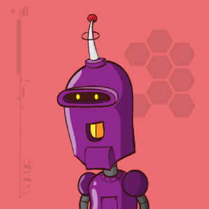

# hackthebox-writeups
Writeups for HacktheBox machines (boot2root) and challenges written in Spanish or English.  

https://www.hackthebox.eu/  

**Important**
All Challenge Writeups are password protected with the corresponding flag.  
**Active** machines writeups are protected with the corresponding root flag.

  

# Disclaimer

It is totally forbidden to unprotect (remove the password) and distribute the pdf files of active machines, if we detect any misuse will be reported immediately to the HTB admins.  
Anyway, all the authors of the writeups of active machines in this repository **are not responsible** for the misuse that can be given to the corresponding documents. Please think that this is done to share techniques not for spoilers.

# Submissions

If you want to incorporate your own writeup, notes, scripts or other material to solve the boot2root machines and challenges you can do it through a **'pull request'** or by sending us an email to: **hackplayers_at_Ymail.com**.

In this way, you will be added to our **top contributors list** (see below) and you will also receive an **invitation link to an exclusive Telegram group** where several hints (not spoilers) are discussed for the HacktheBox machines.  

Please consider **protecting the text of your writeup** (e.g. not allowing to be copied) so that it can not be easily shared on platforms such as Pastebin. Of course, if someone leaks a writeup of an active machine it is not the responsibility of the author. If we detect someone who does it, they will immediately report to the HTB Staff so they can take the appropriate measures.

Note: the minimum requirement to enter the "special" Telegram group is also to have a hacker level or higher (no script kiddies).  

# Contributors

 No | ctry | nick | avatar | team | machines | challenges
 --- | --- | --- | --- | --- | --- | ---
1 |  | Fiti |  | [L1k0rD3B3ll0t4](https://www.hackthebox.eu/home/teams/profile/149) |  [Bashed,](https://github.com/Hackplayers/hackthebox-writeups/blob/master/machines/Bashed/fiti-bashed.pdf) [Arctic,](https://github.com/Hackplayers/hackthebox-writeups/blob/master/machines/Arctic/fiti-arctic.pdf) [Tenten,](https://github.com/Hackplayers/hackthebox-writeups/blob/master/machines/Tenten/fiti-tenten.pdf) [Celestial,](https://github.com/Hackplayers/hackthebox-writeups/blob/master/machines/Celestial/fiti-celestial.pdf) [Mirai,](https://github.com/Hackplayers/hackthebox-writeups/blob/master/machines/Mirai/fiti-mirai.pdf) [Nibbles,](https://github.com/Hackplayers/hackthebox-writeups/blob/master/machines/Nibbles/fiti-nibbles.pdf) [Sunday,](https://github.com/Hackplayers/hackthebox-writeups/blob/master/machines/Sunday/fiti-sunday.pdf) [Valentine,](https://github.com/Hackplayers/hackthebox-writeups/blob/master/machines/Valentine/fiti-valentine.pdf) [Dev0ops, ](https://github.com/Hackplayers/hackthebox-writeups/blob/master/machines/DevOops/fiti-dev0ps.pdf) [Aragog, ](https://github.com/Hackplayers/hackthebox-writeups/blob/master/machines/Aragog/fiti-aragog.pdf)  [Canape, ](https://github.com/Hackplayers/hackthebox-writeups/blob/master/machines/Canape/fiti-canape.pdf) [Mischief, ](https://github.com/Hackplayers/hackthebox-writeups/blob/master/machines/Mischief/fiti-mischief.pdf) [Jerry, ](https://github.com/Hackplayers/hackthebox-writeups/blob/master/machines/Jerry/fiti-jerry.pdf) [Olympus, ](https://github.com/Hackplayers/hackthebox-writeups/blob/master/machines/Olympus/fiti-olympus.pdf)  [Bounty, ](https://github.com/Hackplayers/hackthebox-writeups/blob/master/machines/Bounty/fiti-bounty.pdf) [Access, ](https://github.com/Hackplayers/hackthebox-writeups/blob/master/machines/Access/fiti-access.pdf) [Carrier, ](https://github.com/Hackplayers/hackthebox-writeups/blob/master/machines/Carrier/fiti-carrier.pdf) [Curling, ](https://github.com/Hackplayers/hackthebox-writeups/blob/master/machines/Curling/fiti-curling.pdf) [Dab, ](https://github.com/Hackplayers/hackthebox-writeups/blob/master/machines/Dab/fiti-dab.pdf) [Ypuffy, ](https://github.com/Hackplayers/hackthebox-writeups/blob/master/machines/Ypuffy/fiti-ypuffy.pdf) [Waldo, ](https://github.com/Hackplayers/hackthebox-writeups/blob/master/machines/Waldo/fiti-waldo.pdf) [Secnotes, ](https://github.com/Hackplayers/hackthebox-writeups/blob/master/machines/Secnotes/fiti-secnotes.pdf) [Irked, ](https://github.com/Hackplayers/hackthebox-writeups/blob/master/machines/Irked/fiti-irked.pdf) [Frolic, ](https://github.com/Hackplayers/hackthebox-writeups/blob/master/machines/Frolic/fiti-frolic.pdf) [Chaos, ](https://github.com/Hackplayers/hackthebox-writeups/tree/master/machines/Chaos/fiti-chaos.pdf) [Fortune, ](https://github.com/Hackplayers/hackthebox-writeups/blob/master/machines/Fortune/fiti-fortune.pdf) [Friendzone, ](https://github.com/Hackplayers/hackthebox-writeups/blob/master/machines/Friendzone/fiti-Friendzone.pdf) [Lightweight, ](https://github.com/Hackplayers/hackthebox-writeups/blob/master/machines/Lightweight/fiti-Lightweight.pdf) [Querier, ](https://github.com/Hackplayers/hackthebox-writeups/blob/master/machines/Querier/fiti-Querier.pdf) [Help](https://github.com/Hackplayers/hackthebox-writeups/blob/master/machines/Help/fiti-Help.pdf) [Conceal, ](https://github.com/Hackplayers/hackthebox-writeups/blob/master/machines/Conceal/fiti-conceal.pdf) [CTF, ](https://github.com/Hackplayers/hackthebox-writeups/blob/master/machines/CTF/fiti-ctf.pdf) [Netmon, ](https://github.com/Hackplayers/hackthebox-writeups/blob/master/machines/Netmon/fiti-netmon.pdf) [Sizzle, ](https://github.com/Hackplayers/hackthebox-writeups/blob/master/machines/Sizzle/fiti-sizzle.pdf) [Arkham, ](https://github.com/Hackplayers/hackthebox-writeups/blob/master/machines/Arkham/fiti-arkham.pdf) [OneTwoSeven, ](https://github.com/Hackplayers/hackthebox-writeups/blob/master/machines/OneTwoSeven/fiti-onetwoseven.pdf) [LaCasaDePapel, ](https://github.com/Hackplayers/hackthebox-writeups/blob/master/machines/LaCasaDePapel/fiti-lacasadepapel.pdf) [Helpline, ](https://github.com/Hackplayers/hackthebox-writeups/blob/master/machines/Helpline/fiti-helpline.pdf) [Ghoul, ](https://github.com/Hackplayers/hackthebox-writeups/blob/master/machines/Ghoul/fiti-ghoul.pdf) [Bastion, ](https://github.com/Hackplayers/hackthebox-writeups/blob/master/machines/Bastion/fiti-bastion.pdf) [Swagshop, ](https://github.com/Hackplayers/hackthebox-writeups/blob/master/machines/Swagshop/fiti-swagshop.pdf) [Ellingson, ](https://github.com/Hackplayers/hackthebox-writeups/blob/master/machines/Ellingson/l1k0rd3b3ll0t4-ellingson.pdf) [Writeup, ](https://github.com/Hackplayers/hackthebox-writeups/blob/master/machines/writeup/fiti-writeup.pdf) [Chainsaw, ](https://github.com/Hackplayers/hackthebox-writeups/blob/master/machines/Chainsaw/fiti-Chainsaw.pdf) [Haystack, ](https://github.com/Hackplayers/hackthebox-writeups/blob/master/machines/Haystack/fiti-Haystack.pdf) [Jarvis, ](https://github.com/Hackplayers/hackthebox-writeups/blob/master/machines/Jarvis/fiti-Jarvis.pdf) [Player, ](https://github.com/Hackplayers/hackthebox-writeups/blob/master/machines/Player/fiti-Player.pdf) [Smasher2, ](https://github.com/Hackplayers/hackthebox-writeups/blob/master/machines/Smasher2/fiti-Smasher2.pdf) [Unattended, ](https://github.com/Hackplayers/hackthebox-writeups/blob/master/machines/Unattended/fiti-Unattended.pdf) [Kryptos](https://github.com/Hackplayers/hackthebox-writeups/blob/master/machines/Kriptos/fiti-Kryptos.pdf) | [Impossible password, ](https://github.com/Hackplayers/hackthebox-writeups/blob/master/challenges/reversing/Impossible_password/fiti-impossible-password.pdf) [Widescreen, ](https://github.com/Hackplayers/hackthebox-writeups/blob/master/challenges/stego/Widescreen/fiti-widescreen.pdf) [Unified, ](https://github.com/Hackplayers/hackthebox-writeups/blob/master/challenges/stego/Unified/fiti-unified.pdf) [Milkshake, ](https://github.com/Hackplayers/hackthebox-writeups/blob/master/challenges/stego/Milkshake/fiti-milkshake.pdf) [It's raining blood, ](https://github.com/Hackplayers/hackthebox-writeups/blob/master/challenges/stego/Raining%20Blood/fiti-Its_Raining_Blood.pdf) [Hackerman, ](https://github.com/Hackplayers/hackthebox-writeups/blob/master/challenges/stego/Hackerman/fiti-hackerman.pdf) [Forest, ](https://github.com/Hackplayers/hackthebox-writeups/blob/master/challenges/stego/Forest/fiti-forest.pdf) [Cartographer, ](https://github.com/Hackplayers/hackthebox-writeups/blob/master/challenges/web/cartographer/fiti-cartographer.pdf) [0ld is g0ld, ](https://github.com/Hackplayers/hackthebox-writeups/blob/master/challenges/misc/0ld_is_g0ld/fiti-0ld_is_g0ld.pdf) [HDC, ](https://github.com/Hackplayers/hackthebox-writeups/blob/master/challenges/web/HDC/fit-HDC.pdf) [Beatles, ](https://github.com/Hackplayers/hackthebox-writeups/blob/master/challenges/stego/Beatles/fiti-Beatles.pdf) [Brainy's Cipher, ](https://github.com/Hackplayers/hackthebox-writeups/blob/master/challenges/crypto/Brainy-s%20Cipher/fiti-BrainysCipher.pdf) [Classic Yet Complicated, ](https://github.com/Hackplayers/hackthebox-writeups/blob/master/challenges/crypto/Classic%20Yet%20Complicated/fiti-ClassicYetComplicated.pdf) [Da Vinci, ](https://github.com/Hackplayers/hackthebox-writeups/blob/master/challenges/stego/DaVinci/fiti-DaVinci.pdf) [Deceitful Batman, ](https://github.com/Hackplayers/hackthebox-writeups/blob/master/challenges/crypto/Deceitful_Batman/fiti-DeceitfulBatman.pdf) [Digital Cube, ](https://github.com/Hackplayers/hackthebox-writeups/blob/master/challenges/stego/Digital_Cube/fiti-DigitalCube.pdf) [Keys, ](https://github.com/Hackplayers/hackthebox-writeups/blob/master/challenges/crypto/Keys/fiti-Keys.pdf) [Lernaean, ](https://github.com/Hackplayers/hackthebox-writeups/blob/master/challenges/web/lernaean/fiti-Lernaean.pdf) [Pusheen Loves Graphs, ](https://github.com/Hackplayers/hackthebox-writeups/blob/master/challenges/stego/Pusheen%20Loves%20Graphs/icebreakcrypt-PusheenLovesGraphs.pdf) [Sick Teacher, ](https://github.com/Hackplayers/hackthebox-writeups/blob/master/challenges/crypto/SickTeacher/fiti-Sick-Teacher.pdf) [Weak RSA, ](https://github.com/Hackplayers/hackthebox-writeups/blob/master/challenges/crypto/Weak%20RSA/fiti-Weak-RSA.pdf) [Fuzzy, ](https://github.com/Hackplayers/hackthebox-writeups/blob/master/challenges/web/Fuzzy/fiti-fuzzy.pdf) [I Know Mag1k, ](https://github.com/Hackplayers/hackthebox-writeups/blob/master/challenges/web/iknowmag1k/fiti-I_know_mag1k.pdf) [Grammar](https://github.com/Hackplayers/hackthebox-writeups/blob/master/challenges/web/grammar/fiti-grammar.pdf) |
2 |  | drx51 |   | solitaire wolf | [Celestial,](https://github.com/Hackplayers/hackthebox-writeups/blob/master/machines/Celestial/drx51-celestial.pdf) [Dev0ops,](https://github.com/Hackplayers/hackthebox-writeups/blob/master/machines/DevOops/drx51-dev0ops.pdf) [Nibbles,](https://github.com/Hackplayers/hackthebox-writeups/blob/master/machines/Nibbles/drx51-nibbles.pdf) [Shocker,](https://github.com/Hackplayers/hackthebox-writeups/blob/master/machines/Shocker/drx51-shocker.pdf) [Valentine,](https://github.com/Hackplayers/hackthebox-writeups/blob/master/machines/Valentine/drx51-valentine.pdf) [Bashed,](https://github.com/Hackplayers/hackthebox-writeups/blob/master/machines/Bashed/drx51-bashed.pdf) [Chatterbox,](https://github.com/Hackplayers/hackthebox-writeups/blob/master/machines/Chatterbox/drx51-chatterbox.pdf) [Jerry,](https://github.com/Hackplayers/hackthebox-writeups/blob/master/machines/Jerry/drx51-jerry.pdf) [Canape,](https://github.com/Hackplayers/hackthebox-writeups/blob/master/machines/Canape/drx51-canape.pdf) [Sense,](https://github.com/Hackplayers/hackthebox-writeups/blob/master/machines/Sense/drx51-sense.pdf) [Silo, ](https://github.com/Hackplayers/hackthebox-writeups/blob/master/machines/Silo/drx51-silo.pdf) [Active, ](https://github.com/Hackplayers/hackthebox-writeups/blob/master/machines/Active/drx51-active.pdf) [Waldo, ](https://github.com/Hackplayers/hackthebox-writeups/blob/master/machines/Waldo/drx51-waldo.pdf) [Mischief, ](https://github.com/Hackplayers/hackthebox-writeups/blob/master/machines/Mischief/drx51-mischief.pdf) [Stratosphere, ](https://github.com/Hackplayers/hackthebox-writeups/blob/master/machines/Stratosphere/drx51-stratosphere.pdf) [Poison, ](https://github.com/Hackplayers/hackthebox-writeups/blob/master/machines/Poison/drx51-poison.pdf) [Olympus, ](https://github.com/Hackplayers/hackthebox-writeups/blob/master/machines/Olympus/drx51-olympus.pdf) [Tartarsauce](https://github.com/Hackplayers/hackthebox-writeups/blob/master/machines/TartarSauce/drx51-tartarsauce.pdf) | |
3 |  | volken |   | [SinHack](https://www.hackthebox.eu/home/teams/profile/1313) | [Poison, ](https://github.com/Hackplayers/hackthebox-writeups/blob/master/machines/Poison/volken-poison.pdf) [Jerry, ](https://github.com/Hackplayers/hackthebox-writeups/blob/master/machines/Jerry/volken-jerry.pdf) [Curling, ](https://github.com/Hackplayers/hackthebox-writeups/blob/master/machines/Curling/volken-curling.pdf) [Help, ](https://github.com/Hackplayers/hackthebox-writeups/blob/master/machines/Help/volken-help-unintendedway.pdf) [Irked, ](https://github.com/Hackplayers/hackthebox-writeups/blob/master/machines/Irked/volken-irked.pdf) [Popcorn](https://github.com/Hackplayers/hackthebox-writeups/blob/master/machines/Popcorn/volken-popcorn.pdf) | [0ld is g0ld, ](https://github.com/Hackplayers/hackthebox-writeups/blob/master/challenges/misc/0ld_is_g0ld/volken-0ld-is-g0ld.pdf) [Blackhole, ](https://github.com/Hackplayers/hackthebox-writeups/blob/master/challenges/misc/Blackhole/volken-blackhole.pdf) [fs0ciety, ](https://github.com/Hackplayers/hackthebox-writeups/blob/master/challenges/misc/fs0ciety/volken-fsociety.pdf) [Art, ](https://github.com/Hackplayers/hackthebox-writeups/blob/master/challenges/misc/Art/volken-art.pdf) [Inferno, ](https://github.com/Hackplayers/hackthebox-writeups/blob/master/challenges/misc/Inferno/volken-inferno.pdf) [misDIRection, ](https://github.com/Hackplayers/hackthebox-writeups/blob/master/challenges/misc/misDIRection/volken-misDIRection.pdf)[Eternal Loop, ](https://github.com/Hackplayers/hackthebox-writeups/blob/master/challenges/misc/Eternal_Loop/volken-Eternal%20Loop.zip) [Longbottom's Locker, ](https://github.com/Hackplayers/hackthebox-writeups/blob/master/challenges/misc/Longbottom-s%20Locker/volken-Longbottom's%20Locker.zip) [Hackerman, ](https://github.com/Hackplayers/hackthebox-writeups/blob/master/challenges/stego/Hackerman/volken-hackerman.pdf) [Raining Blood, ](https://github.com/Hackplayers/hackthebox-writeups/blob/master/challenges/stego/Raining%20Blood/volken-RainingBlood.pdf) [Unified, ](https://github.com/Hackplayers/hackthebox-writeups/blob/master/challenges/stego/Unified/volken-unified.pdf) [Brainy's cipher, ](https://github.com/Hackplayers/hackthebox-writeups/blob/master/challenges/crypto/Brainy-s%20Cipher/volken-brainys_cipher.pdf) [Da Vinci, ](https://github.com/Hackplayers/hackthebox-writeups/blob/master/challenges/stego/DaVinci/volken-Da_vinci.pdf) [Deceiful Batman, ](https://github.com/Hackplayers/hackthebox-writeups/blob/master/challenges/crypto/Deceitful_Batman/volken-deceiful_batman.pdf) [Forest, ](https://github.com/Hackplayers/hackthebox-writeups/blob/master/challenges/stego/Forest/volken-forest.pdf) [HDC, ](https://github.com/Hackplayers/hackthebox-writeups/blob/master/challenges/web/HDC/volken-hdc.pdf) [Marshal in the Middle, ](https://github.com/Hackplayers/hackthebox-writeups/blob/master/challenges/forensics/volken-marshal_in_the_middle.pdf) [Weak RSA, ](https://github.com/Hackplayers/hackthebox-writeups/blob/master/challenges/crypto/Weak%20RSA/volken-weak_rsa.pdf) [Keys, ](https://github.com/Hackplayers/hackthebox-writeups/blob/master/challenges/crypto/Keys/volken-keys.pdf) [Retro](https://github.com/Hackplayers/hackthebox-writeups/blob/master/challenges/stego/Retro/volken-retro.pdf)|  
4 |  | wilsonnkwan |   | [CyberFrenzy](https://www.hackthebox.eu/home/teams/profile/1709) | [Ethereal, ](https://github.com/Hackplayers/hackthebox-writeups/blob/master/machines/Ethereal/wilsonnkwan%20-%20Ethereal.pdf) [Arkham (coauthor mmb), ](https://github.com/Hackplayers/hackthebox-writeups/blob/master/machines/Arkham/wilsonnkwan-arkham.pdf) [OneTwoSeven, ](https://github.com/Hackplayers/hackthebox-writeups/blob/master/machines/OneTwoSeven/Wilson-OneTwoSeven.pdf) [Bastion, ](https://github.com/Hackplayers/hackthebox-writeups/blob/master/machines/Bastion/Wilson-Bastion.pdf) [SwagShop, ](https://github.com/Hackplayers/hackthebox-writeups/blob/master/machines/SwagShop/wilsonnkwan-SwagShop.pdf) [Lacasadepapel, ](https://github.com/Hackplayers/hackthebox-writeups/blob/master/machines/LaCasaDePapel/wilsonnkwan-Lacasadepapel.pdf) [Ellingson, ](https://github.com/Hackplayers/hackthebox-writeups/blob/master/machines/Ellingson/wilsonnkwan-Ellingson.pdf) [Luke, ](https://github.com/Hackplayers/hackthebox-writeups/blob/master/machines/Luke/wilsonnkwan-Luke.pdf) [Kryptos, ](https://github.com/Hackplayers/hackthebox-writeups/blob/master/machines/Kriptos/wilsonnkwan-Kryptos.pdf) [Smasher2, ](https://github.com/Hackplayers/hackthebox-writeups/blob/master/machines/Smasher2/wilsonnkwan-Smasher2.pdf) [Ghoul, ](https://github.com/Hackplayers/hackthebox-writeups/blob/master/machines/Ghoul/wilsonnkwan-Ghoul.pdf) [Unattended, ](https://github.com/Hackplayers/hackthebox-writeups/blob/master/machines/Unattended/wilsonnkwan-Unattended.pdf) [Craft](https://github.com/Hackplayers/hackthebox-writeups/blob/master/machines/Craft/wilsonnkwan-Craft.pdf)| |
5 |  | pimmytrousers |   | [BitsPlz](https://www.hackthebox.eu/home/teams/profile/732) | [Bounty,](https://github.com/Hackplayers/hackthebox-writeups/blob/master/machines/Bounty/pimmytrousers-bounty.pdf) [Celestial,](https://github.com/Hackplayers/hackthebox-writeups/blob/master/machines/Celestial/pimmytrousers-celestial.pdf) [Jerry,](https://github.com/Hackplayers/hackthebox-writeups/blob/master/machines/Jerry/pimmytrousers-jerry.pdf) [Poison,](https://github.com/Hackplayers/hackthebox-writeups/blob/master/machines/Poison/pimmytrousers-poison.pdf) [Sunday,](https://github.com/Hackplayers/hackthebox-writeups/blob/master/machines/Sunday/pimmytrousers-sunday.pdf) [Valentine,](https://github.com/Hackplayers/hackthebox-writeups/blob/master/machines/Valentine/pimmytrousers-valentine.pdf) [Canape,](https://github.com/Hackplayers/hackthebox-writeups/blob/master/machines/Canape/pimmytrousers-canape.pdf) [Stratosphere, ](https://github.com/Hackplayers/hackthebox-writeups/blob/master/machines/Stratosphere/pimmytrousers-stratosphere.pdf)[Dev0ops](https://github.com/Hackplayers/hackthebox-writeups/blob/master/machines/DevOops/pimmytrousers-dev0ops.pdf) |
6 |  | mcruz |   | solitaire wolf | [Valentine,](https://github.com/Hackplayers/hackthebox-writeups/blob/master/machines/Valentine/mcruz-valentine.pdf) [Jerry,](https://github.com/Hackplayers/hackthebox-writeups/blob/master/machines/Jerry/mcruz-jerry.pdf) [Legacy,](https://github.com/Hackplayers/hackthebox-writeups/blob/master/machines/Legacy/mcruz-legacy.pdf) [Poison,](https://github.com/Hackplayers/hackthebox-writeups/blob/master/machines/Poison/mcruz-poison.pdf) [Sunday, ](https://github.com/Hackplayers/hackthebox-writeups/blob/master/machines/Sunday/mcruz-sunday.pdf) [Silo, ](https://github.com/Hackplayers/hackthebox-writeups/blob/master/machines/Silo/mcruz-silo.pdf) [Active, ](https://github.com/Hackplayers/hackthebox-writeups/blob/master/machines/Active/mcruz-active.pdf) [Hawk, ](https://github.com/Hackplayers/hackthebox-writeups/blob/master/machines/Hawk/mcruz-hawk.pdf) [Querier](https://github.com/Hackplayers/hackthebox-writeups/blob/master/machines/Querier/mcruz-querier.pdf)| |
7 |  | SirBroccoli |   | Solitaire wolf | [SwagShop, ](https://github.com/Hackplayers/hackthebox-writeups/blob/master/machines/SwagShop/SirBroccoli-SwagShop.pdf) [Jarvis, ](https://github.com/Hackplayers/hackthebox-writeups/blob/master/machines/Jarvis/SirBroccoli-Jarvis.pdf) [OneTwoSeven, ](https://github.com/Hackplayers/hackthebox-writeups/blob/master/machines/OneTwoSeven/SirBroccoli-OneTwoSeven.pdf) [Haystack, ](https://github.com/Hackplayers/hackthebox-writeups/blob/master/machines/Haystack/SirBroccoli%20-%20Haystack.pdf) [Heist, ](https://github.com/Hackplayers/hackthebox-writeups/blob/master/machines/Heist/SirBroccoli-Heist.pdf) [Bitlab](https://github.com/Hackplayers/hackthebox-writeups/blob/master/machines/Bitlab/SirBroccoli-Bitlab.pdf)| [Emdee five for life, ](https://github.com/Hackplayers/hackthebox-writeups/blob/master/challenges/web/Emdee%20five%20for%20life/Sirbroccoli-Emdee%20five%20for%20life.pdf) [Craft, ](https://github.com/Hackplayers/hackthebox-writeups/blob/master/machines/Craft/SirBroccoli-Craft.pdf) [FreeLancer, ](https://github.com/Hackplayers/hackthebox-writeups/blob/master/challenges/web/Freelancer/SirBroccoli-FreeLancer.pdf) [Bombs landed, ](https://github.com/Hackplayers/hackthebox-writeups/blob/master/challenges/reversing/Bombs%20landed/SirBroccoli-Bombs%20Landed.pdf)[Eat the cake, ](https://github.com/Hackplayers/hackthebox-writeups/blob/master/challenges/reversing/Eat%20the%20cake/SirBroccoli-Eat%20the%20Cake.pdf)[Headache, ](https://github.com/Hackplayers/hackthebox-writeups/blob/master/challenges/reversing/Headache/SirBroccoli-Headache.pdf)[Find the secret flag, ](https://github.com/Hackplayers/hackthebox-writeups/blob/master/challenges/reversing/Find%20the%20secret%20flag/SirBroccoli-Find%20The%20Secret%20Flag.pdf)[Debugme, ](https://github.com/Hackplayers/hackthebox-writeups/blob/master/challenges/reversing/Debugme/SirBroccoli-Debugme.pdf)[Impossible password, ](https://github.com/Hackplayers/hackthebox-writeups/blob/master/challenges/reversing/Impossible_password/SirBroccoli-Impossible%20Password.pdf)[DSYM, ](https://github.com/Hackplayers/hackthebox-writeups/blob/master/challenges/reversing/DSYM/SirBroccoli-DSYM.pdf)[Snake, ](https://github.com/Hackplayers/hackthebox-writeups/blob/master/challenges/reversing/snake/SirBroccoli-Snake.pdf)[Find the easy pass, ](https://github.com/Hackplayers/hackthebox-writeups/blob/master/challenges/reversing/Find_the_easy_pass/SirBroccoli-Find%20The%20Easy%20Pass.pdf)[Obscure, ](https://github.com/Hackplayers/hackthebox-writeups/blob/master/challenges/forensics/SirBroccoli-Obscure.pdf)  [Crooked crockford](https://github.com/Hackplayers/hackthebox-writeups/blob/master/challenges/misc/Crooked%20Crockford/SirBroccoli-Crooked%20crockford.pdf) |
8 |  | 1v4n |   | solitaire wolf | [Olympus, ](https://github.com/Hackplayers/hackthebox-writeups/blob/master/machines/Olympus/1v4n-olympus.pdf) [Jerry, ](https://github.com/Hackplayers/hackthebox-writeups/blob/master/machines/Jerry/1v4n-jerry.pdf) [Curling, ](https://github.com/Hackplayers/hackthebox-writeups/blob/master/machines/Curling/1v4n-curling.pdf) [Netmon](https://github.com/Hackplayers/hackthebox-writeups/blob/master/machines/Netmon/1v4n-netmon.pdf) | [Da Vinci, ](https://github.com/Hackplayers/hackthebox-writeups/blob/master/challenges/stego/DaVinci/1v4n-davinci.pdf) [Hackerman, ](https://github.com/Hackplayers/hackthebox-writeups/blob/master/challenges/stego/Hackerman/1v4n-Hackerman.pdf) [Forest, ](https://github.com/Hackplayers/hackthebox-writeups/blob/master/challenges/stego/Forest/1v4n-forest.pdf) [fs0ciety, ](https://github.com/Hackplayers/hackthebox-writeups/blob/master/challenges/misc/fs0ciety/fs0ciety-1v4n.pdf) [Weak RSA, ](https://github.com/Hackplayers/hackthebox-writeups/blob/master/challenges/crypto/Weak%20RSA/1v4n-weak_rsa.pdf) [Unified, ](https://github.com/Hackplayers/hackthebox-writeups/blob/master/challenges/stego/Unified/1v4n-unified.pdf) [SickTeacher, ](https://github.com/Hackplayers/hackthebox-writeups/blob/master/challenges/crypto/SickTeacher/1v4n-SickTeacher.pdf) [Milkshake, ](https://github.com/Hackplayers/hackthebox-writeups/blob/master/challenges/stego/Milkshake/1v4n-milkshake.pdf) [Easy Phis](https://github.com/Hackplayers/hackthebox-writeups/blob/master/challenges/OSINT/1v4n-Easy%20Phis.pdf) |  
9 |  | frosters |   |  solitaire wolf | [Aragog,](https://github.com/Hackplayers/hackthebox-writeups/blob/master/machines/Aragog/frosters-aragog.pdf) [Silo,](https://github.com/Hackplayers/hackthebox-writeups/blob/master/machines/Silo/frosters-silo.pdf) [Bounty,](https://github.com/Hackplayers/hackthebox-writeups/blob/master/machines/Bounty/frosters-bounty.pdf) [Rabbit,](https://github.com/Hackplayers/hackthebox-writeups/blob/master/machines/Rabbit/frosters-rabbit.pdf) [Dev0ps,](https://github.com/Hackplayers/hackthebox-writeups/blob/master/machines/DevOops/frosters-dev0ops.pdf) [Valentine, ](https://github.com/Hackplayers/hackthebox-writeups/blob/master/machines/Valentine/frosters-valentine.pdf) [Secnotes, ](https://github.com/Hackplayers/hackthebox-writeups/blob/master/machines/Secnotes/frosters-secnotes.pdf) [Oz](https://github.com/Hackplayers/hackthebox-writeups/blob/master/machines/Oz/frosters-oz.pdf) |   
10 |  | artikrh |  |  [Sushi](https://www.hackthebox.eu/home/teams/profile/780) | [Hawk,](https://github.com/Hackplayers/hackthebox-writeups/blob/master/machines/Hawk/artikrh-hawk.pdf) [Stratosphere, ](https://github.com/Hackplayers/hackthebox-writeups/blob/master/machines/Stratosphere/artikrh-stratosphere.pdf) [Reddish, ](https://github.com/Hackplayers/hackthebox-writeups/blob/master/machines/Reddish/artikrh-reddish.pdf) [Waldo, ](https://github.com/Hackplayers/hackthebox-writeups/blob/master/machines/Waldo/artikrh-waldo.pdf) [Dab, ](https://github.com/Hackplayers/hackthebox-writeups/blob/master/machines/Dab/artikrh-dab.pdf) [Secnotes, ](https://github.com/Hackplayers/hackthebox-writeups/blob/master/machines/Secnotes/artikrh-secnotes.pdf) [Access](https://github.com/Hackplayers/hackthebox-writeups/blob/master/machines/Access/artikrh-access.pdf) |
11 |  | KaoRz |   | [L1k0rD3B3ll0t4](https://www.hackthebox.eu/home/teams/profile/149) | [Olympus, ](https://github.com/Hackplayers/hackthebox-writeups/blob/master/machines/Olympus/kaorz-olympus.pdf) [Secnotes, ](https://github.com/Hackplayers/hackthebox-writeups/blob/master/machines/Secnotes/kaorz-secnotes.pdf) [Ypuffy, ](https://github.com/Hackplayers/hackthebox-writeups/blob/master/machines/Ypuffy/kaorz-ypuffy.pdf) [Smasher](https://github.com/Hackplayers/hackthebox-writeups/blob/master/machines/Smasher/kaorz-smasher.zip)| [Find the easy pass, ](https://github.com/Hackplayers/hackthebox-writeups/blob/master/challenges/reversing/Find_the_easy_pass/kaoRz_Find_the_easy_pass.pdf) [Impossible Password, ](https://github.com/Hackplayers/hackthebox-writeups/blob/master/challenges/reversing/Impossible_password/kaoRz-impossible_password.pdf) [ropme, ](https://github.com/Hackplayers/hackthebox-writeups/blob/master/challenges/pwn/ropme/KaoRz-ropme.zip) [Old Bridge, ](https://github.com/Hackplayers/hackthebox-writeups/blob/master/challenges/pwn/old_bridge/kaorz-old_bridge.zip) [ropmev2](https://github.com/Hackplayers/hackthebox-writeups/blob/master/challenges/pwn/ropmev2/KaoRz-ropmev2.zip)|  
12 |  | Sekisback |   |  solitaire wolf | [Carrier, ](https://github.com/Hackplayers/hackthebox-writeups/blob/master/machines/Carrier/sekisback-Carrier.pdf) [Teacher, ](https://github.com/Hackplayers/hackthebox-writeups/blob/master/machines/Teacher/sekisback-Teacher.pdf) [Ypuffy, ](https://github.com/Hackplayers/hackthebox-writeups/blob/master/machines/Ypuffy/sekisback-Ypuffy.pdf)[Redcross, ](https://github.com/Hackplayers/hackthebox-writeups/blob/master/machines/Redcross/sekisback-redcross.pdf) [Lightweight, ](https://github.com/Hackplayers/hackthebox-writeups/blob/master/machines/Lightweight/sekisback_lightweight.pdf) [Conceal, ](https://github.com/Hackplayers/hackthebox-writeups/blob/master/machines/Conceal/sekisback-conceal.pdf) [Fortune](https://github.com/Hackplayers/hackthebox-writeups/blob/master/machines/Fortune/sekisback-fortune.pdf)|   |
13 |  | crysal0 |   | [SKPH4X](https://www.hackthebox.eu/home/teams/profile/1135) | [Bastion,](https://github.com/Hackplayers/hackthebox-writeups/blob/master/machines/Bastion/Crysal0_Bastion.pdf) [Writeup](https://github.com/Hackplayers/hackthebox-writeups/blob/master/machines/writeup/Crysal0_writeup.pdf) | [Find the easy pass, ](https://github.com/Hackplayers/hackthebox-writeups/blob/master/challenges/reversing/Find_the_easy_pass/Crysal0_FindTheEasyPass.pdf) [snake, ](https://github.com/Hackplayers/hackthebox-writeups/blob/master/challenges/reversing/snake/Crysal0_snake.pdf) [Da Vinci, ](https://github.com/Hackplayers/hackthebox-writeups/tree/master/challenges/stego/DaVinci/Crysal0_Da_Vinci.pdf) [Beatles, ](https://github.com/Hackplayers/hackthebox-writeups/tree/master/challenges/stego/Beatles/Crysal0_Beatles.pdf) [BitsNBytes, ](https://github.com/Hackplayers/hackthebox-writeups/tree/master/challenges/stego/BitsNBytes/Crysal0_BitsNBytes.pdf) [Forest, ](https://github.com/Hackplayers/hackthebox-writeups/tree/master/challenges/stego/Forest/Crysal0_Forest.pdf) [hackerman, ](https://github.com/Hackplayers/hackthebox-writeups/tree/master/challenges/stego/Hackerman/Crysal0_hackerman.pdf) [Hidden in Colors, ](https://github.com/Hackplayers/hackthebox-writeups/tree/master/challenges/stego/Hidden%20in%20Colors/Crysal0_Hidden_in_Colors.pdf) [Milkshake, ](https://github.com/Hackplayers/hackthebox-writeups/tree/master/challenges/stego/Milkshake/Crysal0_MilkShake.pdf) [Monstrosity, ](https://github.com/Hackplayers/hackthebox-writeups/tree/master/challenges/stego/Monstrosity/Crysal0_Monstrosity.pdf) [Raining Blood, ](https://github.com/Hackplayers/hackthebox-writeups/tree/master/challenges/stego/Raining%20Blood/Crysal0_Raining_Blood.pdf) [Retro, ](https://github.com/Hackplayers/hackthebox-writeups/tree/master/challenges/stego/Retro/Crysal0_Retro.pdf) [Widescreen, ](https://github.com/Hackplayers/hackthebox-writeups/tree/master/challenges/stego/Widescreen/Crysal0_widescreen.pdf) [Digital Cube, ](https://github.com/Hackplayers/hackthebox-writeups/tree/master/challenges/stego/Digital_Cube/Crysal0_Digital_Cube.pdf) [Pusheen Loves Graphs, ](https://github.com/Hackplayers/hackthebox-writeups/tree/master/challenges/stego/Pusheen%20Loves%20Graphs/Crysal0_Pusheen_Loves_Graphs.pdf) [0ld is g0ld, ](https://github.com/Hackplayers/hackthebox-writeups/blob/master/challenges/misc/0ld_is_g0ld/Crysal0_0ld_is_g0ld.pdf) [Eternal loop, ](https://github.com/Hackplayers/hackthebox-writeups/blob/master/challenges/misc/Eternal_Loop/Crysal0_Eternal_Loop.pdf) [Blackhole, ](https://github.com/Hackplayers/hackthebox-writeups/blob/master/challenges/misc/Blackhole/Crysal0_Blackhole.pdf) [misDIRection, ](https://github.com/Hackplayers/hackthebox-writeups/blob/master/challenges/misc/misDIRection/Crysal0_misDIRection.pdf) [fs0ciety, ](https://github.com/Hackplayers/hackthebox-writeups/blob/master/challenges/misc/fs0ciety/Crysal0_fs0ciety.pdf) [Longbottoms Locker, ](https://github.com/Hackplayers/hackthebox-writeups/blob/master/challenges/misc/Longbottom-s%20Locker/Crysal0_Longbottoms_Locker.pdf) [Inferno, ](https://github.com/Hackplayers/hackthebox-writeups/blob/master/challenges/misc/Inferno/Crysal0_Inferno.pdf) [Grammar, ](https://github.com/Hackplayers/hackthebox-writeups/blob/master/challenges/web/grammar/Crysal0_Grammar.pdf) [I know Mag1k](https://github.com/Hackplayers/hackthebox-writeups/blob/master/challenges/web/iknowmag1k/Crysal0_I_know_Mag1k.pdf) |
14 |  | Magichk |   | [Watch4Hack](https://www.hackthebox.eu/home/teams/profile/401) | [Luke, ](https://github.com/Hackplayers/hackthebox-writeups/blob/master/machines/Luke/Luke%20-%20Writeup-magichk.pdf) [Writeup](https://github.com/Hackplayers/hackthebox-writeups/blob/master/machines/writeup/magichk-writeup.pdf) | [Please, don't share, ](https://github.com/Hackplayers/hackthebox-writeups/blob/master/challenges/crypto/Please-%20don-t%20share/magichk-please_dont_share.pdf) [Bank Heist, ](https://github.com/Hackplayers/hackthebox-writeups/blob/master/challenges/crypto/Bank%20Heist/magichk-BankHeist.pdf) [MarketDump, ](https://github.com/Hackplayers/hackthebox-writeups/blob/master/challenges/forensics/magichk-MarketDump.pdf) [Emdee five for life, ](https://github.com/Hackplayers/hackthebox-writeups/blob/master/challenges/web/Emdee%20five%20for%20life/magichk-Emdee%20five%20for%20life.pdf) [Fuzzy, ](https://github.com/Hackplayers/hackthebox-writeups/blob/master/challenges/web/Fuzzy/Magichk-Fuzzy.pdf) [August, ](https://github.com/Hackplayers/hackthebox-writeups/blob/master/challenges/crypto/August/magichk-August.pdf) [Easy Phish, ](https://github.com/Hackplayers/hackthebox-writeups/blob/master/challenges/OSINT/magichk-Easy%20Phish.pdf) [DSYM](https://github.com/Hackplayers/hackthebox-writeups/blob/master/challenges/reversing/DSYM/magichk-DSYM.pdf) |
15 |  | icebreakcrypt |   | Solitaire wolf | | [Massacre, ](https://github.com/Hackplayers/hackthebox-writeups/blob/master/challenges/stego/Massacre/icebreakcrypt-massacre.pdf) [Brainy's Cipher, ](https://github.com/Hackplayers/hackthebox-writeups/blob/master/challenges/crypto/Brainy-s%20Cipher/icebreakcrypt-Brainy's%20Cipher.pdf) [Widescreen, ](https://github.com/Hackplayers/hackthebox-writeups/blob/master/challenges/stego/Widescreen/Icebreakcrypt-widescreen.pdf) [Blackhole, ](https://github.com/Hackplayers/hackthebox-writeups/blob/master/challenges/misc/Blackhole/Icebreakcrypt-Blackhole.pdf) [Pusheen Loves Graphs, ](https://github.com/Hackplayers/hackthebox-writeups/blob/master/challenges/stego/Pusheen%20Loves%20Graphs/icebreakcrypt-PusheenLovesGraphs.pdf) [Milkshake, ](https://github.com/Hackplayers/hackthebox-writeups/blob/master/challenges/stego/Milkshake/icebreakcrypt-Milkshake.pdf) [Raining blood, ](https://github.com/Hackplayers/hackthebox-writeups/blob/master/challenges/stego/Raining%20Blood/icebreakcrypt-rainingblood.pdf)  [The Future Bender, ](https://github.com/Hackplayers/hackthebox-writeups/blob/master/challenges/stego/TheFutureBender/icebreakcrypt-TheFutureBender.pdf) [Decode me](https://github.com/Hackplayers/hackthebox-writeups/blob/master/challenges/crypto/Decode%20me/icebreakcrypt-decodeme.pdf) |
16 |  | manulqwerty |   | [L1k0rD3B3ll0t4](https://www.hackthebox.eu/home/teams/profile/149) | [Stratosphere,](https://github.com/Hackplayers/hackthebox-writeups/blob/master/machines/Stratosphere/Stratosphere-manulqwerty.pdf) [Canape,](https://github.com/Hackplayers/hackthebox-writeups/blob/master/machines/Canape/manulqwerty-canape.pdf) [Nibbles,](https://github.com/Hackplayers/hackthebox-writeups/blob/master/machines/Nibbles/manulqwerty-nibbles.pdf) [Bounty, ](https://github.com/Hackplayers/hackthebox-writeups/blob/master/machines/Bounty/manulqwerty-bounty.pdf) [Jarvis, ](https://github.com/Hackplayers/hackthebox-writeups/blob/master/machines/Jarvis/manulqwerty-jarvis.pdf) |  
17 |  | amber |   | solitaire wolf | [Vault, ](https://github.com/Hackplayers/hackthebox-writeups/blob/master/machines/Vault/amber-vault.pdf) [Giddy, ](https://github.com/Hackplayers/hackthebox-writeups/blob/master/machines/Giddy/amber-giddy.pdf) [Frolic, ](https://github.com/Hackplayers/hackthebox-writeups/blob/master/machines/Frolic/amber-frolic.pdf) [Chaos](https://github.com/Hackplayers/hackthebox-writeups/blob/master/machines/Chaos/amber-chaos.pdf) | [Infinite Descent, ](https://github.com/Hackplayers/hackthebox-writeups/blob/master/challenges/crypto/Infinite_Descent/amber-infinite_descent.pdf) [Call](https://github.com/Hackplayers/hackthebox-writeups/blob/master/challenges/crypto/Call/amber-call.pdf) |  
18 |  | d0n601 |   | [mystiko](https://www.hackthebox.eu/home/teams/profile/1834) | [Luke](https://github.com/Hackplayers/hackthebox-writeups/blob/master/machines/Luke/d0n601-luke.pdf), [SwagShop, ](https://github.com/Hackplayers/hackthebox-writeups/blob/master/machines/SwagShop/HTB_SwagShop-d0n601.pdf) [Writeup](https://github.com/Hackplayers/hackthebox-writeups/blob/master/machines/writeup/d0n601-writeup.pdf), [Jarvis](https://github.com/Hackplayers/hackthebox-writeups/blob/master/machines/Jarvis/HTB_Jarvis-d0n601.pdf), [Haystack](https://github.com/Hackplayers/hackthebox-writeups/blob/master/machines/Haystack/HTB_Haystack-d0n601.pdf), [Craft](https://github.com/Hackplayers/hackthebox-writeups/blob/master/machines/Craft/HTB_Craft-d0n601.pdf)| [snake ](https://github.com/Hackplayers/hackthebox-writeups/blob/master/challenges/reversing/snake/HTB_Challenge_Snake-d0n601.pdf), [Emdee five for life](https://github.com/Hackplayers/hackthebox-writeups/blob/master/challenges/web/Emdee%20five%20for%20life/HTB_Emdee_five_for_life-d0n601.pdf), [Fuzzy](https://github.com/Hackplayers/hackthebox-writeups/blob/master/challenges/web/HTB_Fuzzy-d0n601.pdf), [Easy Phish](https://github.com/Hackplayers/hackthebox-writeups/blob/master/challenges/OSINT/HTB_EasyPhish-d0n601.pdf) |
19 |  | Leonishan |   | solitaire wolf | [Helpline, ](https://github.com/Hackplayers/hackthebox-writeups/blob/master/machines/Helpline/leonishan-helpline.pdf) [Unattended](https://github.com/Hackplayers/hackthebox-writeups/blob/master/machines/Unattended/Leonishan-Unattended.pdf) | [Blue Shadow, ](https://github.com/Hackplayers/hackthebox-writeups/blob/master/challenges/forensics/leonishan-blue_shadow.pdf) [Reminiscent, ](https://github.com/Hackplayers/hackthebox-writeups/blob/master/challenges/forensics/leonishan-reminiscent.pdf) [Took the byte](https://github.com/Hackplayers/hackthebox-writeups/blob/master/challenges/forensics/Leonishan-Took_the_byte.pdf) |
20 |  | wilde |   | Solitaire wolf | [Active, ](https://github.com/Hackplayers/hackthebox-writeups/blob/master/machines/Active/wilde-active.zip) [Waldo, ](https://github.com/Hackplayers/hackthebox-writeups/blob/master/machines/Waldo/wilde-waldo.pdf) [Hawk, ](https://github.com/Hackplayers/hackthebox-writeups/blob/master/machines/Hawk/wilde-hawk.pdf) [Zipper](https://github.com/Hackplayers/hackthebox-writeups/blob/master/machines/zipper/wilde-zipper.pdf) | |  
21 |  | fibbot |   | solitaire wolf | [Celestial, ](https://github.com/Hackplayers/hackthebox-writeups/blob/master/machines/Celestial/fibbot-celestial.pdf) [Poison, ](https://github.com/Hackplayers/hackthebox-writeups/blob/master/machines/Poison/fibbot-poison.pdf) [Canape, ](https://github.com/Hackplayers/hackthebox-writeups/blob/master/machines/Canape/fibbot-canape.pdf) [Sunday](https://github.com/Hackplayers/hackthebox-writeups/blob/master/machines/Sunday/fibbot-sunday.pdf) | |
22 |  | spenkk |   |  [Sentry](https://www.hackthebox.eu/home/teams/profile/637) | [Bart,](https://github.com/Hackplayers/hackthebox-writeups/blob/master/machines/Bart/spenkk-bart.pdf) [Dev0ops,](https://github.com/Hackplayers/hackthebox-writeups/blob/master/machines/DevOops/spenkk-dev0ops.pdf) [Dropzone](https://github.com/Hackplayers/hackthebox-writeups/blob/master/machines/Dropzone/spenkk-dropzone.pdf) | [snake](https://github.com/Hackplayers/hackthebox-writeups/blob/master/challenges/reversing/snake/spenkk-snake.pdf) |
23 |  | ozunu |  |  [OzunuClan](https://www.hackthebox.eu/home/teams/profile/919) | [Giddy, ](https://github.com/Hackplayers/hackthebox-writeups/blob/master/machines/Giddy/ozunu-giddy.pdf) [Irked, ](https://github.com/Hackplayers/hackthebox-writeups/blob/master/machines/Irked/ozunu-irked.pdf) [Teacher, ](https://github.com/Hackplayers/hackthebox-writeups/blob/master/machines/Teacher/ozunu-teacher.pdf) [Access](https://github.com/Hackplayers/hackthebox-writeups/blob/master/machines/Access/ozunu-access.pdf)| |
24 |  | n4xh4ck5 |   | solitaire wolf | [Jerry, ](https://github.com/Hackplayers/hackthebox-writeups/blob/master/machines/Jerry/n4xh4ck5-jerry.pdf) [PopCorn, ](https://github.com/Hackplayers/hackthebox-writeups/blob/master/machines/Popcorn/Popcorn-n4xh4ck5.pdf) [Haircut, ](https://github.com/Hackplayers/hackthebox-writeups/blob/master/machines/Haircut/n4xh4ck5_haircut_write_up.pdf) [Curling](https://github.com/Hackplayers/hackthebox-writeups/blob/master/machines/Curling/n4ch4ck5-curling.pdf)| |  
25 |  | 3v4Si0N |   | [L1k0rD3B3ll0t4](https://www.hackthebox.eu/home/teams/profile/149) | [Canape,](https://github.com/Hackplayers/hackthebox-writeups/blob/master/machines/Canape/3v4si0n-canape.pdf) [TartarSauce,](https://github.com/Hackplayers/hackthebox-writeups/blob/master/machines/TartarSauce/3v4Si0N-tartarsauce.pdf) [Bounty](https://github.com/Hackplayers/hackthebox-writeups/blob/master/machines/Bounty/Bounty-3v4Si0N.pdf) |
26 |  | Pitenager |   |  solitaire wolf | [Blue,](https://github.com/Hackplayers/hackthebox-writeups/blob/master/machines/Blue/pitenager-blue.pdf) [Mirai,](https://githu89b.com/Hackplayers/hackthebox-writeups/blob/master/machines/Mirai/pitenager-mirai.pdf) [Nibbles](https://github.com/Hackplayers/hackthebox-writeups/blob/master/machines/Nibbles/pitenager-nibbles.pdf) | [Cartographer,](https://github.com/Hackplayers/hackthebox-writeups/blob/master/challenges/web/cartographer/pitenager-cartographer.pdf) [Lernaean](https://github.com/Hackplayers/hackthebox-writeups/blob/master/challenges/web/lernaean/pitenager-lernaean.pdf)
27 |  | x4nt0n  |  | [AlphaPwner](https://www.hackthebox.eu/home/teams/profile/673) | [Sunday, ](https://github.com/Hackplayers/hackthebox-writeups/blob/master/machines/Sunday/x4nt0n-Sunday.pdf) [Olympus, ](https://github.com/Hackplayers/hackthebox-writeups/blob/master/machines/Olympus/x4nt0n-Olympus.pdf) [Access](https://github.com/Hackplayers/hackthebox-writeups/blob/master/machines/Access/x4nt0n-aAccess.pdf) | [Marshal In The Middle](https://github.com/Hackplayers/hackthebox-writeups/blob/master/challenges/forensics/x4nt0n-Marshal_In_The_Middle.pdf) |
28 |  | FrankyTech |   | [L1k0rD3B3ll0t4](https://www.hackthebox.eu/home/teams/profile/149) | [Active, ](https://github.com/Hackplayers/hackthebox-writeups/blob/master/machines/Active/frankytech-active.pdf) [Dev0ops, ](https://github.com/Hackplayers/hackthebox-writeups/blob/master/machines/DevOops/frankytech-dev0ops.pdf) [Olympus](https://github.com/Hackplayers/hackthebox-writeups/blob/master/machines/Olympus/frankytech-olympus.pdf) | |  
29 |  | TheLegend |   |  solitaire wolf | [Active, ](https://github.com/Hackplayers/hackthebox-writeups/blob/master/machines/Active/TheLegend-Active.pdf) [Dev0ops](https://github.com/Hackplayers/hackthebox-writeups/blob/master/machines/DevOops/TheLegend-DevOops.pdf)| [I know Mag1k, ](https://github.com/Hackplayers/hackthebox-writeups/blob/master/challenges/web/iknowmag1k/TheLegend-IknowMag1k.pdf) [Snake](https://github.com/Hackplayers/hackthebox-writeups/blob/master/challenges/reversing/snake/TheLegend-Snake.pdf) |
30 |  | kabutor |   | solitaire wolf | [Aragog, ](https://github.com/Hackplayers/hackthebox-writeups/blob/master/machines/Aragog/kabutor-aragog.pdf) [Access, ](https://github.com/Hackplayers/hackthebox-writeups/blob/master/machines/Access/kabutor-access.pdf) [LaCasaDePapel_alt](https://github.com/Hackplayers/hackthebox-writeups/blob/master/machines/LaCasaDePapel/kabutor-LaCasaDePapel_alt.pdf) | |  
31 |  | Vis0r |   |  [L1k0rD3B3ll0t4](https://www.hackthebox.eu/home/teams/profile/149) | [Blocky,](https://github.com/Hackplayers/hackthebox-writeups/blob/master/machines/Blocky/vis0r_blocky.pdf) [Chatterbox](https://github.com/Hackplayers/hackthebox-writeups/blob/master/machines/Chatterbox/vis0r-chatterbox.pdf) | [Matrioshka](https://github.com/Hackplayers/hackthebox-writeups/blob/master/challenges/misc/Matrioshka/vis0r-matrioshka.pdf) |  
32 |  | giru |   |  solitaire wolf | [Irked, ](https://github.com/Hackplayers/hackthebox-writeups/blob/master/machines/Irked/giru-irked.pdf) [Bounty](https://github.com/Hackplayers/hackthebox-writeups/blob/master/machines/Bounty/giru-bounty.pdf) |  |
33 |  | morph3 |   | solitaire wolf | [Help, ](https://github.com/Hackplayers/hackthebox-writeups/blob/master/machines/Help/morph3-help.pdf) [Friendzone](https://github.com/Hackplayers/hackthebox-writeups/blob/master/machines/Friendzone/morph3-friendzone.pdf)|  |
34 |  | Paint |   | solitaire wolf | [Carrier, ](https://github.com/Hackplayers/hackthebox-writeups/blob/master/machines/Carrier/paint-carrier.pdf) [Ethereal](https://github.com/Hackplayers/hackthebox-writeups/blob/master/machines/Ethereal/paint-ethereal.pdf) | |  
35 |  | Ghostpp7 |   | [L1k0rD3B3ll0t4](https://www.hackthebox.eu/home/teams/profile/149) | [Valentine,](https://github.com/Hackplayers/hackthebox-writeups/blob/master/machines/Valentine/Ghostpp7-Valentine.pdf) [TartarSauce](https://github.com/Hackplayers/hackthebox-writeups/blob/master/machines/TartarSauce/ghostpp7-tartarsauce.pdf) |  
36 |  | o00o |   | solitarire wolf | [Reel,](https://github.com/Hackplayers/hackthebox-writeups/blob/master/machines/Reel/o00o-reel.pdf) [Nightmare](https://github.com/Hackplayers/hackthebox-writeups/blob/master/machines/Nightmare/o00o_nightmare.pdf) | |
37 |  | felli0t |  | solitaire wolf |  [DevOops,](https://github.com/its-arun/hackthebox-writeups/blob/master/machines/DevOops/felli0t-DevOops.pdf) [Chatterbox](https://github.com/Hackplayers/hackthebox-writeups/blob/master/machines/Chatterbox/felli0t-Chatterbox.pdf) | |  
38 |  | CyberVaca |   | [L1k0rD3B3ll0t4](https://www.hackthebox.eu/home/teams/profile/149) | [Chatterbox,](https://github.com/Hackplayers/hackthebox-writeups/blob/master/machines/Chatterbox/cybervaca-chatterbox.pdf) [Reddish](https://github.com/Hackplayers/hackthebox-writeups/blob/master/machines/Reddish/reddish-cybervaca.pdf)|
39 |  | b1gb1t |   |  [r00th4ck](https://www.hackthebox.eu/home/teams/profile/450) | [Sunday, ](https://github.com/Hackplayers/hackthebox-writeups/blob/master/machines/Sunday/b1gb1t-Sunday.pdf) [Active](https://github.com/Hackplayers/hackthebox-writeups/blob/master/machines/Active/b1gb1t-Active.pdf) |  
40 |  | roskyfrosky |   | solitaire wolf | [Jerry, ](https://github.com/Hackplayers/hackthebox-writeups/blob/master/machines/Jerry/roskyfrosky-jerry.pdf) [Celestial](https://github.com/Hackplayers/hackthebox-writeups/blob/master/machines/Celestial/Roskyfrosky-Celestial.pdf)| |  
41 |  | Sephiroth |   | [Bin4ryCh4os](https://www.hackthebox.eu/home/teams/profile/1403) | [Fortune, ](https://github.com/Hackplayers/hackthebox-writeups/blob/master/machines/Fortune/Sephiroth-Fortune.zip) [Vault](https://github.com/Hackplayers/hackthebox-writeups/blob/master/machines/Vault/Sephiroth-Vault.pdf) |  |
42 |  | OscarAkaElvis |   |  [FuckTheBox](https://www.hackthebox.eu/home/teams/profile/1987) | [Olympus](https://github.com/Hackplayers/hackthebox-writeups/blob/master/machines/Olympus/oscarakaelvis-olympus.pdf) | [The Art of Reversing,](https://github.com/Hackplayers/hackthebox-writeups/blob/master/challenges/reversing/theartofreversing/oscarakaelvis-the_art_of_reversing.pdf) [I know Mag1k,](https://github.com/Hackplayers/hackthebox-writeups/blob/master/challenges/web/iknowmag1k/oscarakaelvis-i_know_mag1k.pdf) [Retro](https://github.com/Hackplayers/hackthebox-writeups/blob/master/challenges/stego/Retro/oscarakaelvis-retro.pdf) |   
43 |  | BinaryShadow |   | [Watch4Hack](https://www.hackthebox.eu/home/teams/profile/401) | [Safe](https://github.com/Hackplayers/hackthebox-writeups/blob/master/machines/Safe/BinaryShadow-Safe.pdf) | [Call, ](https://github.com/Hackplayers/hackthebox-writeups/blob/master/challenges/crypto/Call/BinaryShadow-Call.pdf) [Crack this!, ](https://github.com/Hackplayers/hackthebox-writeups/blob/master/challenges/reversing/Crack_This/BinaryShadow-Crack_This!.pdf) [Decode me](https://github.com/Hackplayers/hackthebox-writeups/blob/master/challenges/crypto/Decode%20me/BinaryShadow-Decode_Me.pdf) |)
44 |  | tabacci |   | Solitaire wolf | [HackBack, ](https://github.com/Hackplayers/hackthebox-writeups/blob/master/machines/Hackback/tabacci-HackBack.pdf) [RE](https://github.com/Hackplayers/hackthebox-writeups/blob/master/machines/RE/tabacci-RE.pdf) | [Obscure](https://github.com/Hackplayers/hackthebox-writeups/blob/master/challenges/forensics/tabacci-obscure.pdf) |
45 |  | thereallulz |   |  solitaire wolf | | [Retro,](https://github.com/Hackplayers/hackthebox-writeups/blob/master/challenges/stego/Retro/thereallulz-retro.pdf) [Monstrosity,](https://github.com/Hackplayers/hackthebox-writeups/blob/master/challenges/stego/Monstrosity/thereallulz-monstrosity.pdf) [Senseless Behaviour](https://github.com/Hackplayers/hackthebox-writeups/blob/master/challenges/stego/Senseless_Behaviour/thereallulz-senseless-behaviour.pdf) |    
46 |  | luthorien |   | [ARGSS](https://www.hackthebox.eu/home/teams/profile/1032) | | [Not Art, ](https://github.com/Hackplayers/hackthebox-writeups/blob/master/challenges/stego/Not%20Art/luthorien-not_art.pdf) [Grammar, ](https://github.com/Hackplayers/hackthebox-writeups/blob/master/challenges/web/grammar/luthorien-grammar.pdf) [Hidden in Colors](https://github.com/Hackplayers/hackthebox-writeups/blob/master/challenges/stego/Hidden%20in%20Colors/luthorien-hiddenincolors.pdf) |  
47 |  | absolutezero |   | [Sentry](https://www.hackthebox.eu/home/teams/profile/637) | [Fighter](https://github.com/Hackplayers/hackthebox-writeups/blob/master/machines/Fighter/absolutezero-fighter.pdf) | |
48 |  | xephrox |  | solitaire wolf | [Mischief](https://github.com/Hackplayers/hackthebox-writeups/blob/master/machines/Mischief/xephrox_Mischief.zip) |  
49 |  | worldunruled |   | [hackmethod](https://www.hackthebox.eu/home/teams/profile/64) | [Active](https://github.com/Hackplayers/hackthebox-writeups/blob/master/machines/Active/worldunruled-active.pdf) |  
50 |  | rtheory |   | [FlavorTown](https://www.hackthebox.eu/home/teams/profile/531) | [Reddish](https://github.com/Hackplayers/hackthebox-writeups/blob/master/machines/Reddish/rtheory-reddish.pdf) |  
51 |  | thereverend |   | solitaire wolf | [Active](https://github.com/Hackplayers/hackthebox-writeups/blob/master/machines/Active/thereverend-active.pdf) |  
52 |  | Zaiuss |   |  [L1k0rD3B3ll0t4](https://www.hackthebox.eu/home/teams/profile/149) | [Celestial](https://github.com/Hackplayers/hackthebox-writeups/raw/master/machines/Celestial/zaiuss-celestial.pdf) |        
53 |  | attl4s |   | [juankeres](https://www.hackthebox.eu/home/teams/profile/160) | [Falafel](https://github.com/Hackplayers/hackthebox-writeups/tree/master/machines/Falafel/attl4s-falafel.pdf) |   
54 |  | kauffman |   |  solitaire wolf | [Poison](https://github.com/Hackplayers/hackthebox-writeups/blob/master/machines/Poison/kauffman-poison.pdf) |   
55 |  | revil |   | solitaire wolf | [Sunday](https://github.com/Hackplayers/hackthebox-writeups/blob/master/machines/Sunday/revil-sunday.pdf)  |  
56 |  | k4nj1d |   | solitaire wolf | [nibbles](https://github.com/Hackplayers/hackthebox-writeups/blob/master/machines/Nibbles/k4nj1d-nibbles.pdf)  |  
57 |  | giovii |   | [criuz](https://www.hackthebox.eu/home/teams/profile/621) | [Mischief](https://github.com/Hackplayers/hackthebox-writeups/blob/master/machines/Mischief/giovii-mischief.pdf)  |
58 |  | 3zculprit |   | solitaire wolf | [Olympus](https://github.com/Hackplayers/hackthebox-writeups/blob/master/machines/Olympus/3zculprit-mischief.pdf)  |
59 |  | w4tchw0lf |   |  [L1k0rD3B3ll0t4](https://www.hackthebox.eu/home/teams/profile/149) | | [BitsNBytes,](https://github.com/Hackplayers/hackthebox-writeups/blob/master/challenges/stego/BitsNBytes/w4tchw0lf-bitsNbytes.pdf) [Monstrosity](https://github.com/Hackplayers/hackthebox-writeups/blob/master/challenges/stego/Monstrosity/w4tchw0lf-Monstruosity.pdf) |
60 |  | SadFud |   |  solitaire wolf | | [Impossible Password,](https://github.com/Hackplayers/hackthebox-writeups/blob/master/challenges/reversing/Impossible_password/sadfud-impossible_password.pdf) [Find the easy pass](https://github.com/Hackplayers/hackthebox-writeups/blob/master/challenges/reversing/Find_the_easy_pass/sadfud_Find_the_easy_pass.pdf) |   
61|  | FuxSocy  |   |  [PhobosGroup](https://www.hackthebox.eu/home/teams/profile/177) | [Dev0ops](https://github.com/Hackplayers/hackthebox-writeups/blob/master/machines/DevOops/fux-DevOops.pdf) | |  
62 |  | abselithat |   | [Pratum](https://www.hackthebox.eu/home/teams/profile/666) | [Chatterbox](https://github.com/Hackplayers/hackthebox-writeups/blob/master/machines/Chatterbox/chadporter1-chatterbox.pdf) | |  
63 |  | Killerloops |   |  [prosegur](https://www.hackthebox.eu/home/teams/profile/79) | | [Tear or dear](https://github.com/Hackplayers/hackthebox-writeups/blob/master/challenges/reversing/tearordear/killerloops-tearordear.pdf) |  
64 |  | Renero |   |  [criuz](https://www.hackthebox.eu/home/teams/profile/621) | | [Digital Cube](https://github.com/Hackplayers/hackthebox-writeups/blob/master/challenges/stego/Digital_Cube/renero-digitalcube.pdf) |  
65 |  | Gibdeon |   |  [PKTeam](https://www.hackthebox.eu/home/teams/profile/122) | | [Old Bridge](https://github.com/Hackplayers/hackthebox-writeups/blob/master/challenges/pwn/old_bridge/gibdeon-old_bridge.rar) |  
66 |  | therearwindow |   | solitaire wolf | | [Beatles](https://github.com/Hackplayers/hackthebox-writeups/blob/master/machines/Beatles/therearwindow-beatles.pdf)  |  
67 |  | malwrecon |   | solitaire wolf | [Ypuffy](https://github.com/Hackplayers/hackthebox-writeups/blob/master/machines/Ypuffy/malwrecon-ypuffy.pdf) | |  
68 |  | labyrinth |   |  [badwolf](https://www.hackthebox.eu/home/teams/profile/999) | | [Ebola Virus](https://github.com/Hackplayers/hackthebox-writeups/blob/master/challenges/crypto/ebola/labyrinth-ebola.pdf) | |
69 |  | zdravich |   | [TMHC](https://www.hackthebox.eu/home/teams/profile/709) | [Carrier](https://github.com/Hackplayers/hackthebox-writeups/blob/master/machines/Carrier/zdravich-carrier.pdf) | [Mission Impossible](https://github.com/Hackplayers/hackthebox-writeups/blob/master/challenges/crypto/Mission%20Impossible/Mission%20Impossible%20-%20zdravich.pdf) |
70 |  | epi |   | [Hackmethod](https://www.hackthebox.eu/home/teams/profile/64) | [Ypuffy](https://github.com/Hackplayers/hackthebox-writeups/blob/master/machines/Ypuffy/epi-ypuffy.pdf)  | |
71 |  | Wh04m1 |  |  [YoRHa](https://www.hackthebox.eu/home/teams/profile/999) | | [Ropme](https://github.com/Hackplayers/hackthebox-writeups/blob/master/challenges/pwn/ropme/Wh04m1-ropme.zip) | |
72 |  | coldBug |  |  [NeatMalwAreParty](https://www.hackthebox.eu/home/teams/profile/1006) | [Curling](https://github.com/Hackplayers/hackthebox-writeups/blob/master/machines/Curling/coldbug-curling.pdf) | |
73 |  | dionero |   |  solitaire wolf | [Jerry](https://github.com/Hackplayers/hackthebox-writeups/blob/master/machines/Jerry/dionero-jerry.pdf) |   |
74 |  | TheShahzada |   |  solitaire wolf | [Mischief](https://github.com/Hackplayers/hackthebox-writeups/blob/master/machines/Mischief/TheShahzada%20-%20Mischief.pdf) |   |
75 |  | SadClown |   |  solitaire wolf | [Redcross](https://github.com/Hackplayers/hackthebox-writeups/blob/master/machines/Redcross/SadClown-RedCross.pdf) |   |
76 |  | julianjm |   |  solitaire wolf | | [Old Bridge](https://github.com/Hackplayers/hackthebox-writeups/blob/master/challenges/pwn/old_bridge/julianjm-old_bridge.7z)  |
77 |  | snowman418 |   |  solitaire wolf | [Reel](https://github.com/Hackplayers/hackthebox-writeups/blob/master/machines/Reel/snowman418-reel.pdf) | |
78 |  | jondow |   |  [Bailando](https://www.hackthebox.eu/home/teams/profile/1057) | [Help](https://github.com/Hackplayers/hackthebox-writeups/blob/master/machines/Help/jondow-help.pdf) |  |
79 |  | lolfireball |   | solitaire wolf | [Lightweight](https://github.com/Hackplayers/hackthebox-writeups/blob/master/machines/Lightweight/lolfireball-lightweight.pdf) |  |
80 |  | solsanctum |   | solitaire wolf | [Carrier](https://github.com/Hackplayers/hackthebox-writeups/blob/master/machines/Carrier/solsanctum-carrier.pdf) |  |
81 |  | fbbc |   | solitaire wolf | [Conceal](https://github.com/Hackplayers/hackthebox-writeups/blob/master/machines/Conceal/fbbc-Conceal.pdf) |  |
82 |  | 4lexag |   | [EphorSec](https://www.hackthebox.eu/home/teams/profile/225) |  | [Cryptohorrific_es, ](https://github.com/Hackplayers/hackthebox-writeups/blob/master/challenges/mobile/Cryptohorrific_es.pdf) [Cryptohorrific_en](https://github.com/Hackplayers/hackthebox-writeups/blob/master/challenges/mobile/Cryptohorrific_en.pdf)  |  
83 |  | superhedgy |   | Solitaire wolf | [Netmon](https://github.com/Hackplayers/hackthebox-writeups/blob/master/machines/Netmon/superhedgy-Netmon_Walkthrough.pdf) |  |
84 |  | blazz3 |   | [PwnD34L3rS](https://www.hackthebox.eu/home/teams/profile/920) | [Sizzle](https://github.com/Hackplayers/hackthebox-writeups/blob/master/machines/Sizzle/blazz3-sizzle.pdf) |  |
85 |  | Marduk |   | [PwnD34L3rS](https://www.hackthebox.eu/home/teams/profile/920) | [Helpline](https://github.com/Hackplayers/hackthebox-writeups/blob/master/machines/Helpline/markuk-helpline.pdf) |  |
86 |  | lduros |   | solitaire wolf | [SwagShop](https://github.com/Hackplayers/hackthebox-writeups/blob/master/machines/SwagShop/loicduros-SwagShop.pdf) | |
87 |  | explmuzz |   | [N00b543V3R](https://www.hackthebox.eu/home/teams/profile/164) | [Bastion](https://github.com/Hackplayers/hackthebox-writeups/blob/master/machines/Bastion/explmuzz-Bastion.pdf) | |
88 |  | AlhA |   | solitaire wolf | | [Emdee Five for Live](https://github.com/Hackplayers/hackthebox-writeups/blob/master/challenges/web/Emdee%20five%20for%20life/AlhA-Emdee_Five_For_Life.zip) |
89 |  | liamm |  | [PORTKNOCKWHOSTHERE](https://www.hackthebox.eu/home/teams/profile/1288) | [Jarvis](https://github.com/Hackplayers/hackthebox-writeups/blob/master/machines/Jarvis/liamm-Jarvis.pdf) | |
90 |  | cavla |   | Solitaire wolf | | [Crooked Crockford](https://github.com/Hackplayers/hackthebox-writeups/blob/master/challenges/misc/Crooked%20Crockford/cavla-Crooked_Crockford.pdf) |
91 |  | entropy |   | Solitaire wolf | | [Crooked Crockford](https://github.com/Hackplayers/hackthebox-writeups/blob/master/challenges/misc/Crooked%20Crockford/Entropy-Crooked_Crockford.zip) |
92 |  | MrP4p3r |   | Solitaire wolf | | [Fuzzy](https://github.com/Hackplayers/hackthebox-writeups/blob/master/challenges/web/Fuzzy/MrP4p3r-Fuzzy.pdf) |
93 |  | Pepelu |   | Solitaire wolf | [Player, ](https://github.com/Hackplayers/hackthebox-writeups/blob/master/machines/Player/josehares-Player.pdf) [Craft](https://github.com/Hackplayers/hackthebox-writeups/blob/master/machines/Craft/josehares-Craft.pdf)| |
93 |  | emmanuel |   | Solitaire wolf | [Craft](https://github.com/emmaunel/hackthebox-writeups/blob/master/machines/Craft/emmanuel-craft.pdf)| |
94 |  | Cript0crc |   | Solitaire wolf | | [Eemedefive for live](https://github.com/Hackplayers/hackthebox-writeups/blob/master/challenges/web/Emdee%20five%20for%20life/Cript0crc-emdee_five_for_life.zip)|
95 |  | bWlrZQo |  | [USCh4ck3r5](https://www.hackthebox.eu/home/teams/profile/1712) | [Craft](https://github.com/Hackplayers/hackthebox-writeups/blob/master/machines/Craft/bWlrZQo-Craft.pdf) | |
96 |  | ChrisTo |  | Solitaire wolf | [Bastion](https://github.com/Hackplayers/hackthebox-writeups/blob/master/machines/Bastion/ChrisTo-Bastion.pdf) | |
97 |  | naveen1729 |  | Solitaire wolf | [Player](https://github.com/Hackplayers/hackthebox-writeups/blob/master/machines/Player/naveen1729-player.pdf) | |
98 |  | Jacker31 |  | [NightTrain](https://www.hackthebox.eu/home/teams/profile/1498) | [Heist](https://github.com/Hackplayers/hackthebox-writeups/blob/master/machines/Heist/Jacker31-Heist.pdf) | |
99 |  | mansoor |  | Solitaire wolf | [Ellingson,](https://github.com/Hackplayers/hackthebox-writeups/blob/master/machines/Ellingson/Mansoor-ellingson.pdf) [Safe,](https://github.com/Hackplayers/hackthebox-writeups/blob/master/machines/Safe/Mansoor-Safe.pdf) [Frolic,](https://github.com/Hackplayers/hackthebox-writeups/blob/master/machines/Frolic/Mansoor-Frolic.pdf) [OneTwoSeven,](https://github.com/Hackplayers/hackthebox-writeups/blob/master/machines/OneTwoSeven/Mansoor-OneTwoSeven.pdf) [Ghoul](https://github.com/Hackplayers/hackthebox-writeups/blob/master/machines/Ghoul/Mansoor-Ghoul.pdf) | |
100 |  | AmbrotD |   | Solitaire wolf || [USB Ripper ](https://github.com/Hackplayers/hackthebox-writeups/blob/master/challenges/forensics/usbripper-ambrotd.pdf ) | |
101 |  | humurabbi |  | Solitaire wolf | [Safe,](https://github.com/Hackplayers/hackthebox-writeups/blob/master/machines/Safe/humurabbi-Safe.pdf)[Heist, ](https://github.com/Hackplayers/hackthebox-writeups/blob/master/machines/Heist/humurabbi-Heist.pdf)[Unattended, ](https://github.com/Hackplayers/hackthebox-writeups/blob/master/machines/Unattended/humurabbi-Unattended.pdf)[Networked, ](https://github.com/Hackplayers/hackthebox-writeups/blob/master/machines/Networked/humurabbi-Networked.pdf)[Craft](https://github.com/Hackplayers/hackthebox-writeups/blob/master/machines/Craft/humurabbi-Craft.pdf) | |
102 |  | egotisticalSW |  | Solitaire wolf | [Heist](https://github.com/Hackplayers/hackthebox-writeups/blob/master/machines/Heist/egotisticalSW-Heist.pdf) | |
103 |  | danielcues |  | [Ripp3rs](https://www.hackthebox.eu/home/teams/profile/1782) | | [Mission Impossible](https://github.com/Hackplayers/hackthebox-writeups/blob/master/challenges/crypto/Mission%20Impossible/Mission%20Impossible%20-%20danielcues.pdf) |
104 |  | v3he |   |  solitaire wolf | | [Old Bridge, ](https://github.com/Hackplayers/hackthebox-writeups/blob/master/challenges/pwn/old_bridge/vehe-old-bridge.zip) [ropmev2](https://github.com/Hackplayers/hackthebox-writeups/blob/master/challenges/pwn/ropmev2/vehe-ropmev2.zip)|

# Special note  

Hack the Box is a superb platform to learn pentesting, there are many challenges and machines of different levels and with each one you manage to pass you learn a new thing. But talking among ourselves we realized that many times there are several ways to get rooting a machine, get a flag ... That's why we created this repository, as a site to share different unofficial writeups to see different techniques and acquire even more knowledge. That is our goal and our passion, to share to learn together.  

Some people have been distrustful because in this repository there are writeups of active machines, even knowing that absolutely each one of them is protected with the corresponding password (root flag or challenge). But We did not want to give up this because we think the most interesting thing for a HTB player is to check other users' walkthroughs right after they get it, that is, not wait for weeks or months afterwards. For this reason, we have asked the HTB admins and they have given us a pleasant surprise: in the future, they are going to add the ability for users to submit writeups directly to HTB which can automatically be unlocked after owning a machine. And also, they merge in all of the writeups from this github page. Simply great!  

Therefore it is a real pride that they have decided to include the functionality of this repo directly on their platform. When this is done, this Github will be migrated and will be inactive but with a pleasantly fulfilled mission. Until then, Keep pushing!  

*Hackplayers community, HTB Hispano & Born2root groups*.  
