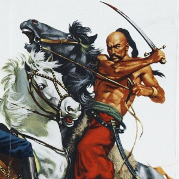
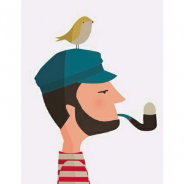

# hackthebox-writeups
Writeups for HacktheBox machines (boot2root) and challenges written in Spanish or English.  

https://www.hackthebox.eu/  

## Important notes about password protection
Machines writeups until 2020 March are protected with the corresponding root flag. But since this date, HTB flags are dynamic and different for every user, so is not possible for us to maintain this kind of system. So from now we will accept only password protected challenges, endgames, fortresses and retired machines (that machine write-ups don't need password). For endgames or fortresses, the password should be all the flags concatenated.

  

# Disclaimer

It is totally forbidden to unprotect (remove the password) and distribute the pdf files of active machines, if we detect any misuse will be reported immediately to the HTB admins.  
Anyway, all the authors of the writeups of active machines in this repository **are not responsible** for the misuse that can be given to the corresponding documents. Please think that this is done to share techniques not for spoilers.

# Submissions

If you want to incorporate your own writeup, notes, scripts or other material to solve the boot2root machines and challenges you can do it through a **'pull request'** or by sending us an email to: **hackplayers_at_Ymail.com**.

In this way, you will be added to our **top contributors list** (see below) and you will also receive an **invitation link to an exclusive Telegram group** where several hints (not spoilers) are discussed for the HacktheBox machines.  

Please consider **protecting the text of your writeup** (e.g. not allowing to be copied) so that it can not be easily shared on platforms such as Pastebin. Of course, if someone leaks a writeup of an active machine it is not the responsibility of the author. If we detect someone who does it, they will immediately report to the HTB Staff so they can take the appropriate measures.

Note: the minimum requirement to enter the "special" Telegram group is also to have a hacker level or higher (no script kiddies).  

# Star contributors (+5 writeups)

 No | ctry | nick | avatar | team | machines | challenges | total writeups
 --- | --- | --- | --- | --- | --- | --- | ---
1	|	  | Fiti |  | [L1k0rD3B3ll0t4](https://www.hackthebox.eu/home/teams/profile/149) |  [Bashed,](https://github.com/Hackplayers/hackthebox-writeups/blob/master/machines/Bashed/fiti-bashed.pdf) [Arctic,](https://github.com/Hackplayers/hackthebox-writeups/blob/master/machines/Arctic/fiti-arctic.pdf) [Tenten,](https://github.com/Hackplayers/hackthebox-writeups/blob/master/machines/Tenten/fiti-tenten.pdf) [Celestial,](https://github.com/Hackplayers/hackthebox-writeups/blob/master/machines/Celestial/fiti-celestial.pdf) [Mirai,](https://github.com/Hackplayers/hackthebox-writeups/blob/master/machines/Mirai/fiti-mirai.pdf) [Nibbles,](https://github.com/Hackplayers/hackthebox-writeups/blob/master/machines/Nibbles/fiti-nibbles.pdf) [Sunday,](https://github.com/Hackplayers/hackthebox-writeups/blob/master/machines/Sunday/fiti-sunday.pdf) [Valentine,](https://github.com/Hackplayers/hackthebox-writeups/blob/master/machines/Valentine/fiti-valentine.pdf) [Dev0ops, ](https://github.com/Hackplayers/hackthebox-writeups/blob/master/machines/DevOops/fiti-dev0ps.pdf) [Aragog, ](https://github.com/Hackplayers/hackthebox-writeups/blob/master/machines/Aragog/fiti-aragog.pdf)  [Canape, ](https://github.com/Hackplayers/hackthebox-writeups/blob/master/machines/Canape/fiti-canape.pdf) [Mischief, ](https://github.com/Hackplayers/hackthebox-writeups/blob/master/machines/Mischief/fiti-mischief.pdf) [Jerry, ](https://github.com/Hackplayers/hackthebox-writeups/blob/master/machines/Jerry/fiti-jerry.pdf) [Olympus, ](https://github.com/Hackplayers/hackthebox-writeups/blob/master/machines/Olympus/fiti-olympus.pdf)  [Bounty, ](https://github.com/Hackplayers/hackthebox-writeups/blob/master/machines/Bounty/fiti-bounty.pdf) [Access, ](https://github.com/Hackplayers/hackthebox-writeups/blob/master/machines/Access/fiti-access.pdf) [Carrier, ](https://github.com/Hackplayers/hackthebox-writeups/blob/master/machines/Carrier/fiti-carrier.pdf) [Curling, ](https://github.com/Hackplayers/hackthebox-writeups/blob/master/machines/Curling/fiti-curling.pdf) [Dab, ](https://github.com/Hackplayers/hackthebox-writeups/blob/master/machines/Dab/fiti-dab.pdf) [Ypuffy, ](https://github.com/Hackplayers/hackthebox-writeups/blob/master/machines/Ypuffy/fiti-ypuffy.pdf) [Waldo, ](https://github.com/Hackplayers/hackthebox-writeups/blob/master/machines/Waldo/fiti-waldo.pdf) [Secnotes, ](https://github.com/Hackplayers/hackthebox-writeups/blob/master/machines/Secnotes/fiti-secnotes.pdf) [Irked, ](https://github.com/Hackplayers/hackthebox-writeups/blob/master/machines/Irked/fiti-irked.pdf) [Frolic, ](https://github.com/Hackplayers/hackthebox-writeups/blob/master/machines/Frolic/fiti-frolic.pdf) [Chaos, ](https://github.com/Hackplayers/hackthebox-writeups/tree/master/machines/Chaos/fiti-chaos.pdf) [Fortune, ](https://github.com/Hackplayers/hackthebox-writeups/blob/master/machines/Fortune/fiti-fortune.pdf) [Friendzone, ](https://github.com/Hackplayers/hackthebox-writeups/blob/master/machines/Friendzone/fiti-Friendzone.pdf) [Lightweight, ](https://github.com/Hackplayers/hackthebox-writeups/blob/master/machines/Lightweight/fiti-Lightweight.pdf) [Querier, ](https://github.com/Hackplayers/hackthebox-writeups/blob/master/machines/Querier/fiti-Querier.pdf) [Help](https://github.com/Hackplayers/hackthebox-writeups/blob/master/machines/Help/fiti-Help.pdf) [Conceal, ](https://github.com/Hackplayers/hackthebox-writeups/blob/master/machines/Conceal/fiti-conceal.pdf) [CTF, ](https://github.com/Hackplayers/hackthebox-writeups/blob/master/machines/CTF/fiti-ctf.pdf) [Netmon, ](https://github.com/Hackplayers/hackthebox-writeups/blob/master/machines/Netmon/fiti-netmon.pdf) [Sizzle, ](https://github.com/Hackplayers/hackthebox-writeups/blob/master/machines/Sizzle/fiti-sizzle.pdf) [Arkham, ](https://github.com/Hackplayers/hackthebox-writeups/blob/master/machines/Arkham/fiti-arkham.pdf) [OneTwoSeven, ](https://github.com/Hackplayers/hackthebox-writeups/blob/master/machines/OneTwoSeven/fiti-onetwoseven.pdf) [LaCasaDePapel, ](https://github.com/Hackplayers/hackthebox-writeups/blob/master/machines/LaCasaDePapel/fiti-lacasadepapel.pdf) [Helpline, ](https://github.com/Hackplayers/hackthebox-writeups/blob/master/machines/Helpline/fiti-helpline.pdf) [Ghoul, ](https://github.com/Hackplayers/hackthebox-writeups/blob/master/machines/Ghoul/fiti-ghoul.pdf) [Bastion, ](https://github.com/Hackplayers/hackthebox-writeups/blob/master/machines/Bastion/fiti-bastion.pdf) [Swagshop, ](https://github.com/Hackplayers/hackthebox-writeups/blob/master/machines/Swagshop/fiti-swagshop.pdf) [Ellingson, ](https://github.com/Hackplayers/hackthebox-writeups/blob/master/machines/Ellingson/l1k0rd3b3ll0t4-ellingson.pdf) [Writeup, ](https://github.com/Hackplayers/hackthebox-writeups/blob/master/machines/writeup/fiti-writeup.pdf) [Chainsaw, ](https://github.com/Hackplayers/hackthebox-writeups/blob/master/machines/Chainsaw/fiti-Chainsaw.pdf) [Haystack, ](https://github.com/Hackplayers/hackthebox-writeups/blob/master/machines/Haystack/fiti-Haystack.pdf) [Jarvis, ](https://github.com/Hackplayers/hackthebox-writeups/blob/master/machines/Jarvis/fiti-Jarvis.pdf) [Player, ](https://github.com/Hackplayers/hackthebox-writeups/blob/master/machines/Player/fiti-Player.pdf) [Smasher2, ](https://github.com/Hackplayers/hackthebox-writeups/blob/master/machines/Smasher2/fiti-Smasher2.pdf) [Unattended, ](https://github.com/Hackplayers/hackthebox-writeups/blob/master/machines/Unattended/fiti-Unattended.pdf) [Kryptos](https://github.com/Hackplayers/hackthebox-writeups/blob/master/machines/Kriptos/fiti-Kryptos.pdf) | [Impossible password, ](https://github.com/Hackplayers/hackthebox-writeups/blob/master/challenges/reversing/Impossible_password/fiti-impossible-password.pdf) [Widescreen, ](https://github.com/Hackplayers/hackthebox-writeups/blob/master/challenges/stego/Widescreen/fiti-widescreen.pdf) [Unified, ](https://github.com/Hackplayers/hackthebox-writeups/blob/master/challenges/stego/Unified/fiti-unified.pdf) [Milkshake, ](https://github.com/Hackplayers/hackthebox-writeups/blob/master/challenges/stego/Milkshake/fiti-milkshake.pdf) [It's raining blood, ](https://github.com/Hackplayers/hackthebox-writeups/blob/master/challenges/stego/Raining%20Blood/fiti-Its_Raining_Blood.pdf) [Hackerman, ](https://github.com/Hackplayers/hackthebox-writeups/blob/master/challenges/stego/Hackerman/fiti-hackerman.pdf) [Forest, ](https://github.com/Hackplayers/hackthebox-writeups/blob/master/challenges/stego/Forest/fiti-forest.pdf) [Cartographer, ](https://github.com/Hackplayers/hackthebox-writeups/blob/master/challenges/web/cartographer/fiti-cartographer.pdf) [0ld is g0ld, ](https://github.com/Hackplayers/hackthebox-writeups/blob/master/challenges/misc/0ld_is_g0ld/fiti-0ld_is_g0ld.pdf) [HDC, ](https://github.com/Hackplayers/hackthebox-writeups/blob/master/challenges/web/HDC/fit-HDC.pdf) [Beatles, ](https://github.com/Hackplayers/hackthebox-writeups/blob/master/challenges/stego/Beatles/fiti-Beatles.pdf) [Brainy's Cipher, ](https://github.com/Hackplayers/hackthebox-writeups/blob/master/challenges/crypto/Brainy-s%20Cipher/fiti-BrainysCipher.pdf) [Classic Yet Complicated, ](https://github.com/Hackplayers/hackthebox-writeups/blob/master/challenges/crypto/Classic%20Yet%20Complicated/fiti-ClassicYetComplicated.pdf) [Da Vinci, ](https://github.com/Hackplayers/hackthebox-writeups/blob/master/challenges/stego/DaVinci/fiti-DaVinci.pdf) [Deceitful Batman, ](https://github.com/Hackplayers/hackthebox-writeups/blob/master/challenges/crypto/Deceitful_Batman/fiti-DeceitfulBatman.pdf) [Digital Cube, ](https://github.com/Hackplayers/hackthebox-writeups/blob/master/challenges/stego/Digital_Cube/fiti-DigitalCube.pdf) [Keys, ](https://github.com/Hackplayers/hackthebox-writeups/blob/master/challenges/crypto/Keys/fiti-Keys.pdf) [Lernaean, ](https://github.com/Hackplayers/hackthebox-writeups/blob/master/challenges/web/lernaean/fiti-Lernaean.pdf) [Pusheen Loves Graphs, ](https://github.com/Hackplayers/hackthebox-writeups/blob/master/challenges/stego/Pusheen%20Loves%20Graphs/icebreakcrypt-PusheenLovesGraphs.pdf) [Sick Teacher, ](https://github.com/Hackplayers/hackthebox-writeups/blob/master/challenges/crypto/SickTeacher/fiti-Sick-Teacher.pdf) [Weak RSA, ](https://github.com/Hackplayers/hackthebox-writeups/blob/master/challenges/crypto/Weak%20RSA/fiti-Weak-RSA.pdf) [Fuzzy, ](https://github.com/Hackplayers/hackthebox-writeups/blob/master/challenges/web/Fuzzy/fiti-fuzzy.pdf) [I Know Mag1k, ](https://github.com/Hackplayers/hackthebox-writeups/blob/master/challenges/web/iknowmag1k/fiti-I_know_mag1k.pdf) [Grammar](https://github.com/Hackplayers/hackthebox-writeups/blob/master/challenges/web/grammar/fiti-grammar.pdf) | 74 |
2	|	  | SirBroccoli |   | [Watch4Hack](https://www.hackthebox.eu/home/teams/profile/401) | [SwagShop, ](https://github.com/Hackplayers/hackthebox-writeups/blob/master/machines/SwagShop/SirBroccoli-SwagShop.pdf) [Jarvis, ](https://github.com/Hackplayers/hackthebox-writeups/blob/master/machines/Jarvis/SirBroccoli-Jarvis.pdf) [OneTwoSeven, ](https://github.com/Hackplayers/hackthebox-writeups/blob/master/machines/OneTwoSeven/SirBroccoli-OneTwoSeven.pdf) [Haystack, ](https://github.com/Hackplayers/hackthebox-writeups/blob/master/machines/Haystack/SirBroccoli%20-%20Haystack.pdf) [Heist, ](https://github.com/Hackplayers/hackthebox-writeups/blob/master/machines/Heist/SirBroccoli-Heist.pdf) [Bitlab, ](https://github.com/Hackplayers/hackthebox-writeups/blob/master/machines/Bitlab/SirBroccoli-Bitlab.pdf) [Wall, ](https://github.com/Hackplayers/hackthebox-writeups/blob/master/machines/Wall/SirBroccoli-Wall.pdf) [Bankrobber, ](https://github.com/Hackplayers/hackthebox-writeups/blob/master/machines/Bankrobber/SirBroccoli-Bankrobber.pdf) [Postman, ](https://github.com/Hackplayers/hackthebox-writeups/blob/master/machines/Postman/SirBroccoli-Postman.pdf) [Mango, ](https://github.com/Hackplayers/hackthebox-writeups/blob/master/machines/Mango/SirBroccoli-Mango.pdf) [AI, ](https://github.com/Hackplayers/hackthebox-writeups/blob/master/machines/AI/SirBroccoli-AI.pdf)  [Control, ](https://github.com/Hackplayers/hackthebox-writeups/blob/master/machines/Control/SirBroccoli-Control.pdf) [Obscurity, ](https://github.com/Hackplayers/hackthebox-writeups/blob/master/machines/Obscurity/SirBroccoli-Obscurity.pdf) [Registry, ](https://github.com/Hackplayers/hackthebox-writeups/blob/master/machines/Registry/SirBroccoli-Registry.pdf) [Resolute, ](https://github.com/Hackplayers/hackthebox-writeups/blob/master/machines/Resolute/SirBroccoli-Resolute.pdf) [Sniper, ](https://github.com/Hackplayers/hackthebox-writeups/blob/master/machines/Sniper/SirBroccoli-Sniper.pdf) [JSON, ](https://github.com/Hackplayers/hackthebox-writeups/blob/master/machines/Json/SirBroccoli-JSON.pdf) [OpenAdmin, ](https://github.com/Hackplayers/hackthebox-writeups/blob/master/machines/OpenAdmin/SirBroccoli-OpenAdmin.pdf) [Monteverde, ](https://github.com/Hackplayers/hackthebox-writeups/blob/master/machines/Monteverde/SirBroccoli-Monteverde.pdf) [Nest, ](https://github.com/Hackplayers/hackthebox-writeups/blob/master/machines/Nest/SirBroccoli-Nest.pdf) [Sauna, ](https://github.com/Hackplayers/hackthebox-writeups/blob/master/machines/Sauna/SirBroccoli-Sauna.pdf) [Book](https://github.com/Hackplayers/hackthebox-writeups/blob/master/machines/Book/SirBroccoli-Book.pdf) | [Emdee five for life, ](https://github.com/Hackplayers/hackthebox-writeups/blob/master/challenges/web/Emdee%20five%20for%20life/Sirbroccoli-Emdee%20five%20for%20life.pdf) [Craft, ](https://github.com/Hackplayers/hackthebox-writeups/blob/master/machines/Craft/SirBroccoli-Craft.pdf) [FreeLancer, ](https://github.com/Hackplayers/hackthebox-writeups/blob/master/challenges/web/Freelancer/SirBroccoli-FreeLancer.pdf) [Bombs landed, ](https://github.com/Hackplayers/hackthebox-writeups/blob/master/challenges/reversing/Bombs%20landed/SirBroccoli-Bombs%20Landed.pdf)[Eat the cake, ](https://github.com/Hackplayers/hackthebox-writeups/blob/master/challenges/reversing/Eat%20the%20cake/SirBroccoli-Eat%20the%20Cake.pdf)[Headache, ](https://github.com/Hackplayers/hackthebox-writeups/blob/master/challenges/reversing/Headache/SirBroccoli-Headache.pdf)[Find the secret flag, ](https://github.com/Hackplayers/hackthebox-writeups/blob/master/challenges/reversing/Find%20the%20secret%20flag/SirBroccoli-Find%20The%20Secret%20Flag.pdf)[Debugme, ](https://github.com/Hackplayers/hackthebox-writeups/blob/master/challenges/reversing/Debugme/SirBroccoli-Debugme.pdf)[Impossible password, ](https://github.com/Hackplayers/hackthebox-writeups/blob/master/challenges/reversing/Impossible_password/SirBroccoli-Impossible%20Password.pdf)[DSYM, ](https://github.com/Hackplayers/hackthebox-writeups/blob/master/challenges/reversing/DSYM/SirBroccoli-DSYM.pdf)[Snake, ](https://github.com/Hackplayers/hackthebox-writeups/blob/master/challenges/reversing/snake/SirBroccoli-Snake.pdf)[Find the easy pass, ](https://github.com/Hackplayers/hackthebox-writeups/blob/master/challenges/reversing/Find_the_easy_pass/SirBroccoli-Find%20The%20Easy%20Pass.pdf)[Obscure, ](https://github.com/Hackplayers/hackthebox-writeups/blob/master/challenges/forensics/SirBroccoli-Obscure.pdf)  [Crooked crockford, ](https://github.com/Hackplayers/hackthebox-writeups/blob/master/challenges/misc/Crooked%20Crockford/SirBroccoli-Crooked%20crockford.pdf) [ExploitedStream, ](https://github.com/Hackplayers/hackthebox-writeups/blob/master/challenges/ExploitedStream/Crooked%20Crockford/SirBroccoli%20-%20ExploitedStream.pdf) [Ropme, ](https://github.com/Hackplayers/hackthebox-writeups/blob/master/challenges/pwn/ropme/SirBroccoli%20-%20Ropme.pdf) [Old Bridge, ](https://github.com/Hackplayers/hackthebox-writeups/blob/master/challenges/pwn/old_bridge/SirBroccoli%20-%20Old%20Bridge.pdf) [Little Tommy, ](https://github.com/Hackplayers/hackthebox-writeups/blob/master/challenges/pwn/Little%20Tommy/SirBroccoli%20-%20Little%20Tommy.pdf) [Ropmev2, ](https://github.com/Hackplayers/hackthebox-writeups/blob/master/challenges/pwn/ropmev2/SirBroccoli%20-%20Ropmev2.pdf) [Baby RE, ](https://github.com/Hackplayers/hackthebox-writeups/blob/master/challenges/reversing/Baby%20RE/SirBroccoli%20-%20Baby%20RE.pdf) [headache2, ](https://github.com/Hackplayers/hackthebox-writeups/blob/master/challenges/reversing/headache2/SirBroccoli%20-%20Headache2.pdf) [Breach, ](https://github.com/Hackplayers/hackthebox-writeups/blob/master/challenges/OSINT/Breach/SirBroccoli-Breach.pdf) [Easy Phish, ](https://github.com/Hackplayers/hackthebox-writeups/blob/master/challenges/OSINT/Easy%20Phish/SirBroccoli-Easy%20Phish.pdf) [Infiltration, ](https://github.com/Hackplayers/hackthebox-writeups/blob/master/challenges/OSINT/Infiltration/SirBroccoli-Infiltration.pdf) [We Have a Leak, ](https://github.com/Hackplayers/hackthebox-writeups/blob/master/challenges/OSINT/We%20Have%20a%20Leak/SirBroccoli-We%20Have%20a%20Leak.pdf) [Cryptohorrific, ](https://github.com/Hackplayers/hackthebox-writeups/blob/master/challenges/mobile/SirBroccoli-Cryptohorrific.pdf) [Da Vinci, ](https://github.com/Hackplayers/hackthebox-writeups/blob/master/challenges/stego/DaVinci/SirBroccoli-Da%20Vinci.pdf) [Digital Cube, ](https://github.com/Hackplayers/hackthebox-writeups/blob/master/challenges/stego/Digital_Cube/SirBroccoli-Digital%20Cube.pdf) [Forest, ](https://github.com/Hackplayers/hackthebox-writeups/blob/master/challenges/stego/Forest/SirBroccoli-Forest.pdf) [Pusheen Loves Graphs, ](https://github.com/Hackplayers/hackthebox-writeups/blob/master/challenges/stego/Pusheen%20Loves%20Graphs/SirBroccoli-Pusheen%20Loves%20Graphs.pdf) [Senseless Behaviour, ](https://github.com/Hackplayers/hackthebox-writeups/blob/master/challenges/stego/Senseless_Behaviour/SirBroccoli-Senseless%20Behaviour.pdf) [Templed, ](https://github.com/Hackplayers/hackthebox-writeups/blob/master/challenges/crypto/Templed/SirBroccoli-Templed.pdf) [M0rsarchive, ](https://github.com/Hackplayers/hackthebox-writeups/blob/master/challenges/misc/M0rsarchive/SirBroccoli-M0rsarchive.pdf) [Interdimensional Internet, ](https://github.com/Hackplayers/hackthebox-writeups/blob/master/challenges/web/Interdimensional%20Internet/SirBroccoli-Interdimensional%20Internet.pdf) [ezpz, ](https://github.com/Hackplayers/hackthebox-writeups/blob/master/challenges/web/ezpz/SirBroccoli-EZPZ.pdf) [Under Construction, ](https://github.com/Hackplayers/hackthebox-writeups/blob/master/challenges/web/Under%20Construction/SirBroccoli-Under%20Construction.pdf) | 58 |
3 |  | noraj |  | [Rawsec](https://www.hackthebox.eu/home/teams/profile/638) | [Academy][noraj-Academy], [Admirer][noraj-Admirer], [Blackfield][noraj-Blackfield], [Blunder][noraj-Blunder], [Book][noraj-Book], [Buff][noraj-Buff], [Cache][noraj-Cache], [Cascade][noraj-Cascade], [Control][noraj-Control], [Doctor][noraj-Doctor], [Dyplesher][noraj-Dyplesher], [Fatty][noraj-Fatty], [ForwardSlash][noraj-ForwardSlash], [Jewel][noraj-Jewel], [Laboratory][noraj-Laboratory], [Magic][noraj-Magic], [Mango][noraj-Mango], [Monteverde][noraj-Monteverde], [Nest][noraj-Nest], [Obscurity][noraj-Obscurity], [Omni][noraj-Omni], [Oouch][noraj-Oouch], [OpenAdmin][noraj-OpenAdmin], [Passage][noraj-Passage], [Remote][noraj-Remote], [Resolute][noraj-Resolute], [ServMon][noraj-ServMon], [SneakyMailer][noraj-SneakyMailer], [Tabby][noraj-Tabby], [Traceback][noraj-Traceback], [Traverxec][noraj-Traverxec], [Worker][noraj-Worker] | | 32
4		|  | crysal |   | [SKPH4X](https://www.hackthebox.eu/home/teams/profile/1135) | [Bastion,](https://github.com/Hackplayers/hackthebox-writeups/blob/master/machines/Bastion/Crysal0_Bastion.pdf) [Writeup,](https://github.com/Hackplayers/hackthebox-writeups/blob/master/machines/writeup/Crysal0_writeup.pdf) [SwagShop](https://github.com/Hackplayers/hackthebox-writeups/blob/master/machines/SwagShop/Crysal0_SwagShop.pdf) | [Find the easy pass, ](https://github.com/Hackplayers/hackthebox-writeups/blob/master/challenges/reversing/Find_the_easy_pass/Crysal0_FindTheEasyPass.pdf) [snake, ](https://github.com/Hackplayers/hackthebox-writeups/blob/master/challenges/reversing/snake/Crysal0_snake.pdf) [Da Vinci, ](https://github.com/Hackplayers/hackthebox-writeups/tree/master/challenges/stego/DaVinci/Crysal0_Da_Vinci.pdf) [Beatles, ](https://github.com/Hackplayers/hackthebox-writeups/tree/master/challenges/stego/Beatles/Crysal0_Beatles.pdf) [BitsNBytes, ](https://github.com/Hackplayers/hackthebox-writeups/tree/master/challenges/stego/BitsNBytes/Crysal0_BitsNBytes.pdf) [Forest, ](https://github.com/Hackplayers/hackthebox-writeups/tree/master/challenges/stego/Forest/Crysal0_Forest.pdf) [hackerman, ](https://github.com/Hackplayers/hackthebox-writeups/tree/master/challenges/stego/Hackerman/Crysal0_hackerman.pdf) [Hidden in Colors, ](https://github.com/Hackplayers/hackthebox-writeups/tree/master/challenges/stego/Hidden%20in%20Colors/Crysal0_Hidden_in_Colors.pdf) [Milkshake, ](https://github.com/Hackplayers/hackthebox-writeups/tree/master/challenges/stego/Milkshake/Crysal0_MilkShake.pdf) [Monstrosity, ](https://github.com/Hackplayers/hackthebox-writeups/tree/master/challenges/stego/Monstrosity/Crysal0_Monstrosity.pdf) [Raining Blood, ](https://github.com/Hackplayers/hackthebox-writeups/tree/master/challenges/stego/Raining%20Blood/Crysal0_Raining_Blood.pdf) [Retro, ](https://github.com/Hackplayers/hackthebox-writeups/tree/master/challenges/stego/Retro/Crysal0_Retro.pdf) [Widescreen, ](https://github.com/Hackplayers/hackthebox-writeups/tree/master/challenges/stego/Widescreen/Crysal0_widescreen.pdf) [Digital Cube, ](https://github.com/Hackplayers/hackthebox-writeups/tree/master/challenges/stego/Digital_Cube/Crysal0_Digital_Cube.pdf) [Pusheen Loves Graphs, ](https://github.com/Hackplayers/hackthebox-writeups/tree/master/challenges/stego/Pusheen%20Loves%20Graphs/Crysal0_Pusheen_Loves_Graphs.pdf) [0ld is g0ld, ](https://github.com/Hackplayers/hackthebox-writeups/blob/master/challenges/misc/0ld_is_g0ld/Crysal0_0ld_is_g0ld.pdf) [Eternal loop, ](https://github.com/Hackplayers/hackthebox-writeups/blob/master/challenges/misc/Eternal_Loop/Crysal0_Eternal_Loop.pdf) [Blackhole, ](https://github.com/Hackplayers/hackthebox-writeups/blob/master/challenges/misc/Blackhole/Crysal0_Blackhole.pdf) [misDIRection, ](https://github.com/Hackplayers/hackthebox-writeups/blob/master/challenges/misc/misDIRection/Crysal0_misDIRection.pdf) [fs0ciety, ](https://github.com/Hackplayers/hackthebox-writeups/blob/master/challenges/misc/fs0ciety/Crysal0_fs0ciety.pdf) [Longbottoms Locker, ](https://github.com/Hackplayers/hackthebox-writeups/blob/master/challenges/misc/Longbottom-s%20Locker/Crysal0_Longbottoms_Locker.pdf) [Inferno, ](https://github.com/Hackplayers/hackthebox-writeups/blob/master/challenges/misc/Inferno/Crysal0_Inferno.pdf) [Grammar, ](https://github.com/Hackplayers/hackthebox-writeups/blob/master/challenges/web/grammar/Crysal0_Grammar.pdf) [I know Mag1k, ](https://github.com/Hackplayers/hackthebox-writeups/blob/master/challenges/web/iknowmag1k/Crysal0_I_know_Mag1k.pdf) [M0rsarchive, ](https://github.com/Hackplayers/hackthebox-writeups/blob/master/challenges/misc/M0rsarchive/Crysal0_M0rsArchive.pdf) [Money Flowz, ](https://github.com/Hackplayers/hackthebox-writeups/blob/master/challenges/OSINT/Money_Flowz/Crysal0_Money_Flowz.pdf) [cat](https://github.com/Hackplayers/hackthebox-writeups/blob/master/challenges/mobile/Crysal0_cat.pdf) |	  30 |
5	|	  | volken |   | [SinHack](https://www.hackthebox.eu/home/teams/profile/1313) | [Poison, ](https://github.com/Hackplayers/hackthebox-writeups/blob/master/machines/Poison/volken-poison.pdf) [Jerry, ](https://github.com/Hackplayers/hackthebox-writeups/blob/master/machines/Jerry/volken-jerry.pdf) [Curling, ](https://github.com/Hackplayers/hackthebox-writeups/blob/master/machines/Curling/volken-curling.pdf) [Help, ](https://github.com/Hackplayers/hackthebox-writeups/blob/master/machines/Help/volken-help-unintendedway.pdf) [Irked, ](https://github.com/Hackplayers/hackthebox-writeups/blob/master/machines/Irked/volken-irked.pdf) [Popcorn](https://github.com/Hackplayers/hackthebox-writeups/blob/master/machines/Popcorn/volken-popcorn.pdf) | [0ld is g0ld, ](https://github.com/Hackplayers/hackthebox-writeups/blob/master/challenges/misc/0ld_is_g0ld/volken-0ld-is-g0ld.pdf) [Blackhole, ](https://github.com/Hackplayers/hackthebox-writeups/blob/master/challenges/misc/Blackhole/volken-blackhole.pdf) [fs0ciety, ](https://github.com/Hackplayers/hackthebox-writeups/blob/master/challenges/misc/fs0ciety/volken-fsociety.pdf) [Art, ](https://github.com/Hackplayers/hackthebox-writeups/blob/master/challenges/misc/Art/volken-art.pdf) [Inferno, ](https://github.com/Hackplayers/hackthebox-writeups/blob/master/challenges/misc/Inferno/volken-inferno.pdf) [misDIRection, ](https://github.com/Hackplayers/hackthebox-writeups/blob/master/challenges/misc/misDIRection/volken-misDIRection.pdf)[Eternal Loop, ](https://github.com/Hackplayers/hackthebox-writeups/blob/master/challenges/misc/Eternal_Loop/volken-Eternal%20Loop.zip) [Longbottom's Locker, ](https://github.com/Hackplayers/hackthebox-writeups/blob/master/challenges/misc/Longbottom-s%20Locker/volken-Longbottom's%20Locker.zip) [Hackerman, ](https://github.com/Hackplayers/hackthebox-writeups/blob/master/challenges/stego/Hackerman/volken-hackerman.pdf) [Raining Blood, ](https://github.com/Hackplayers/hackthebox-writeups/blob/master/challenges/stego/Raining%20Blood/volken-RainingBlood.pdf) [Unified, ](https://github.com/Hackplayers/hackthebox-writeups/blob/master/challenges/stego/Unified/volken-unified.pdf) [Brainy's cipher, ](https://github.com/Hackplayers/hackthebox-writeups/blob/master/challenges/crypto/Brainy-s%20Cipher/volken-brainys_cipher.pdf) [Da Vinci, ](https://github.com/Hackplayers/hackthebox-writeups/blob/master/challenges/stego/DaVinci/volken-Da_vinci.pdf) [Deceiful Batman, ](https://github.com/Hackplayers/hackthebox-writeups/blob/master/challenges/crypto/Deceitful_Batman/volken-deceiful_batman.pdf) [Forest, ](https://github.com/Hackplayers/hackthebox-writeups/blob/master/challenges/stego/Forest/volken-forest.pdf) [HDC, ](https://github.com/Hackplayers/hackthebox-writeups/blob/master/challenges/web/HDC/volken-hdc.pdf) [Marshal in the Middle, ](https://github.com/Hackplayers/hackthebox-writeups/blob/master/challenges/forensics/volken-marshal_in_the_middle.pdf) [Weak RSA, ](https://github.com/Hackplayers/hackthebox-writeups/blob/master/challenges/crypto/Weak%20RSA/volken-weak_rsa.pdf) [Keys, ](https://github.com/Hackplayers/hackthebox-writeups/blob/master/challenges/crypto/Keys/volken-keys.pdf) [Retro](https://github.com/Hackplayers/hackthebox-writeups/blob/master/challenges/stego/Retro/volken-retro.pdf)|	26 |  
6 |  | FlatMarsSociet |  | Solitaire wolf | [Bastion](https://github.com/Hackplayers/hackthebox-writeups/blob/master/machines/Bastion/hackthebox-bastion.pdf), [Networked](https://github.com/Hackplayers/hackthebox-writeups/blob/master/machines/Networked/hackthebox-networked.pdf), [Writeup](https://github.com/Hackplayers/hackthebox-writeups/blob/master/machines/writeup/hackthebox-writeup.pdf), [Traverxec](https://github.com/Hackplayers/hackthebox-writeups/blob/master/machines/writeup/hackthebox-traverxec.pdf), [Sauna](https://github.com/Hackplayers/hackthebox-writeups/blob/master/machines/Sauna/FlatMarsSociet-hackthebox-sauna.pdf), [OpenAdmin](https://github.com/Hackplayers/hackthebox-writeups/blob/master/machines/OpenAdmin/FlatMarsSociet-hackthebox-openadmin.pdf), [Nest](https://github.com/Hackplayers/hackthebox-writeups/blob/master/machines/Nest/FlatMarsSociet-hackthebox-nest.pdf) | [Easy Phish](https://github.com/Hackplayers/hackthebox-writeups/blob/master/challenges/OSINT/Easy%20Phish/hackthebox-easyphish.pdf), [Infiltration](https://github.com/Hackplayers/hackthebox-writeups/blob/master/challenges/OSINT/Infiltration/hackthebox-infiltration.pdf), [0ld is g0ld](https://github.com/Hackplayers/hackthebox-writeups/blob/master/challenges/misc/0ld_is_g0ld/hackthebox-0ldisg0ld.pdf), [Art](https://github.com/Hackplayers/hackthebox-writeups/blob/master/challenges/misc/Art/hackthebox-art.pdf), [Blackhole](https://github.com/Hackplayers/hackthebox-writeups/blob/master/challenges/misc/Blackhole/hackthebox-blackhole.pdf), [Croocked Crockford](https://github.com/Hackplayers/hackthebox-writeups/blob/master/challenges/misc/Crooked%20Crockford/hackthebox-crookedcrockford.pdf), [Eternal_Loop](https://github.com/Hackplayers/hackthebox-writeups/blob/master/challenges/misc/Eternal_Loop/hackthebox-eternalloop.pdf), [Inferno](https://github.com/Hackplayers/hackthebox-writeups/blob/master/challenges/misc/Inferno/hackthebox-inferno.pdf), [Longbottom's Locker](https://github.com/Hackplayers/hackthebox-writeups/blob/master/challenges/misc/Longbottom-s%20Locker/hackthebox-longbottomslocker.pdf), [M0sarchive](https://github.com/Hackplayers/hackthebox-writeups/blob/master/challenges/misc/M0rsarchive/hackthebox-m0rsarchive.pdf), [fs0ciety](https://github.com/Hackplayers/hackthebox-writeups/blob/master/challenges/misc/fs0ciety/hackthebox-fs0ciety.pdf), [misDIRection](https://github.com/Hackplayers/hackthebox-writeups/blob/master/challenges/misc/misDIRection/hackthebox-misdirection.pdf), [Emdee five for life](https://github.com/Hackplayers/hackthebox-writeups/blob/master/challenges/web/Emdee%20five%20for%20life/hackthebox-emdeefiveforlife.pdf), [Fuzzy](https://github.com/Hackplayers/hackthebox-writeups/blob/master/challenges/web/Fuzzy/hackthebox-fuzzy.pdf), [Cartographer](https://github.com/Hackplayers/hackthebox-writeups/blob/master/challenges/web/cartographer/hackthebox-cartographer.pdf), [iknowmag1k](https://github.com/Hackplayers/hackthebox-writeups/blob/master/challenges/web/iknowmag1k/hackthebox-iknowmag1k.pdf), [Lernaean](https://github.com/Hackplayers/hackthebox-writeups/blob/master/challenges/web/lernaean/hackthebox-lernaean.pdf), [Freelancer](https://github.com/Hackplayers/hackthebox-writeups/blob/master/challenges/web/freelancer/hackthebox-freelancer.pdf) | 25
7 |  | kaosam |  | [CameLUG](https://www.hackthebox.eu/home/teams/profile/2125) | [Obscurity, ](https://github.com/Hackplayers/hackthebox-writeups/blob/master/machines/Obscurity/kaosam-Obscurity.pdf) [Postman, ](https://github.com/Hackplayers/hackthebox-writeups/blob/master/machines/Postman/kaosam-Postman.pdf) [Openadmin, ](https://github.com/Hackplayers/hackthebox-writeups/blob/master/machines/OpenAdmin/kaosam-Openadmin.pdf) [Sauna, ](https://github.com/Hackplayers/hackthebox-writeups/blob/master/machines/Sauna/kaosam-Sauna.pdf) [Resolute, ](https://github.com/Hackplayers/hackthebox-writeups/blob/master/machines/Resolute/kaosam-Resolute.pdf) [Book, ](https://github.com/Hackplayers/hackthebox-writeups/blob/master/machines/Book/kaosam-Book.pdf) [Forest, ](https://github.com/Hackplayers/hackthebox-writeups/blob/master/machines/Forest/kaosam-Forest.pdf) [Registry, ](https://github.com/Hackplayers/hackthebox-writeups/blob/master/machines/Registry/kaosam-Registry.pdf) [Nest, ](https://github.com/Hackplayers/hackthebox-writeups/blob/master/machines/Nest/kaosam-Nest.pdf) [Control, ](https://github.com/Hackplayers/hackthebox-writeups/blob/master/machines/Control/kaosam-Control.pdf) [Sniper, ](https://github.com/Hackplayers/hackthebox-writeups/blob/master/machines/Sniper/kaosam-Sniper.pdf) [Traceback, ](https://github.com/Hackplayers/hackthebox-writeups/blob/master/machines/Traceback/kaosam-Traceback.pdf) [Traverxec, ](https://github.com/Hackplayers/hackthebox-writeups/blob/master/machines/Traverxec/kaosam-Traverxec.pdf) [Mango, ](https://github.com/Hackplayers/hackthebox-writeups/blob/master/machines/Mango/kaosam-Mango.pdf) [Servmon, ](https://github.com/Hackplayers/hackthebox-writeups/blob/master/machines/Servmon/kaosam-Servmon.pdf) [Cascade, ](https://github.com/Hackplayers/hackthebox-writeups/blob/master/machines/Cascade/kaosam-Cascade.pdf) [Magic, ](https://github.com/Hackplayers/hackthebox-writeups/blob/master/machines/Magic/kaosam-Magic.pdf) [Remote, ](https://github.com/Hackplayers/hackthebox-writeups/blob/master/machines/Remote/kaosam-Remote.pdf) [Blunder, ](https://github.com/Hackplayers/hackthebox-writeups/blob/master/machines/Blunder/kaosam-Blunder.pdf) [Buff, ](https://github.com/Hackplayers/hackthebox-writeups/blob/master/machines/Buff/kaosam-Buff.pdf) [Doctor, ](https://github.com/Hackplayers/hackthebox-writeups/blob/master/machines/Doctor/kaosam-Doctor.pdf) [APT, ](https://github.com/Hackplayers/hackthebox-writeups/blob/master/machines/APT/kaosam-apt.pdf) [Laboratory](https://github.com/Hackplayers/hackthebox-writeups/blob/master/machines/Laboratory/Kaosam-Laboratory.pdf) | | 23 |
8		|  | icebreakcrypt |   | Solitaire wolf | | [Massacre, ](https://github.com/Hackplayers/hackthebox-writeups/blob/master/challenges/stego/Massacre/icebreakcrypt-massacre.pdf) [Brainy's Cipher, ](https://github.com/Hackplayers/hackthebox-writeups/blob/master/challenges/crypto/Brainy-s%20Cipher/icebreakcrypt-Brainy's%20Cipher.pdf) [Widescreen, ](https://github.com/Hackplayers/hackthebox-writeups/blob/master/challenges/stego/Widescreen/Icebreakcrypt-widescreen.pdf) [Blackhole, ](https://github.com/Hackplayers/hackthebox-writeups/blob/master/challenges/misc/Blackhole/Icebreakcrypt-Blackhole.pdf) [Pusheen Loves Graphs, ](https://github.com/Hackplayers/hackthebox-writeups/blob/master/challenges/stego/Pusheen%20Loves%20Graphs/icebreakcrypt-PusheenLovesGraphs.pdf) [Milkshake, ](https://github.com/Hackplayers/hackthebox-writeups/blob/master/challenges/stego/Milkshake/icebreakcrypt-Milkshake.pdf) [Raining blood, ](https://github.com/Hackplayers/hackthebox-writeups/blob/master/challenges/stego/Raining%20Blood/icebreakcrypt-rainingblood.pdf)  [The Future Bender, ](https://github.com/Hackplayers/hackthebox-writeups/blob/master/challenges/stego/TheFutureBender/icebreakcrypt-TheFutureBender.pdf) [Decode me, ](https://github.com/Hackplayers/hackthebox-writeups/blob/master/challenges/crypto/Decode%20me/icebreakcrypt-decodeme.pdf) [Baby RE, ](https://github.com/Hackplayers/hackthebox-writeups/blob/master/challenges/reversing/Baby%20RE/icebreakcrypt-BabyRE.pdf) [Illumination, ](https://github.com/Hackplayers/hackthebox-writeups/blob/master/challenges/forensics/icebreakcrypt-Illumination.pdf) [Walzer, ](https://github.com/Hackplayers/hackthebox-writeups/blob/master/challenges/crypto/Walzer/icebreakcrypt-Walzer.pdf) [Window's Infinity Edge](https://github.com/Hackplayers/hackthebox-writeups/blob/master/challenges/forensics/Icebreak-Window's%20Infinity%20Edge.pdf)  | 19 |
9 |	  | drx51 |   | solitaire wolf | [Celestial,](https://github.com/Hackplayers/hackthebox-writeups/blob/master/machines/Celestial/drx51-celestial.pdf) [Dev0ops,](https://github.com/Hackplayers/hackthebox-writeups/blob/master/machines/DevOops/drx51-dev0ops.pdf) [Nibbles,](https://github.com/Hackplayers/hackthebox-writeups/blob/master/machines/Nibbles/drx51-nibbles.pdf) [Shocker,](https://github.com/Hackplayers/hackthebox-writeups/blob/master/machines/Shocker/drx51-shocker.pdf) [Valentine,](https://github.com/Hackplayers/hackthebox-writeups/blob/master/machines/Valentine/drx51-valentine.pdf) [Bashed,](https://github.com/Hackplayers/hackthebox-writeups/blob/master/machines/Bashed/drx51-bashed.pdf) [Chatterbox,](https://github.com/Hackplayers/hackthebox-writeups/blob/master/machines/Chatterbox/drx51-chatterbox.pdf) [Jerry,](https://github.com/Hackplayers/hackthebox-writeups/blob/master/machines/Jerry/drx51-jerry.pdf) [Canape,](https://github.com/Hackplayers/hackthebox-writeups/blob/master/machines/Canape/drx51-canape.pdf) [Sense,](https://github.com/Hackplayers/hackthebox-writeups/blob/master/machines/Sense/drx51-sense.pdf) [Silo, ](https://github.com/Hackplayers/hackthebox-writeups/blob/master/machines/Silo/drx51-silo.pdf) [Active, ](https://github.com/Hackplayers/hackthebox-writeups/blob/master/machines/Active/drx51-active.pdf) [Waldo, ](https://github.com/Hackplayers/hackthebox-writeups/blob/master/machines/Waldo/drx51-waldo.pdf) [Mischief, ](https://github.com/Hackplayers/hackthebox-writeups/blob/master/machines/Mischief/drx51-mischief.pdf) [Stratosphere, ](https://github.com/Hackplayers/hackthebox-writeups/blob/master/machines/Stratosphere/drx51-stratosphere.pdf) [Poison, ](https://github.com/Hackplayers/hackthebox-writeups/blob/master/machines/Poison/drx51-poison.pdf) [Olympus, ](https://github.com/Hackplayers/hackthebox-writeups/blob/master/machines/Olympus/drx51-olympus.pdf) [Tartarsauce](https://github.com/Hackplayers/hackthebox-writeups/blob/master/machines/TartarSauce/drx51-tartarsauce.pdf) ||18|	  
10	|	  | wilsonnkwan |   | [CyberFrenzy](https://www.hackthebox.eu/home/teams/profile/1709) | [Ethereal, ](https://github.com/Hackplayers/hackthebox-writeups/blob/master/machines/Ethereal/wilsonnkwan%20-%20Ethereal.pdf) [Arkham (coauthor mmb), ](https://github.com/Hackplayers/hackthebox-writeups/blob/master/machines/Arkham/wilsonnkwan-arkham.pdf) [OneTwoSeven, ](https://github.com/Hackplayers/hackthebox-writeups/blob/master/machines/OneTwoSeven/Wilson-OneTwoSeven.pdf) [Bastion, ](https://github.com/Hackplayers/hackthebox-writeups/blob/master/machines/Bastion/Wilson-Bastion.pdf) [SwagShop, ](https://github.com/Hackplayers/hackthebox-writeups/blob/master/machines/SwagShop/wilsonnkwan-SwagShop.pdf) [Lacasadepapel, ](https://github.com/Hackplayers/hackthebox-writeups/blob/master/machines/LaCasaDePapel/wilsonnkwan-Lacasadepapel.pdf) [Ellingson, ](https://github.com/Hackplayers/hackthebox-writeups/blob/master/machines/Ellingson/wilsonnkwan-Ellingson.pdf) [Luke, ](https://github.com/Hackplayers/hackthebox-writeups/blob/master/machines/Luke/wilsonnkwan-Luke.pdf) [Kryptos, ](https://github.com/Hackplayers/hackthebox-writeups/blob/master/machines/Kriptos/wilsonnkwan-Kryptos.pdf) [Smasher2, ](https://github.com/Hackplayers/hackthebox-writeups/blob/master/machines/Smasher2/wilsonnkwan-Smasher2.pdf) [Ghoul, ](https://github.com/Hackplayers/hackthebox-writeups/blob/master/machines/Ghoul/wilsonnkwan-Ghoul.pdf) [Unattended, ](https://github.com/Hackplayers/hackthebox-writeups/blob/master/machines/Unattended/wilsonnkwan-Unattended.pdf) [Craft](https://github.com/Hackplayers/hackthebox-writeups/blob/master/machines/Craft/wilsonnkwan-Craft.pdf)| |	 13 |
11	|	  | 1v4n |   | solitaire wolf | [Olympus, ](https://github.com/Hackplayers/hackthebox-writeups/blob/master/machines/Olympus/1v4n-olympus.pdf) [Jerry, ](https://github.com/Hackplayers/hackthebox-writeups/blob/master/machines/Jerry/1v4n-jerry.pdf) [Curling, ](https://github.com/Hackplayers/hackthebox-writeups/blob/master/machines/Curling/1v4n-curling.pdf) [Netmon](https://github.com/Hackplayers/hackthebox-writeups/blob/master/machines/Netmon/1v4n-netmon.pdf) | [Da Vinci, ](https://github.com/Hackplayers/hackthebox-writeups/blob/master/challenges/stego/DaVinci/1v4n-davinci.pdf) [Hackerman, ](https://github.com/Hackplayers/hackthebox-writeups/blob/master/challenges/stego/Hackerman/1v4n-Hackerman.pdf) [Forest, ](https://github.com/Hackplayers/hackthebox-writeups/blob/master/challenges/stego/Forest/1v4n-forest.pdf) [fs0ciety, ](https://github.com/Hackplayers/hackthebox-writeups/blob/master/challenges/misc/fs0ciety/fs0ciety-1v4n.pdf) [Weak RSA, ](https://github.com/Hackplayers/hackthebox-writeups/blob/master/challenges/crypto/Weak%20RSA/1v4n-weak_rsa.pdf) [Unified, ](https://github.com/Hackplayers/hackthebox-writeups/blob/master/challenges/stego/Unified/1v4n-unified.pdf) [SickTeacher, ](https://github.com/Hackplayers/hackthebox-writeups/blob/master/challenges/crypto/SickTeacher/1v4n-SickTeacher.pdf) [Milkshake, ](https://github.com/Hackplayers/hackthebox-writeups/blob/master/challenges/stego/Milkshake/1v4n-milkshake.pdf) [Easy Phis](https://github.com/Hackplayers/hackthebox-writeups/blob/master/challenges/OSINT/Easy%20Phish/1v4n-Easy%20Phis.pdf) |	 13 |
12	|	  | IceL0rd |   | [BirdsArentReal](https://www.hackthebox.eu/home/teams/profile/1709) | [Arkham, ](https://github.com/Hackplayers/hackthebox-writeups/blob/master/machines/Arkham/IceL0rd-Arkham.pdf)[Fordwardslash, ](https://github.com/Hackplayers/hackthebox-writeups/blob/master/machines/ForwardSlash/IceL0rd-Fordwardslash.pdf)[Tenten, ](https://github.com/Hackplayers/hackthebox-writeups/blob/master/machines/Tenten/IceL0rd-Tenten.pdf)[Valentine, ](https://github.com/Hackplayers/hackthebox-writeups/blob/master/machines/Valentine/IceL0rd-Valentine.pdf)[Blackfield, ](https://github.com/Hackplayers/hackthebox-writeups/blob/master/machines/Blackfield/IceL0rd-Blackfield.pdf)[Fuse, ](https://github.com/Hackplayers/hackthebox-writeups/blob/master/machines/Fuse/IceL0rd-Fuse.pdf)[Cache, ](https://github.com/Hackplayers/hackthebox-writeups/blob/master/machines/Cache/IceL0rd-Cache.pdf)[Apocalyst, ](https://github.com/Hackplayers/hackthebox-writeups/blob/master/machines/Apocalyst/IceL0rd-Apocalyst.pdf)[Cronos, ](https://github.com/Hackplayers/hackthebox-writeups/blob/master/machines/Cronos/IceL0rd-Cronos.pdf)[Bank, ](https://github.com/Hackplayers/hackthebox-writeups/blob/master/machines/Bank/IceL0rd-Bank.pdf)[Poison, ](https://github.com/Hackplayers/hackthebox-writeups/blob/master/machines/Poison/IceL0rd-Poison.pdf)[Blunder](https://github.com/Hackplayers/hackthebox-writeups/blob/master/machines/Blunder/IceL0rd-Blunder.pdf) | | 13 |
13  |  | Qarnix |  | [Hacky](https://www.hackthebox.eu/home/teams/profile/1958) | [Craft, ](https://github.com/Hackplayers/hackthebox-writeups/blob/master/machines/Craft/Craft-Writeup-Qarnix.pdf) [Sniper, ](https://github.com/Hackplayers/hackthebox-writeups/blob/master/machines/Sniper/Sniper-Writeup-Qarnix.pdf) [Traverxec, ](https://github.com/Hackplayers/hackthebox-writeups/blob/master/machines/Traverxec/Traverxec-Writeup-Qarnix.pdf) [Worker, ](https://github.com/Hackplayers/hackthebox-writeups/blob/master/machines/Worker/Worker-Writeup-Qarnix.pdf) [Doctor](https://github.com/Hackplayers/hackthebox-writeups/blob/master/machines/Doctor/Doctor-Writeup-Qarnix.pdf) | [Easy Phish, ](https://github.com/Hackplayers/hackthebox-writeups/blob/master/challenges/OSINT/Easy%20Phish/Easy-Phish-Writeup-Qarnix.pdf) [Infiltration, ](https://github.com/Hackplayers/hackthebox-writeups/blob/master/challenges/OSINT/Infiltration/Infiltration-Writeup-Qarnix.pdf) [We Have a Leak, ](https://github.com/Hackplayers/hackthebox-writeups/blob/master/challenges/OSINT/We%20Have%20a%20Leak/We-Have-a-Leak-Writeup-Qarnix.pdf) [Breach, ](https://github.com/Hackplayers/hackthebox-writeups/blob/master/challenges/OSINT/Breach/Breach-Writeup-Qarnix.pdf) [Bank Heist, ](https://github.com/Hackplayers/hackthebox-writeups/blob/master/challenges/crypto/Bank%20Heist/Bank-Heist-Writeup-Qarnix.pdf) [USB-Ripper, ](https://github.com/Hackplayers/hackthebox-writeups/blob/master/challenges/forensics/USB-Ripper-Writeup-Qarnix.pdf) [ID Exposed, ](https://github.com/Hackplayers/hackthebox-writeups/blob/master/challenges/OSINT/ID%20Exposed/ID-Exposed-Writeup-Qarnix.pdf) [Money Flowz](https://github.com/Hackplayers/hackthebox-writeups/blob/master/challenges/OSINT/Money%20Flowz/Money-Flowz-Writeup-Qarnix.pdf) | 13 |
14		|  | d0n601 |   | [mystiko](https://www.hackthebox.eu/home/teams/profile/1834) | [Luke](https://github.com/Hackplayers/hackthebox-writeups/blob/master/machines/Luke/d0n601-luke.pdf), [SwagShop, ](https://github.com/Hackplayers/hackthebox-writeups/blob/master/machines/SwagShop/HTB_SwagShop-d0n601.pdf) [Writeup](https://github.com/Hackplayers/hackthebox-writeups/blob/master/machines/writeup/d0n601-writeup.pdf), [Jarvis](https://github.com/Hackplayers/hackthebox-writeups/blob/master/machines/Jarvis/HTB_Jarvis-d0n601.pdf), [Haystack](https://github.com/Hackplayers/hackthebox-writeups/blob/master/machines/Haystack/HTB_Haystack-d0n601.pdf), [Craft](https://github.com/Hackplayers/hackthebox-writeups/blob/master/machines/Craft/HTB_Craft-d0n601.pdf), [Traverxec](https://github.com/Hackplayers/hackthebox-writeups/blob/master/machines/Traverxec/HTB_Traverxec-d0n601.pdf)| [snake ](https://github.com/Hackplayers/hackthebox-writeups/blob/master/challenges/reversing/snake/HTB_Challenge_Snake-d0n601.pdf), [Emdee five for life](https://github.com/Hackplayers/hackthebox-writeups/blob/master/challenges/web/Emdee%20five%20for%20life/HTB_Emdee_five_for_life-d0n601.pdf), [Fuzzy](https://github.com/Hackplayers/hackthebox-writeups/blob/master/challenges/web/HTB_Fuzzy-d0n601.pdf), [Easy Phish](https://github.com/Hackplayers/hackthebox-writeups/blob/master/challenges/OSINT/Easy%20Phish/HTB_EasyPhish-d0n601.pdf), [Illumination](https://github.com/Hackplayers/hackthebox-writeups/blob/master/challenges/forensics/HTB_Illumination-d0n601.pdf) |	 12 |
15	|	  | KaoRz |   | [L1k0rD3B3ll0t4](https://www.hackthebox.eu/home/teams/profile/149) | [Olympus, ](https://github.com/Hackplayers/hackthebox-writeups/blob/master/machines/Olympus/kaorz-olympus.pdf) [Secnotes, ](https://github.com/Hackplayers/hackthebox-writeups/blob/master/machines/Secnotes/kaorz-secnotes.pdf) [Ypuffy, ](https://github.com/Hackplayers/hackthebox-writeups/blob/master/machines/Ypuffy/kaorz-ypuffy.pdf) [Smasher](https://github.com/Hackplayers/hackthebox-writeups/blob/master/machines/Smasher/kaorz-smasher.zip)| [Find the easy pass, ](https://github.com/Hackplayers/hackthebox-writeups/blob/master/challenges/reversing/Find_the_easy_pass/kaoRz_Find_the_easy_pass.pdf) [Impossible Password, ](https://github.com/Hackplayers/hackthebox-writeups/blob/master/challenges/reversing/Impossible_password/kaoRz-impossible_password.pdf) [ropme, ](https://github.com/Hackplayers/hackthebox-writeups/blob/master/challenges/pwn/ropme/KaoRz-ropme.zip) [Old Bridge, ](https://github.com/Hackplayers/hackthebox-writeups/blob/master/challenges/pwn/old_bridge/kaorz-old_bridge.zip) [ropmev2, ](https://github.com/Hackplayers/hackthebox-writeups/blob/master/challenges/pwn/ropmev2/KaoRz-ropmev2.zip) [Dream diary 1, ](https://github.com/Hackplayers/hackthebox-writeups/blob/master/challenges/pwn/dream%20diary/KaoRz_Dream_Diary_Chapter_1.zip) [Dream diary 2](https://github.com/Hackplayers/hackthebox-writeups/blob/master/challenges/pwn/dream%20diary/KaoRz_Dream_Diary_Chapter_2.zip)|	11 |
16		|  | Magichk |   | [Watch4Hack](https://www.hackthebox.eu/home/teams/profile/401) | [Luke, ](https://github.com/Hackplayers/hackthebox-writeups/blob/master/machines/Luke/Luke%20-%20Writeup-magichk.pdf) [Writeup](https://github.com/Hackplayers/hackthebox-writeups/blob/master/machines/writeup/magichk-writeup.pdf) | [Please, don't share, ](https://github.com/Hackplayers/hackthebox-writeups/blob/master/challenges/crypto/Please-%20don-t%20share/magichk-please_dont_share.pdf) [Bank Heist, ](https://github.com/Hackplayers/hackthebox-writeups/blob/master/challenges/crypto/Bank%20Heist/magichk-BankHeist.pdf) [MarketDump, ](https://github.com/Hackplayers/hackthebox-writeups/blob/master/challenges/forensics/magichk-MarketDump.pdf) [Emdee five for life, ](https://github.com/Hackplayers/hackthebox-writeups/blob/master/challenges/web/Emdee%20five%20for%20life/magichk-Emdee%20five%20for%20life.pdf) [Fuzzy, ](https://github.com/Hackplayers/hackthebox-writeups/blob/master/challenges/web/Fuzzy/Magichk-Fuzzy.pdf) [August, ](https://github.com/Hackplayers/hackthebox-writeups/blob/master/challenges/crypto/August/magichk-August.pdf) [Easy Phish, ](https://github.com/Hackplayers/hackthebox-writeups/blob/master/challenges/OSINT/Easy%20Phish/magichk-Easy%20Phish.pdf) [DSYM](https://github.com/Hackplayers/hackthebox-writeups/blob/master/challenges/reversing/DSYM/magichk-DSYM.pdf) |	 10 |
17	|	  | pimmytrousers |   | [BitsPlz](https://www.hackthebox.eu/home/teams/profile/732) | [Bounty,](https://github.com/Hackplayers/hackthebox-writeups/blob/master/machines/Bounty/pimmytrousers-bounty.pdf) [Celestial,](https://github.com/Hackplayers/hackthebox-writeups/blob/master/machines/Celestial/pimmytrousers-celestial.pdf) [Jerry,](https://github.com/Hackplayers/hackthebox-writeups/blob/master/machines/Jerry/pimmytrousers-jerry.pdf) [Poison,](https://github.com/Hackplayers/hackthebox-writeups/blob/master/machines/Poison/pimmytrousers-poison.pdf) [Sunday,](https://github.com/Hackplayers/hackthebox-writeups/blob/master/machines/Sunday/pimmytrousers-sunday.pdf) [Valentine,](https://github.com/Hackplayers/hackthebox-writeups/blob/master/machines/Valentine/pimmytrousers-valentine.pdf) [Canape,](https://github.com/Hackplayers/hackthebox-writeups/blob/master/machines/Canape/pimmytrousers-canape.pdf) [Stratosphere, ](https://github.com/Hackplayers/hackthebox-writeups/blob/master/machines/Stratosphere/pimmytrousers-stratosphere.pdf)[Dev0ops](https://github.com/Hackplayers/hackthebox-writeups/blob/master/machines/DevOops/pimmytrousers-dev0ops.pdf) |	|  9 |
18	|	  | mcruz |   | solitaire wolf | [Valentine,](https://github.com/Hackplayers/hackthebox-writeups/blob/master/machines/Valentine/mcruz-valentine.pdf) [Jerry,](https://github.com/Hackplayers/hackthebox-writeups/blob/master/machines/Jerry/mcruz-jerry.pdf) [Legacy,](https://github.com/Hackplayers/hackthebox-writeups/blob/master/machines/Legacy/mcruz-legacy.pdf) [Poison,](https://github.com/Hackplayers/hackthebox-writeups/blob/master/machines/Poison/mcruz-poison.pdf) [Sunday, ](https://github.com/Hackplayers/hackthebox-writeups/blob/master/machines/Sunday/mcruz-sunday.pdf) [Silo, ](https://github.com/Hackplayers/hackthebox-writeups/blob/master/machines/Silo/mcruz-silo.pdf) [Active, ](https://github.com/Hackplayers/hackthebox-writeups/blob/master/machines/Active/mcruz-active.pdf) [Hawk, ](https://github.com/Hackplayers/hackthebox-writeups/blob/master/machines/Hawk/mcruz-hawk.pdf) [Querier](https://github.com/Hackplayers/hackthebox-writeups/blob/master/machines/Querier/mcruz-querier.pdf)| |	 9 |
19		|  | frosters |   |  solitaire wolf | [Aragog,](https://github.com/Hackplayers/hackthebox-writeups/blob/master/machines/Aragog/frosters-aragog.pdf) [Silo,](https://github.com/Hackplayers/hackthebox-writeups/blob/master/machines/Silo/frosters-silo.pdf) [Bounty,](https://github.com/Hackplayers/hackthebox-writeups/blob/master/machines/Bounty/frosters-bounty.pdf) [Rabbit,](https://github.com/Hackplayers/hackthebox-writeups/blob/master/machines/Rabbit/frosters-rabbit.pdf) [Dev0ps,](https://github.com/Hackplayers/hackthebox-writeups/blob/master/machines/DevOops/frosters-dev0ops.pdf) [Valentine, ](https://github.com/Hackplayers/hackthebox-writeups/blob/master/machines/Valentine/frosters-valentine.pdf) [Secnotes, ](https://github.com/Hackplayers/hackthebox-writeups/blob/master/machines/Secnotes/frosters-secnotes.pdf) [Oz](https://github.com/Hackplayers/hackthebox-writeups/blob/master/machines/Oz/frosters-oz.pdf) |	|  8 |
20		|  | mgp25 |   | [MemoryLeaks](https://www.hackthebox.eu/home/teams/profile/1680) || [Blue Shadow](https://github.com/Hackplayers/hackthebox-writeups/blob/master/challenges/forensics/MemoryLeaks-BlueShadow.pdf), [Deadly Arthropod](https://github.com/Hackplayers/hackthebox-writeups/blob/master/challenges/forensics/MemoryLeaks-DeadlyArthropod.pdf), [MarketDump](https://github.com/Hackplayers/hackthebox-writeups/blob/master/challenges/forensics/MemoryLeaks-MarketDump.pdf), [Marshall In The Middle](https://github.com/Hackplayers/hackthebox-writeups/blob/master/challenges/forensics/MemoryLeaks-MarshallInTheMiddle.pdf), [Obscure](https://github.com/Hackplayers/hackthebox-writeups/blob/master/challenges/forensics/MemoryLeaks-Obscure.pdf), [Reminiscent](https://github.com/Hackplayers/hackthebox-writeups/blob/master/challenges/forensics/MemoryLeaks-Reminiscent.pdf), [Took The Byte](https://github.com/Hackplayers/hackthebox-writeups/blob/master/challenges/forensics/MemoryLeaks-TooktheByte.pdf), [USB Ripper](https://github.com/Hackplayers/hackthebox-writeups/blob/master/challenges/forensics/MemoryLeaks-USBRipper.pdf)|  8 |
21		|  | artikrh |  |  [Sushi](https://www.hackthebox.eu/home/teams/profile/780) | [Hawk,](https://github.com/Hackplayers/hackthebox-writeups/blob/master/machines/Hawk/artikrh-hawk.pdf) [Stratosphere, ](https://github.com/Hackplayers/hackthebox-writeups/blob/master/machines/Stratosphere/artikrh-stratosphere.pdf) [Reddish, ](https://github.com/Hackplayers/hackthebox-writeups/blob/master/machines/Reddish/artikrh-reddish.pdf) [Waldo, ](https://github.com/Hackplayers/hackthebox-writeups/blob/master/machines/Waldo/artikrh-waldo.pdf) [Dab, ](https://github.com/Hackplayers/hackthebox-writeups/blob/master/machines/Dab/artikrh-dab.pdf) [Secnotes, ](https://github.com/Hackplayers/hackthebox-writeups/blob/master/machines/Secnotes/artikrh-secnotes.pdf) [Access](https://github.com/Hackplayers/hackthebox-writeups/blob/master/machines/Access/artikrh-access.pdf) |	|  7  |
22		|  | Sekisback |   |  solitaire wolf | [Carrier, ](https://github.com/Hackplayers/hackthebox-writeups/blob/master/machines/Carrier/sekisback-Carrier.pdf) [Teacher, ](https://github.com/Hackplayers/hackthebox-writeups/blob/master/machines/Teacher/sekisback-Teacher.pdf) [Ypuffy, ](https://github.com/Hackplayers/hackthebox-writeups/blob/master/machines/Ypuffy/sekisback-Ypuffy.pdf)[Redcross, ](https://github.com/Hackplayers/hackthebox-writeups/blob/master/machines/Redcross/sekisback-redcross.pdf) [Lightweight, ](https://github.com/Hackplayers/hackthebox-writeups/blob/master/machines/Lightweight/sekisback_lightweight.pdf) [Conceal, ](https://github.com/Hackplayers/hackthebox-writeups/blob/master/machines/Conceal/sekisback-conceal.pdf) [Fortune](https://github.com/Hackplayers/hackthebox-writeups/blob/master/machines/Fortune/sekisback-fortune.pdf)| |  7  |
23		|  | un1k0n |   | [MemoryLeaks](https://www.hackthebox.eu/home/teams/profile/1680) || [Keys](https://github.com/Hackplayers/hackthebox-writeups/blob/master/challenges/crypto/Keys/MemoryLeaks-Keys.pdf), [Decode me](https://github.com/Hackplayers/hackthebox-writeups/blob/master/challenges/crypto/Decode%20me/MemoryLeaks-Decode_Me.pdf), [lernaean](https://github.com/Hackplayers/hackthebox-writeups/blob/master/challenges/web/lernaean/MemoryLeaks-Lernaean.pdf), [cartographer](https://github.com/Hackplayers/hackthebox-writeups/blob/master/challenges/web/cartographer/MemoryLeaks-cartographer.pdf), [grammar](https://github.com/Hackplayers/hackthebox-writeups/blob/master/challenges/web/grammar/MemoryLeaks-grammar.pdf), [Emdee five for life](https://github.com/Hackplayers/hackthebox-writeups/blob/master/challenges/web/Emdee%20five%20for%20life/MemoryLeaks-Emdee_five_for_life.pdf), [ezpz](https://github.com/Hackplayers/hackthebox-writeups/blob/master/challenges/web/ezpz/MemoryLeaks-ezpz.pdf)|  7 |  
24		|  | amber |   | solitaire wolf | [Vault, ](https://github.com/Hackplayers/hackthebox-writeups/blob/master/machines/Vault/amber-vault.pdf) [Giddy, ](https://github.com/Hackplayers/hackthebox-writeups/blob/master/machines/Giddy/amber-giddy.pdf) [Frolic, ](https://github.com/Hackplayers/hackthebox-writeups/blob/master/machines/Frolic/amber-frolic.pdf) [Chaos](https://github.com/Hackplayers/hackthebox-writeups/blob/master/machines/Chaos/amber-chaos.pdf) | [Infinite Descent, ](https://github.com/Hackplayers/hackthebox-writeups/blob/master/challenges/crypto/Infinite_Descent/amber-infinite_descent.pdf) [Call, ](https://github.com/Hackplayers/hackthebox-writeups/blob/master/challenges/crypto/Call/amber-call.pdf) [blacksquare](https://github.com/Hackplayers/hackthebox-writeups/blob/master/challenges/stego/blackSquare/amber-blacksquare.pdf) | 7 |
25	|  | Hilbert |  | Solitaire wolf | [Mango, ](https://github.com/Hackplayers/hackthebox-writeups/blob/master/machines/Mango/Hilbert-Mango.pdf) [Blocky, ](https://github.com/Hackplayers/hackthebox-writeups/blob/master/machines/Blocky/Hilbert-Blocky.pdf) [Postman, ](https://github.com/Hackplayers/hackthebox-writeups/blob/master/machines/Postman/wezzlaren-Postman-writeup.pdf) [Networked, ](https://github.com/Hackplayers/hackthebox-writeups/blob/master/machines/Networked/Hilbert-Networked.pdf) [Traverxec, ](https://github.com/Hackplayers/hackthebox-writeups/blob/master/machines/Traverxec/Hilbert-Traverxec.pdf) [Obscurity](https://github.com/Hackplayers/hackthebox-writeups/blob/master/machines/Obscurity/Hilbert-Obscurity.pdf)| [BabyEncryption](https://github.com/Hackplayers/hackthebox-writeups/blob/master/challenges/crypto/BabyEncyption/Hilbert-BabyEncryption.pdf)|  7  |
26 |  | VbScrub |  | Solitaire wolf | [Bastion](https://github.com/Hackplayers/hackthebox-writeups/blob/master/machines/Bastion/VbScrub-Bastion.pdf), [Resolute](https://github.com/Hackplayers/hackthebox-writeups/blob/master/machines/Resolute/VbScrub-Resolute.pdf), [Monteverde](https://github.com/Hackplayers/hackthebox-writeups/blob/master/machines/Monteverde/VbScrub-Monteverde.pdf), [Forest](https://github.com/Hackplayers/hackthebox-writeups/blob/master/machines/Forest/VbScrub-Forest.pdf), [JSON](https://github.com/Hackplayers/hackthebox-writeups/blob/master/machines/Json/vbscrub-json.pdf), [Sniper](https://github.com/Hackplayers/hackthebox-writeups/blob/master/machines/Sniper/VbScrub-Sniper.pdf)| |  6  |
27 |  | Str0ng3erG3ek |  | [Vyt3k1ng5](https://www.hackthebox.eu/home/teams/profile/2390) | [Control](https://github.com/Hackplayers/hackthebox-writeups/blob/master/machines/Control/CONTROL-Str0ng3erG3ek-ES-V1.pdf), [Monteverde](https://github.com/Hackplayers/hackthebox-writeups/blob/master/machines/Monteverde/MONTEVERDE-Str0ng3erG3ek-ES-V1.pdf), [Registry](https://github.com/Hackplayers/hackthebox-writeups/blob/master/machines/Registry/REGISTRY-Str0ng3erG3ek-ES-V2.pdf), [Sniper](https://github.com/Hackplayers/hackthebox-writeups/blob/master/machines/Sniper/SNIPER-Str0ng3erG3ek-ES-V2.pdf), [Traverxec](https://github.com/Hackplayers/hackthebox-writeups/blob/master/machines/Traverxec/TRAVERXEC-Str0ng3erG3ek-ES-V2.pdf), [Sauna](https://github.com/Hackplayers/hackthebox-writeups/blob/master/machines/Sauna/SAUNA-Str0ng3erG3ek-ES-V1.pdf)| |  6  |
28 |  | OscarAkaElvis |   | [FightClub](https://www.hackthebox.eu/home/teams/profile/2569) | [Olympus](https://github.com/Hackplayers/hackthebox-writeups/blob/master/machines/Olympus/oscarakaelvis-olympus.pdf) | [The Art of Reversing,](https://github.com/Hackplayers/hackthebox-writeups/blob/master/challenges/reversing/theartofreversing/oscarakaelvis-the_art_of_reversing.pdf) [I know Mag1k,](https://github.com/Hackplayers/hackthebox-writeups/blob/master/challenges/web/iknowmag1k/oscarakaelvis-i_know_mag1k.pdf) [Retro,](https://github.com/Hackplayers/hackthebox-writeups/blob/master/challenges/stego/Retro/oscarakaelvis-retro.pdf) [Nostalgia](https://github.com/Hackplayers/hackthebox-writeups/blob/master/challenges/reversing/Nostalgia/OscarAkaElvis-nostalgia.pdf) |  6  |

# Occasional contributors (2-5 writeups)

 Ctry | nick | avatar | team | machines | challenges
 --- | --- | --- | --- | --- | ---  
  | manulqwerty |   | [L1k0rD3B3ll0t4](https://www.hackthebox.eu/home/teams/profile/149) | [Stratosphere,](https://github.com/Hackplayers/hackthebox-writeups/blob/master/machines/Stratosphere/Stratosphere-manulqwerty.pdf) [Canape,](https://github.com/Hackplayers/hackthebox-writeups/blob/master/machines/Canape/manulqwerty-canape.pdf) [Nibbles,](https://github.com/Hackplayers/hackthebox-writeups/blob/master/machines/Nibbles/manulqwerty-nibbles.pdf) [Bounty, ](https://github.com/Hackplayers/hackthebox-writeups/blob/master/machines/Bounty/manulqwerty-bounty.pdf) [Jarvis, ](https://github.com/Hackplayers/hackthebox-writeups/blob/master/machines/Jarvis/manulqwerty-jarvis.pdf) |	  
  | humurabbi |  | Solitaire wolf | [Safe,](https://github.com/Hackplayers/hackthebox-writeups/blob/master/machines/Safe/humurabbi-Safe.pdf)[Heist, ](https://github.com/Hackplayers/hackthebox-writeups/blob/master/machines/Heist/humurabbi-Heist.pdf)[Unattended, ](https://github.com/Hackplayers/hackthebox-writeups/blob/master/machines/Unattended/humurabbi-Unattended.pdf)[Networked, ](https://github.com/Hackplayers/hackthebox-writeups/blob/master/machines/Networked/humurabbi-Networked.pdf)[Craft](https://github.com/Hackplayers/hackthebox-writeups/blob/master/machines/Craft/humurabbi-Craft.pdf) | |	  
 | mansoor |  | Solitaire wolf | [Ellingson,](https://github.com/Hackplayers/hackthebox-writeups/blob/master/machines/Ellingson/Mansoor-ellingson.pdf) [Safe,](https://github.com/Hackplayers/hackthebox-writeups/blob/master/machines/Safe/Mansoor-Safe.pdf) [Frolic,](https://github.com/Hackplayers/hackthebox-writeups/blob/master/machines/Frolic/Mansoor-Frolic.pdf) [OneTwoSeven,](https://github.com/Hackplayers/hackthebox-writeups/blob/master/machines/OneTwoSeven/Mansoor-OneTwoSeven.pdf) [Ghoul](https://github.com/Hackplayers/hackthebox-writeups/blob/master/machines/Ghoul/Mansoor-Ghoul.pdf) | |	  
 | Leonishan |   | solitaire wolf | [Helpline, ](https://github.com/Hackplayers/hackthebox-writeups/blob/master/machines/Helpline/leonishan-helpline.pdf) [Unattended](https://github.com/Hackplayers/hackthebox-writeups/blob/master/machines/Unattended/Leonishan-Unattended.pdf) | [Blue Shadow, ](https://github.com/Hackplayers/hackthebox-writeups/blob/master/challenges/forensics/leonishan-blue_shadow.pdf) [Reminiscent, ](https://github.com/Hackplayers/hackthebox-writeups/blob/master/challenges/forensics/leonishan-reminiscent.pdf) [Took the byte](https://github.com/Hackplayers/hackthebox-writeups/blob/master/challenges/forensics/Leonishan-Took_the_byte.pdf) |	  
 | wilde |   | Solitaire wolf | [Active, ](https://github.com/Hackplayers/hackthebox-writeups/blob/master/machines/Active/wilde-active.zip) [Waldo, ](https://github.com/Hackplayers/hackthebox-writeups/blob/master/machines/Waldo/wilde-waldo.pdf) [Hawk, ](https://github.com/Hackplayers/hackthebox-writeups/blob/master/machines/Hawk/wilde-hawk.pdf) [Zipper](https://github.com/Hackplayers/hackthebox-writeups/blob/master/machines/zipper/wilde-zipper.pdf) | |	  
 | fibbot |   | solitaire wolf | [Celestial, ](https://github.com/Hackplayers/hackthebox-writeups/blob/master/machines/Celestial/fibbot-celestial.pdf) [Poison, ](https://github.com/Hackplayers/hackthebox-writeups/blob/master/machines/Poison/fibbot-poison.pdf) [Canape, ](https://github.com/Hackplayers/hackthebox-writeups/blob/master/machines/Canape/fibbot-canape.pdf) [Sunday](https://github.com/Hackplayers/hackthebox-writeups/blob/master/machines/Sunday/fibbot-sunday.pdf) | |	  
 | spenkk |   |  [Sentry](https://www.hackthebox.eu/home/teams/profile/637) | [Bart,](https://github.com/Hackplayers/hackthebox-writeups/blob/master/machines/Bart/spenkk-bart.pdf) [Dev0ops,](https://github.com/Hackplayers/hackthebox-writeups/blob/master/machines/DevOops/spenkk-dev0ops.pdf) [Dropzone](https://github.com/Hackplayers/hackthebox-writeups/blob/master/machines/Dropzone/spenkk-dropzone.pdf) | [snake](https://github.com/Hackplayers/hackthebox-writeups/blob/master/challenges/reversing/snake/spenkk-snake.pdf) |	  
 | ozunu |  |  [OzunuClan](https://www.hackthebox.eu/home/teams/profile/919) | [Giddy, ](https://github.com/Hackplayers/hackthebox-writeups/blob/master/machines/Giddy/ozunu-giddy.pdf) [Irked, ](https://github.com/Hackplayers/hackthebox-writeups/blob/master/machines/Irked/ozunu-irked.pdf) [Teacher, ](https://github.com/Hackplayers/hackthebox-writeups/blob/master/machines/Teacher/ozunu-teacher.pdf) [Access](https://github.com/Hackplayers/hackthebox-writeups/blob/master/machines/Access/ozunu-access.pdf)| |	  
 | n4xh4ck5 |   | solitaire wolf | [Jerry, ](https://github.com/Hackplayers/hackthebox-writeups/blob/master/machines/Jerry/n4xh4ck5-jerry.pdf) [PopCorn, ](https://github.com/Hackplayers/hackthebox-writeups/blob/master/machines/Popcorn/Popcorn-n4xh4ck5.pdf) [Haircut, ](https://github.com/Hackplayers/hackthebox-writeups/blob/master/machines/Haircut/n4xh4ck5_haircut_write_up.pdf) [Curling](https://github.com/Hackplayers/hackthebox-writeups/blob/master/machines/Curling/n4ch4ck5-curling.pdf)| |	  
 | 3v4Si0N |   | [L1k0rD3B3ll0t4](https://www.hackthebox.eu/home/teams/profile/149) | [Canape,](https://github.com/Hackplayers/hackthebox-writeups/blob/master/machines/Canape/3v4si0n-canape.pdf) [TartarSauce,](https://github.com/Hackplayers/hackthebox-writeups/blob/master/machines/TartarSauce/3v4Si0N-tartarsauce.pdf) [Bounty](https://github.com/Hackplayers/hackthebox-writeups/blob/master/machines/Bounty/Bounty-3v4Si0N.pdf) |	  
 | Pitenager |   |  solitaire wolf | [Blue,](https://github.com/Hackplayers/hackthebox-writeups/blob/master/machines/Blue/pitenager-blue.pdf) [Mirai,](https://githu89b.com/Hackplayers/hackthebox-writeups/blob/master/machines/Mirai/pitenager-mirai.pdf) [Nibbles](https://github.com/Hackplayers/hackthebox-writeups/blob/master/machines/Nibbles/pitenager-nibbles.pdf) | [Cartographer,](https://github.com/Hackplayers/hackthebox-writeups/blob/master/challenges/web/cartographer/pitenager-cartographer.pdf) [Lernaean](https://github.com/Hackplayers/hackthebox-writeups/blob/master/challenges/web/lernaean/pitenager-lernaean.pdf)	  
 | x4nt0n  |  | [AlphaPwner](https://www.hackthebox.eu/home/teams/profile/673) | [Sunday, ](https://github.com/Hackplayers/hackthebox-writeups/blob/master/machines/Sunday/x4nt0n-Sunday.pdf) [Olympus, ](https://github.com/Hackplayers/hackthebox-writeups/blob/master/machines/Olympus/x4nt0n-Olympus.pdf) [Access](https://github.com/Hackplayers/hackthebox-writeups/blob/master/machines/Access/x4nt0n-aAccess.pdf) | [Marshal In The Middle](https://github.com/Hackplayers/hackthebox-writeups/blob/master/challenges/forensics/x4nt0n-Marshal_In_The_Middle.pdf) |	  
 | FrankyTech |   | [L1k0rD3B3ll0t4](https://www.hackthebox.eu/home/teams/profile/149) | [Active, ](https://github.com/Hackplayers/hackthebox-writeups/blob/master/machines/Active/frankytech-active.pdf) [Dev0ops, ](https://github.com/Hackplayers/hackthebox-writeups/blob/master/machines/DevOops/frankytech-dev0ops.pdf) [Olympus](https://github.com/Hackplayers/hackthebox-writeups/blob/master/machines/Olympus/frankytech-olympus.pdf) | |	  
 | TheLegend |   |  solitaire wolf | [Active, ](https://github.com/Hackplayers/hackthebox-writeups/blob/master/machines/Active/TheLegend-Active.pdf) [Dev0ops](https://github.com/Hackplayers/hackthebox-writeups/blob/master/machines/DevOops/TheLegend-DevOops.pdf)| [I know Mag1k, ](https://github.com/Hackplayers/hackthebox-writeups/blob/master/challenges/web/iknowmag1k/TheLegend-IknowMag1k.pdf) [Snake](https://github.com/Hackplayers/hackthebox-writeups/blob/master/challenges/reversing/snake/TheLegend-Snake.pdf) |	  
 | kabutor |   | solitaire wolf | [Aragog, ](https://github.com/Hackplayers/hackthebox-writeups/blob/master/machines/Aragog/kabutor-aragog.pdf) [Access, ](https://github.com/Hackplayers/hackthebox-writeups/blob/master/machines/Access/kabutor-access.pdf) [LaCasaDePapel_alt](https://github.com/Hackplayers/hackthebox-writeups/blob/master/machines/LaCasaDePapel/kabutor-LaCasaDePapel_alt.pdf) | |	  
 | Vis0r |   |  [L1k0rD3B3ll0t4](https://www.hackthebox.eu/home/teams/profile/149) | [Blocky,](https://github.com/Hackplayers/hackthebox-writeups/blob/master/machines/Blocky/vis0r_blocky.pdf) [Chatterbox](https://github.com/Hackplayers/hackthebox-writeups/blob/master/machines/Chatterbox/vis0r-chatterbox.pdf) | [Matrioshka](https://github.com/Hackplayers/hackthebox-writeups/blob/master/challenges/misc/Matrioshka/vis0r-matrioshka.pdf) |	  
 | 31337 |  |  | [Writeup, ](https://github.com/Hackplayers/hackthebox-writeups/blob/master/machines/writeup/31377-writeup.pdf) [Haystack, ](https://github.com/Hackplayers/hackthebox-writeups/blob/master/machines/Haystack/31773-haystack.pdf) [Ellingson](https://github.com/Hackplayers/hackthebox-writeups/blob/master/machines/Ellingson/31337-ellingson.pdf) | |	  
 | giru |   |  solitaire wolf | [Irked, ](https://github.com/Hackplayers/hackthebox-writeups/blob/master/machines/Irked/giru-irked.pdf) [Bounty](https://github.com/Hackplayers/hackthebox-writeups/blob/master/machines/Bounty/giru-bounty.pdf) |  |	  
 | morph3 |   | solitaire wolf | [Help, ](https://github.com/Hackplayers/hackthebox-writeups/blob/master/machines/Help/morph3-help.pdf) [Friendzone](https://github.com/Hackplayers/hackthebox-writeups/blob/master/machines/Friendzone/morph3-friendzone.pdf)|  |	  
 | Paint |   | solitaire wolf | [Carrier, ](https://github.com/Hackplayers/hackthebox-writeups/blob/master/machines/Carrier/paint-carrier.pdf) [Ethereal](https://github.com/Hackplayers/hackthebox-writeups/blob/master/machines/Ethereal/paint-ethereal.pdf) | |	  
 | Ghostpp7 |   | [L1k0rD3B3ll0t4](https://www.hackthebox.eu/home/teams/profile/149) | [Valentine,](https://github.com/Hackplayers/hackthebox-writeups/blob/master/machines/Valentine/Ghostpp7-Valentine.pdf) [TartarSauce](https://github.com/Hackplayers/hackthebox-writeups/blob/master/machines/TartarSauce/ghostpp7-tartarsauce.pdf) |	  
 | o00o |   | solitarire wolf | [Reel,](https://github.com/Hackplayers/hackthebox-writeups/blob/master/machines/Reel/o00o-reel.pdf) [Nightmare](https://github.com/Hackplayers/hackthebox-writeups/blob/master/machines/Nightmare/o00o_nightmare.pdf) | |	  
 | felli0t |  | solitaire wolf |  [DevOops,](https://github.com/its-arun/hackthebox-writeups/blob/master/machines/DevOops/felli0t-DevOops.pdf) [Chatterbox](https://github.com/Hackplayers/hackthebox-writeups/blob/master/machines/Chatterbox/felli0t-Chatterbox.pdf) | |	  
 | CyberVaca |   | [L1k0rD3B3ll0t4](https://www.hackthebox.eu/home/teams/profile/149) | [Chatterbox,](https://github.com/Hackplayers/hackthebox-writeups/blob/master/machines/Chatterbox/cybervaca-chatterbox.pdf) [Reddish](https://github.com/Hackplayers/hackthebox-writeups/blob/master/machines/Reddish/reddish-cybervaca.pdf)|
 | b1gb1t |   |  [r00th4ck](https://www.hackthebox.eu/home/teams/profile/450) | [Sunday, ](https://github.com/Hackplayers/hackthebox-writeups/blob/master/machines/Sunday/b1gb1t-Sunday.pdf) [Active](https://github.com/Hackplayers/hackthebox-writeups/blob/master/machines/Active/b1gb1t-Active.pdf) |	  
 | roskyfrosky |   | solitaire wolf | [Jerry, ](https://github.com/Hackplayers/hackthebox-writeups/blob/master/machines/Jerry/roskyfrosky-jerry.pdf) [Celestial](https://github.com/Hackplayers/hackthebox-writeups/blob/master/machines/Celestial/Roskyfrosky-Celestial.pdf)| |	  
 | Sephiroth |   | [Bin4ryCh4os](https://www.hackthebox.eu/home/teams/profile/1403) | [Fortune, ](https://github.com/Hackplayers/hackthebox-writeups/blob/master/machines/Fortune/Sephiroth-Fortune.zip) [Vault](https://github.com/Hackplayers/hackthebox-writeups/blob/master/machines/Vault/Sephiroth-Vault.pdf) |  |	  
 | BinaryShadow |   | [Watch4Hack](https://www.hackthebox.eu/home/teams/profile/401) | [Safe](https://github.com/Hackplayers/hackthebox-writeups/blob/master/machines/Safe/BinaryShadow-Safe.pdf) | [Call, ](https://github.com/Hackplayers/hackthebox-writeups/blob/master/challenges/crypto/Call/BinaryShadow-Call.pdf) [Crack this!, ](https://github.com/Hackplayers/hackthebox-writeups/blob/master/challenges/reversing/Crack_This/BinaryShadow-Crack_This!.pdf) [Decode me](https://github.com/Hackplayers/hackthebox-writeups/blob/master/challenges/crypto/Decode%20me/BinaryShadow-Decode_Me.pdf) |)	  
 | tabacci |   | Solitaire wolf | [HackBack, ](https://github.com/Hackplayers/hackthebox-writeups/blob/master/machines/Hackback/tabacci-HackBack.pdf) [RE](https://github.com/Hackplayers/hackthebox-writeups/blob/master/machines/RE/tabacci-RE.pdf) | [Obscure,](https://github.com/Hackplayers/hackthebox-writeups/blob/master/challenges/forensics/tabacci-obscure.pdf) [Nostalgia,](https://github.com/Hackplayers/hackthebox-writeups/blob/master/challenges/reversing/Nostalgia/tabacci-nostalgia.pdf) [LostKey](https://github.com/Hackplayers/hackthebox-writeups/tree/master/challenges/crypto/LostKey) |	  
 | thereallulz |   |  solitaire wolf | | [Retro,](https://github.com/Hackplayers/hackthebox-writeups/blob/master/challenges/stego/Retro/thereallulz-retro.pdf) [Monstrosity,](https://github.com/Hackplayers/hackthebox-writeups/blob/master/challenges/stego/Monstrosity/thereallulz-monstrosity.pdf) [Senseless Behaviour](https://github.com/Hackplayers/hackthebox-writeups/blob/master/challenges/stego/Senseless_Behaviour/thereallulz-senseless-behaviour.pdf) |	  
 | luthorien |   | [ARGSS](https://www.hackthebox.eu/home/teams/profile/1032) | | [Not Art, ](https://github.com/Hackplayers/hackthebox-writeups/blob/master/challenges/stego/Not%20Art/luthorien-not_art.pdf) [Grammar, ](https://github.com/Hackplayers/hackthebox-writeups/blob/master/challenges/web/grammar/luthorien-grammar.pdf) [Hidden in Colors](https://github.com/Hackplayers/hackthebox-writeups/blob/master/challenges/stego/Hidden%20in%20Colors/luthorien-hiddenincolors.pdf) |	  
 | Pepelu |   | Solitaire wolf | [Player, ](https://github.com/Hackplayers/hackthebox-writeups/blob/master/machines/Player/josehares-Player.pdf) [Craft](https://github.com/Hackplayers/hackthebox-writeups/blob/master/machines/Craft/josehares-Craft.pdf)| |	  
 | w4tchw0lf |   |  [L1k0rD3B3ll0t4](https://www.hackthebox.eu/home/teams/profile/149) | | [BitsNBytes,](https://github.com/Hackplayers/hackthebox-writeups/blob/master/challenges/stego/BitsNBytes/w4tchw0lf-bitsNbytes.pdf) [Monstrosity](https://github.com/Hackplayers/hackthebox-writeups/blob/master/challenges/stego/Monstrosity/w4tchw0lf-Monstruosity.pdf) |	  
 | SadFud |   |  solitaire wolf | | [Impossible Password,](https://github.com/Hackplayers/hackthebox-writeups/blob/master/challenges/reversing/Impossible_password/sadfud-impossible_password.pdf) [Find the easy pass](https://github.com/Hackplayers/hackthebox-writeups/blob/master/challenges/reversing/Find_the_easy_pass/sadfud_Find_the_easy_pass.pdf) |	  
 | epi |   | [Hackmethod](https://www.hackthebox.eu/home/teams/profile/64) | [Ypuffy, ](https://github.com/Hackplayers/hackthebox-writeups/blob/master/machines/Ypuffy/epi-ypuffy.pdf) [SwagShop](https://github.com/Hackplayers/hackthebox-writeups/blob/master/machines/SwagShop/epi-swagshop.pdf)  | |	  
 | v3he |   |  solitaire wolf | | [Old Bridge, ](https://github.com/Hackplayers/hackthebox-writeups/blob/master/challenges/pwn/old_bridge/vehe-old-bridge.zip) [ropmev2](https://github.com/Hackplayers/hackthebox-writeups/blob/master/challenges/pwn/ropmev2/vehe-ropmev2.zip)|	  
 | 3l33t |   |  solitaire wolf | [Safe, ](https://github.com/Hackplayers/hackthebox-writeups/blob/master/machines/Safe/3l33t-safe.pdf) [Jarvis, ](https://github.com/Hackplayers/hackthebox-writeups/blob/master/machines/Jarvis/3l33t-jarvis.pdf) [Player, ](https://github.com/Hackplayers/hackthebox-writeups/blob/master/machines/Player/3l33t-player.pdf) [Craft](https://github.com/Hackplayers/hackthebox-writeups/blob/master/machines/Craft/3l33t-craft.pdf) |  |
 | thecapo |  | Solitaire wolf | [Forest, ](https://github.com/Hackplayers/hackthebox-writeups/blob/master/machines/Forest/Capo2019Forrest.pdf)  [Heist](https://github.com/Hackplayers/hackthebox-writeups/blob/master/machines/Heist/SirBroccoli-Heist.pdf) | |
 | wezzlaren |  | [Hacky](https://www.hackthebox.eu/home/teams/profile/1958) | [Mango, ](https://github.com/Hackplayers/hackthebox-writeups/blob/master/machines/Mango/wezzlaren-Mango-writeup.pdf) [Postman](https://github.com/Hackplayers/hackthebox-writeups/blob/master/machines/Postman/wezzlaren-Postman-writeup.pdf) | |
 | egotisticalSW |  | Solitaire wolf | [Heist, ](https://github.com/Hackplayers/hackthebox-writeups/blob/master/machines/Heist/egotisticalSW-Heist.pdf) [Traverxec, ](https://github.com/Hackplayers/hackthebox-writeups/blob/master/machines/Traverxec/egotisticalSW-Traverxec.pdf) [Obscurity](https://github.com/Hackplayers/hackthebox-writeups/blob/master/machines/Obscurity/egostisticalSW-Obscurity.pdf) | |
 | DarkNight2019 |  | [T0pt33m](https://www.hackthebox.eu/home/teams/profile/1637) | [Forest, ](https://github.com/Hackplayers/hackthebox-writeups/blob/master/machines/Forest/Darknight2019-forest.pdf) [Registry](https://github.com/Hackplayers/hackthebox-writeups/blob/master/machines/Registry/Darknight2019-Registry.pdf) | |  
 | retrocraft |  | Solitaire wolf | [Obscurity](https://github.com/Hackplayers/hackthebox-writeups/blob/master/machines/Obscurity/retrocraft-Obscurity.pdf), [Traverxec](https://github.com/Hackplayers/hackthebox-writeups/blob/master/machines/Traverxec/retrocraft-Traverxec.pdf) | |
 | BananaPr1nc3 |  | Solitaire wolf | [Traverxec](https://github.com/Hackplayers/hackthebox-writeups/blob/master/machines/Traverxec/BananaPr1nc3-Traverxec.pdf) | [DSYM](https://github.com/Hackplayers/hackthebox-writeups/blob/master/challenges/reversing/DSYM/NucuLabs%20DSYM.pdf)|
 | offk0rs |   |  [MemoryLeaks](https://www.hackthebox.eu/home/teams/profile/1680) | [Safe,](https://github.com/Hackplayers/hackthebox-writeups/blob/master/machines/Safe/MemoryLeaks-Safe.pdf) [Ellingson, ](https://github.com/Hackplayers/hackthebox-writeups/blob/master/machines/Ellingson/MemoryLeaks-Ellingson.pdf) [Jarvis](https://github.com/Hackplayers/hackthebox-writeups/blob/master/machines/Jarvis/MemoryLeaks-Jarvis.pdf) |  |	  
 | Jacker31 |  | [NightTrain](https://www.hackthebox.eu/home/teams/profile/1498) | [Heist](https://github.com/Hackplayers/hackthebox-writeups/blob/master/machines/Heist/Jacker31-Heist.pdf), [OpenAdmin](https://github.com/Hackplayers/hackthebox-writeups/blob/master/machines/OpenAdmin/Jacker31-OpenAdmin.pdf), [Arkham](https://github.com/Hackplayers/hackthebox-writeups/blob/master/machines/Arkham/Jacker31-Arkham.pdf), [Book](https://github.com/Hackplayers/hackthebox-writeups/blob/master/machines/Book/Jacker31-Book.pdf)| |
 | Mrx-Exploit |   | [TCLRED](https://www.hackthebox.eu/home/teams/profile/1709) | [Traverxec](https://github.com/Hackplayers/hackthebox-writeups/blob/master/machines/Traverxec/Mrx-Exploit(Traverxec)-protected.pdf) | [Ezpz](https://github.com/Hackplayers/hackthebox-writeups/blob/master/challenges/web/ezpz/Mrx-Exploit(Ezpz-Writeup).pdf) |
 | ypl |  | Solitaire wolf | | [Ropme](https://github.com/Hackplayers/hackthebox-writeups/blob/master/challenges/pwn/ropme/ypl-ropme.zip), [ropmev2](https://github.com/Hackplayers/hackthebox-writeups/blob/master/challenges/pwn/ropmev2/ypl-ropmev2.zip) |
 | xiaobye |  | Solitaire Wolf | [OpenAdmin, ](https://github.com/Hackplayers/hackthebox-writeups/blob/master/machines/OpenAdmin/xiaobye-openadmin.pdf) [Mango, ](https://github.com/Hackplayers/hackthebox-writeups/blob/master/machines/Mango/xiaobye-Mango.pdf) [Obscurity](https://github.com/Hackplayers/hackthebox-writeups/blob/master/machines/Obscurity/xiaobye-obscurity.pdf) |
 | ghsi10 |  | solitaire wolf || [You know 0xDiablos, ](https://github.com/Hackplayers/hackthebox-writeups/blob/master/challenges/pwn/You_know_0xDiablos/ghsi10-0xDiablos.zip) [Console, ](https://github.com/Hackplayers/hackthebox-writeups/blob/master/challenges/web/Console/ghsi10-Console.pdf) [bad_grades](https://github.com/Hackplayers/hackthebox-writeups/blob/master/challenges/pwn/bad_grades/ghsi10-bad_grades.zip)| |
 | h4ckd0tm3 |  | SickaLoot | | [Unprintable](https://github.com/Hackplayers/hackthebox-writeups/blob/master/challenges/stego/Unprintable/h4ckd0tm3_Unprintable.pdf), [QuickR](https://github.com/Hackplayers/hackthebox-writeups/blob/master/challenges/misc/QuickR/h4ckd0tm3_QuickR.pdf)
 | Segf4ul7 |  | Solitaire Wolf | | [You know 0xDiablos, ](https://github.com/Hackplayers/hackthebox-writeups/blob/master/challenges/pwn/You_know_0xDiablos/Segf4ul7-0xDiablos.zip) [ropme, ](https://github.com/Hackplayers/hackthebox-writeups/blob/master/challenges/pwn/ropme/Segf4ul7-ropme.zip) [ropmev2, ](https://github.com/Hackplayers/hackthebox-writeups/blob/master/challenges/pwn/ropmev2/Segf4ul7-ropmev2.zip) [Little Tommy](https://github.com/Hackplayers/hackthebox-writeups/blob/master/challenges/pwn/Little%20Tommy/Segf4ul7-Little-Tommy.zip)
 | hyperreality |  | Solitaire wolf |  | [Optimus Prime](https://github.com/Hackplayers/hackthebox-writeups/blob/master/challenges/crypto/Optimus_Prime/hyperreality-optimus-prime.zip), [RsaCtfTool](https://github.com/Hackplayers/hackthebox-writeups/blob/master/challenges/crypto/RsaCtfTool/hyperreality-rsactftool.zip) |
 | DaWoschbar |  | [SickaLoot](https://www.hackthebox.eu/home/teams/profile/2538) | [Sauna, ](https://github.com/Hackplayers/hackthebox-writeups/blob/master/machines/Sauna/DaWoschbar-Sauna.pdf) [Traceback](https://github.com/Hackplayers/hackthebox-writeups/blob/master/machines/Traceback/DaWoschbar-Traceback.pdf)|
 | ebaitello |   | Solitaire wolf |  | [Cat, ](https://github.com/Hackplayers/hackthebox-writeups/blob/master/challenges/mobile/ebaitello_cat.pdf) [Missing in Action](https://github.com/Hackplayers/hackthebox-writeups/blob/master/challenges/OSINT/Missing%20in%20Action/ebaitello_missing-in-action.pdf) |
 | Ap0k4L1p5 |   | [ALTr34lity](https://www.hackthebox.eu/home/teams/profile/3056) | [Admirer](https://github.com/Ap0k4L1p5/hackthebox-writeups/blob/master/machines/Admirer/HTB-Admirer_AE13.pdf) | [Cryptohorrific](https://github.com/Ap0k4L1p5/hackthebox-writeups/blob/master/challenges/mobile/HTB-Cryptohorrific_AE13.pdf) |
 | blankdash |  | [VoidUnity](https://www.hackthebox.eu/home/teams/profile/2413)  | [obscurity](https://github.com/Hackplayers/hackthebox-writeups/blob/master/machines/Obscurity/blankdash_obscurity.pdf) | [Reminiscent](https://github.com/Hackplayers/hackthebox-writeups/blob/master/challenges/forensics/Reminiscent.pdf), [MarketDump](https://github.com/Karma47/hackthebox-writeups/blob/master/challenges/forensics/blankdash-MarketDump.pdf) |
 | snovvcrash |   | Solitaire Wolf | [Hades](https://github.com/Hackplayers/hackthebox-writeups/blob/master/endgames/Hades/snovvcrash-Hades.pdf), [RPG](https://github.com/Hackplayers/hackthebox-writeups/blob/master/endgames/RPG/snovvcrash-RPG.pdf), [Ascension](https://github.com/Hackplayers/hackthebox-writeups/blob/master/endgames/Ascension/snovvcrash-Ascension.pdf) |
 | d4rkc0nd0r |  | [AlphaPwners](https://www.hackthebox.eu/home/teams/profile/673)  |  | [TwoForOne](https://github.com/Hackplayers/hackthebox-writeups/blob/master/challenges/crypto/TwoForOne/d4rkc0nd0r-TwoForOne.pdf), [Emo](https://github.com/Hackplayers/hackthebox-writeups/blob/master/challenges/forensics/d4rkc0nd0r-emo.pdf) |  | 
 | islamukheef |   | Solitaire Wolf |  | [Baby RE, ](https://github.com/Hackplayers/hackthebox-writeups/blob/master/challenges/reversing/Baby%20RE/IslaMukheef%20-Baby%20RE.pdf) [HackyBird](https://github.com/Hackplayers/hackthebox-writeups/blob/master/challenges/reversing/HackyBird/IslaMukheef-HackyBird.pdf)
 | sp00fexpl01t |   | Solitaire Wolf | [Sharp](https://github.com/Hackplayers/hackthebox-writeups/blob/master/machines/Sharp/Sharp-sp00fexpl01t.pdf) | [Phonebook](https://github.com/Hackplayers/hackthebox-writeups/blob/master/challenges/web/Phonebook/Phonebook-sp00fexpl01t.pdf), [LoveTok](https://github.com/Hackplayers/hackthebox-writeups/blob/master/challenges/web/LoveTok/LoveTok-sp00fexpl01t.pdf)

# Fleeting contributors (1 writeup)

 Ctry | nick | avatar | team | machines | challenges
 --- | --- | --- | --- | --- | ---  
 | absolutezero |   | [Sentry](https://www.hackthebox.eu/home/teams/profile/637) | [Fighter](https://github.com/Hackplayers/hackthebox-writeups/blob/master/machines/Fighter/absolutezero-fighter.pdf) | |	  
 | xephrox |  | solitaire wolf | [Mischief](https://github.com/Hackplayers/hackthebox-writeups/blob/master/machines/Mischief/xephrox_Mischief.zip) |	  
 | worldunruled |   | [hackmethod](https://www.hackthebox.eu/home/teams/profile/64) | [Active](https://github.com/Hackplayers/hackthebox-writeups/blob/master/machines/Active/worldunruled-active.pdf) |	  
 | rtheory |   | [FlavorTown](https://www.hackthebox.eu/home/teams/profile/531) | [Reddish](https://github.com/Hackplayers/hackthebox-writeups/blob/master/machines/Reddish/rtheory-reddish.pdf) |	  
 | thereverend |   | solitaire wolf | [Active](https://github.com/Hackplayers/hackthebox-writeups/blob/master/machines/Active/thereverend-active.pdf) |	  
 | Zaiuss |   |  [L1k0rD3B3ll0t4](https://www.hackthebox.eu/home/teams/profile/149) | [Celestial](https://github.com/Hackplayers/hackthebox-writeups/raw/master/machines/Celestial/zaiuss-celestial.pdf) |	  
 | attl4s |   | [juankeres](https://www.hackthebox.eu/home/teams/profile/160) | [Falafel](https://github.com/Hackplayers/hackthebox-writeups/tree/master/machines/Falafel/attl4s-falafel.pdf) |	  
 | kauffman |   |  solitaire wolf | [Poison](https://github.com/Hackplayers/hackthebox-writeups/blob/master/machines/Poison/kauffman-poison.pdf) |	  
 | revil |   | solitaire wolf | [Sunday](https://github.com/Hackplayers/hackthebox-writeups/blob/master/machines/Sunday/revil-sunday.pdf)  |	  
 | k4nj1d |   | solitaire wolf | [nibbles](https://github.com/Hackplayers/hackthebox-writeups/blob/master/machines/Nibbles/k4nj1d-nibbles.pdf)  |	  
 | giovii |   | [criuz](https://www.hackthebox.eu/home/teams/profile/621) | [Mischief](https://github.com/Hackplayers/hackthebox-writeups/blob/master/machines/Mischief/giovii-mischief.pdf)  |	  
 | 3zculprit |   | solitaire wolf | [Olympus](https://github.com/Hackplayers/hackthebox-writeups/blob/master/machines/Olympus/3zculprit-mischief.pdf)  |	  
 | FuxSocy  |   |  [PhobosGroup](https://www.hackthebox.eu/home/teams/profile/177) | [Dev0ops](https://github.com/Hackplayers/hackthebox-writeups/blob/master/machines/DevOops/fux-DevOops.pdf) | |	  
 | abselithat |   | [Pratum](https://www.hackthebox.eu/home/teams/profile/666) | [Chatterbox](https://github.com/Hackplayers/hackthebox-writeups/blob/master/machines/Chatterbox/chadporter1-chatterbox.pdf) | |	  
 | Killerloops |   |  [prosegur](https://www.hackthebox.eu/home/teams/profile/79) | | [Tear or dear](https://github.com/Hackplayers/hackthebox-writeups/blob/master/challenges/reversing/tearordear/killerloops-tearordear.pdf) |	  
 | Renero |   |  [criuz](https://www.hackthebox.eu/home/teams/profile/621) | | [Digital Cube](https://github.com/Hackplayers/hackthebox-writeups/blob/master/challenges/stego/Digital_Cube/renero-digitalcube.pdf) |	  
 | Gibdeon |   |  [PKTeam](https://www.hackthebox.eu/home/teams/profile/122) | | [Old Bridge](https://github.com/Hackplayers/hackthebox-writeups/blob/master/challenges/pwn/old_bridge/gibdeon-old_bridge.rar) |	  
 | therearwindow |   | solitaire wolf | | [Beatles](https://github.com/Hackplayers/hackthebox-writeups/blob/master/machines/Beatles/therearwindow-beatles.pdf)  |	  
 | malwrecon |   | solitaire wolf | [Ypuffy](https://github.com/Hackplayers/hackthebox-writeups/blob/master/machines/Ypuffy/malwrecon-ypuffy.pdf) | |	  
 | labyrinth |   |  [badwolf](https://www.hackthebox.eu/home/teams/profile/999) | | [Ebola Virus](https://github.com/Hackplayers/hackthebox-writeups/blob/master/challenges/crypto/ebola/labyrinth-ebola.pdf) | |	  
 | zdravich |   | [TMHC](https://www.hackthebox.eu/home/teams/profile/709) | [Carrier](https://github.com/Hackplayers/hackthebox-writeups/blob/master/machines/Carrier/zdravich-carrier.pdf) | [Mission Impossible](https://github.com/Hackplayers/hackthebox-writeups/blob/master/challenges/crypto/Mission%20Impossible/Mission%20Impossible%20-%20zdravich.pdf) |	  
 | Wh04m1 |  |  [YoRHa](https://www.hackthebox.eu/home/teams/profile/999) | | [Ropme](https://github.com/Hackplayers/hackthebox-writeups/blob/master/challenges/pwn/ropme/Wh04m1-ropme.zip) | |	  
 | coldBug |  |  [NeatMalwAreParty](https://www.hackthebox.eu/home/teams/profile/1006) | [Curling](https://github.com/Hackplayers/hackthebox-writeups/blob/master/machines/Curling/coldbug-curling.pdf) | |	  
 | dionero |   |  solitaire wolf | [Jerry](https://github.com/Hackplayers/hackthebox-writeups/blob/master/machines/Jerry/dionero-jerry.pdf) |   |	  
 | TheShahzada |   |  solitaire wolf | [Mischief](https://github.com/Hackplayers/hackthebox-writeups/blob/master/machines/Mischief/TheShahzada%20-%20Mischief.pdf) |   |	  
 | SadClown |   |  solitaire wolf | [Redcross](https://github.com/Hackplayers/hackthebox-writeups/blob/master/machines/Redcross/SadClown-RedCross.pdf) |   |	  
 | julianjm |   |  solitaire wolf | | [Old Bridge](https://github.com/Hackplayers/hackthebox-writeups/blob/master/challenges/pwn/old_bridge/julianjm-old_bridge.7z)  |	  
 | snowman418 |   |  solitaire wolf | [Reel](https://github.com/Hackplayers/hackthebox-writeups/blob/master/machines/Reel/snowman418-reel.pdf) | |	  
 | jondow |   |  [Bailando](https://www.hackthebox.eu/home/teams/profile/1057) | [Help](https://github.com/Hackplayers/hackthebox-writeups/blob/master/machines/Help/jondow-help.pdf) |  |	  
 | lolfireball |   | solitaire wolf | [Lightweight](https://github.com/Hackplayers/hackthebox-writeups/blob/master/machines/Lightweight/lolfireball-lightweight.pdf) |  |	  
 | solsanctum |   | solitaire wolf | [Carrier](https://github.com/Hackplayers/hackthebox-writeups/blob/master/machines/Carrier/solsanctum-carrier.pdf) |  |	  
 | fbbc |   | solitaire wolf | [Conceal](https://github.com/Hackplayers/hackthebox-writeups/blob/master/machines/Conceal/fbbc-Conceal.pdf) |  |	  
 | 4lexag |   | [EphorSec](https://www.hackthebox.eu/home/teams/profile/225) |  | [Cryptohorrific_es, ](https://github.com/Hackplayers/hackthebox-writeups/blob/master/challenges/mobile/Cryptohorrific_es.pdf) [Cryptohorrific_en](https://github.com/Hackplayers/hackthebox-writeups/blob/master/challenges/mobile/Cryptohorrific_en.pdf)  |	  
 | superhedgy |   | Solitaire wolf | [Netmon](https://github.com/Hackplayers/hackthebox-writeups/blob/master/machines/Netmon/superhedgy-Netmon_Walkthrough.pdf) |  |	  
 | blazz3 |   | [PwnD34L3rS](https://www.hackthebox.eu/home/teams/profile/920) | [Sizzle](https://github.com/Hackplayers/hackthebox-writeups/blob/master/machines/Sizzle/blazz3-sizzle.pdf) |  |	  
 | Marduk |   | [PwnD34L3rS](https://www.hackthebox.eu/home/teams/profile/920) | [Helpline](https://github.com/Hackplayers/hackthebox-writeups/blob/master/machines/Helpline/markuk-helpline.pdf) |  |	  
 | lduros |   | solitaire wolf | [SwagShop](https://github.com/Hackplayers/hackthebox-writeups/blob/master/machines/SwagShop/loicduros-SwagShop.pdf) | |	  
 | explmuzz |   | [N00b543V3R](https://www.hackthebox.eu/home/teams/profile/164) | [Bastion](https://github.com/Hackplayers/hackthebox-writeups/blob/master/machines/Bastion/explmuzz-Bastion.pdf) | |	  
 | AlhA |   | solitaire wolf | | [Emdee Five for Live](https://github.com/Hackplayers/hackthebox-writeups/blob/master/challenges/web/Emdee%20five%20for%20life/AlhA-Emdee_Five_For_Life.zip) |	  
 | liamm |  | [PORTKNOCKWHOSTHERE](https://www.hackthebox.eu/home/teams/profile/1288) | [Jarvis](https://github.com/Hackplayers/hackthebox-writeups/blob/master/machines/Jarvis/liamm-Jarvis.pdf) | |	  
 | cavla |   | Solitaire wolf | | [Crooked Crockford](https://github.com/Hackplayers/hackthebox-writeups/blob/master/challenges/misc/Crooked%20Crockford/cavla-Crooked_Crockford.pdf) |	  
 | entropy |   | Solitaire wolf | | [Crooked Crockford](https://github.com/Hackplayers/hackthebox-writeups/blob/master/challenges/misc/Crooked%20Crockford/Entropy-Crooked_Crockford.zip) |	  
 | MrP4p3r |   | Solitaire wolf | | [Fuzzy](https://github.com/Hackplayers/hackthebox-writeups/blob/master/challenges/web/Fuzzy/MrP4p3r-Fuzzy.pdf) |	  
 | emmanuel |   | Solitaire wolf | [Craft](https://github.com/emmaunel/hackthebox-writeups/blob/master/machines/Craft/emmanuel-craft.pdf)| |	  
 | Cript0crc |   | Solitaire wolf | | [Eemedefive for live](https://github.com/Hackplayers/hackthebox-writeups/blob/master/challenges/web/Emdee%20five%20for%20life/Cript0crc-emdee_five_for_life.zip)|	  
 | bWlrZQo |  | [USCh4ck3r5](https://www.hackthebox.eu/home/teams/profile/1712) | [Craft](https://github.com/Hackplayers/hackthebox-writeups/blob/master/machines/Craft/bWlrZQo-Craft.pdf) | |	  
 | naveen1729 |  | Solitaire wolf | [Player](https://github.com/Hackplayers/hackthebox-writeups/blob/master/machines/Player/naveen1729-player.pdf) | |	  
 | AmbrotD |   | Solitaire wolf || [USB Ripper ](https://github.com/Hackplayers/hackthebox-writeups/blob/master/challenges/forensics/usbripper-ambrotd.pdf ) | |	    
 | danielcues |  | [Ripp3rs](https://www.hackthebox.eu/home/teams/profile/1782) | | [Mission Impossible](https://github.com/Hackplayers/hackthebox-writeups/blob/master/challenges/crypto/Mission%20Impossible/Mission%20Impossible%20-%20danielcues.pdf) |	  
 | arcc |   | Solitaire wolf| [json](https://github.com/Hackplayers/hackthebox-writeups/blob/master/machines/Json/HTB%20write-up_%20Json%20-%20by%20arcc_encrypted.pdf) [bitlab](https://github.com/Hackplayers/hackthebox-writeups/blob/master/machines/Bitlab/Write-Up_%20bitlab%20-%20by%20arcc_encrypted.pdf)|	  
 | CRYPT0HEX |  |Solitaire wolf  | [Writeup](https://github.com/Hackplayers/hackthebox-writeups/blob/master/machines/writeup/CRYPT0HEX-writeup.pdf) | |	  
 | couchpotato |  | Solitaire wolf | [Heist](https://github.com/Hackplayers/hackthebox-writeups/blob/master/machines/Heist/couchpotato-Heist.pdf) | |	  
 | sneakypanda |  | [Mystiko](https://www.hackthebox.eu/home/teams/profile/1834) | [Zetta](https://github.com/Hackplayers/hackthebox-writeups/blob/master/machines/Zetta/sneakypanda-zetta.pdf) | |
 | nitrow |  | Solitaire wolf | | [Image Processing 101](https://github.com/Hackplayers/hackthebox-writeups/blob/master/challenges/stego/ImageProcessing101/nitrow-imageprocessing101.pdf) |
 | Cyb3rb0b |  | Solitaire wolf | [Json](https://github.com/Hackplayers/hackthebox-writeups/blob/master/machines/Json/Cyb3rb0b-Json.pdf) |
 | N7E |  | [iamroot](https://www.hackthebox.eu/home/teams/profile/2098)  | [Mango](https://github.com/Hackplayers/hackthebox-writeups/blob/master/machines/Mango/n7e-mango.pdf) |
 | Parteek Singh |   | [D3v1L5](https://www.hackthebox.eu/home/teams/profile/2017)  | [Sniper](https://github.com/parteeksingh005/hackthebox-writeups/blob/master/machines/Sniper/Sniper_Writeup-Parteek%20Singh.pdf) | |
 | c1cada |  | CommandlineKings | [Obscurity](https://github.com/Hackplayers/hackthebox-writeups/blob/master/machines/Obscurity/HTB%20Obscurity-c1cada.pdf) | |
 | Mrigendra Soni |   | Solitaire Wolf  | [Postman](https://github.com/Mrig26/hackthebox-writeups/blob/master/machines/Postman/isuroot-Postman.pdf) | |
| mikeywayne | | Solitaire Wolf  | [traverxec](https://github.com/Michael-Wayne-Wells/traverxec-writeup.git)| |
| Milo | | p0t4t03s | | [ezpz](https://github.com/Hackplayers/hackthebox-writeups/blob/master/challenges/web/ezpz/Ezpz_k10000.pdf) | |
 | N1Z4M |  | [7eam4dholokam](https://www.hackthebox.eu/home/teams/profile/1625)  | [OpenAdmin](https://github.com/Hackplayers/hackthebox-writeups/blob/master/machines/OpenAdmin/HTB-N1Z4M-OpenAdmin.pdf) |
 | corshine |  | Solitaire Wolf | [OpenAdmin](https://github.com/Hackplayers/hackthebox-writeups/blob/master/machines/OpenAdmin/HTB-CORSHINE-OpenAdmin.pdf) |
 | SevenLayerJedi |  | Solitaire Wolf | [Nest](https://github.com/Hackplayers/hackthebox-writeups/blob/master/machines/Nest/SevenLayerJedi-Nest.pdf) |
 | IamKsNoob |  | Solitaire Wolf | [Postman](https://github.com/Hackplayers/hackthebox-writeups/blob/master/machines/Postman/IamKsNoob-Postman.pdf) |
 | Bayrem |   |  |  | [Cartographer](https://github.com/Hackplayers/hackthebox-writeups/blob/master/challenges/web/cartographer/INTJic-Cartographer.zip) |
 | Bayrem |   | Solitaire Wolf  |  | [Cartographer](https://github.com/Hackplayers/hackthebox-writeups/blob/master/challenges/web/cartographer/INTJic-Cartographer.zip) |
 | 3gbCyber |  | [KAU](https://www.hackthebox.eu/home/teams/profile/2139)  | [OpenAdmin](https://github.com/Hackplayers/hackthebox-writeups/blob/master/machines/OpenAdmin/3gbCyber-OpenAdmin.pdf) |
 | FlapJack |  | [NashvilleCTF](https://www.hackthebox.eu/home/teams/profile/1993)  | [OpenAdmin](https://github.com/Hackplayers/hackthebox-writeups/blob/master/machines/OpenAdmin/FlapJack-OpenAdmin.pdf) |
 | wazKoo |  | [ScripTease](https://www.hackthebox.eu/home/teams/profile/2491)  | [Traceback](https://github.com/Hackplayers/hackthebox-writeups/blob/master/machines/Traceback/wazKoo-traceback.pdf) |
 | Shkk |  | Solitaire wolf | [Monteverde](https://github.com/Hackplayers/hackthebox-writeups/blob/master/machines/Monteverde/Shkk-Monteverde.pdf) |
 | elklepo |  | [notSoBad](https://www.hackthebox.eu/home/teams/profile/2540) | [Fatty](https://github.com/Hackplayers/hackthebox-writeups/blob/master/machines/Fatty/elklepo-Fatty.pdf) |
 | Chr0x6eOs |  | SickaLoot | | [QuickR](https://github.com/Hackplayers/hackthebox-writeups/blob/master/challenges/misc/QuickR/Chr0x6eOs_QuickR.pdf)
 | dayld |  | Solitaire wolf | | [breaking grad](https://github.com/Hackplayers/hackthebox-writeups/blob/master/challenges/web/breaking%20grad/dayld-breaking%20grad.pdf)
 | 7riple7hrea7 |  | [p0tat0z](https://www.hackthebox.eu/home/teams/profile/202) |  | [Interdimensional Internet](https://github.com/Hackplayers/hackthebox-writeups/blob/master/challenges/web/Interdimensional%20Internet/7riple7hrea7_interdimensional_internet_writeup.pdf)
 | caracal |  | [HideAndSec](https://www.hackthebox.eu/home/teams/profile/2075) |  | [Mr. Burns](https://github.com/Hackplayers/hackthebox-writeups/blob/master/challenges/web/Mr.%20Burns/caracal-mrburns.pdf)
 | aminegr |  | Solitaire Wolf |  | [Emdee five for life](https://github.com/Hackplayers/hackthebox-writeups/blob/master/challenges/web/Emdee%20five%20for%20life/aminegr-Emdee_five_for_life.pdf)
 | run3 |  | [hack2tan](https://www.hackthebox.eu/home/teams/profile/2963) |  | [Mission Pinpossible](https://github.com/Hackplayers/hackthebox-writeups/blob/master/challenges/Hardware/Mission%2DPinpossible%2Dwriteup%2Drun3.pdf)
 | Isopach |   | Solitaire Wolf |  | [Baby RE](https://github.com/Hackplayers/hackthebox-writeups/blob/master/challenges/reversing/Baby%20RE/Isopach%20-%20Baby%20RE.pdf)
 | YoavD |   | Solitaire Wolf |  | [HackyBird](https://github.com/Hackplayers/hackthebox-writeups/blob/master/challenges/reversing/HackyBird/YoavD-HackyBird.pdf)
 | ejedev |   | Solitaire Wolf |  | [Toxic](https://github.com/Hackplayers/hackthebox-writeups/blob/master/challenges/web/Toxic/Toxic-Writeup-ejedev.pdf)
 | hacefresko |   | Solitaire Wolf |  | [Weather App](https://github.com/Hackplayers/hackthebox-writeups/blob/master/challenges/web/Weather%20App/hacefresko_weather_app.pdf)

# Special note

Hack the Box is a superb platform to learn pentesting, there are many challenges and machines of different levels and with each one you manage to pass you learn a new thing. But talking among ourselves we realized that many times there are several ways to get rooting a machine, get a flag ... That's why we created this repository, as a site to share different unofficial writeups to see different techniques and acquire even more knowledge. That is our goal and our passion, to share to learn together.  

Some people have been distrustful because in this repository there are writeups of active machines, even knowing that absolutely each one of them is protected with the corresponding password (root flag or challenge). But We did not want to give up this because we think the most interesting thing for a HTB player is to check other users' walkthroughs right after they get it, that is, not wait for weeks or months afterwards. For this reason, we have asked the HTB admins and they have given us a pleasant surprise: in the future, they are going to add the ability for users to submit writeups directly to HTB which can automatically be unlocked after owning a machine. And also, they merge in all of the writeups from this github page. Simply great!  

Therefore it is a real pride that they have decided to include the functionality of this repo directly on their platform. When this is done, this Github will be migrated and will be inactive but with a pleasantly fulfilled mission. Until then, Keep pushing!  

*Hackplayers community, HTB Hispano & Born2root groups*.

[noraj-Academy]:https://github.com/Hackplayers/hackthebox-writeups/blob/master/machines/Academy/academy-HTB-WU-noraj.pdf
[noraj-Admirer]:https://github.com/Hackplayers/hackthebox-writeups/blob/master/machines/Admirer/admirer-HTB-WU-noraj.pdf
[noraj-Blackfield]:https://github.com/Hackplayers/hackthebox-writeups/blob/master/machines/Blackfield/blackfield-HTB-WU-noraj.pdf
[noraj-Blunder]:https://github.com/Hackplayers/hackthebox-writeups/blob/master/machines/Blunder/blunder-HTB-WU-noraj.pdf
[noraj-Book]:https://github.com/Hackplayers/hackthebox-writeups/blob/master/machines/Book/book-HTB-WU-noraj.pdf
[noraj-Buff]:https://github.com/Hackplayers/hackthebox-writeups/blob/master/machines/Buff/buff-HTB-WU-noraj.pdf
[noraj-Cache]:https://github.com/Hackplayers/hackthebox-writeups/blob/master/machines/Cache/cache-HTB-WU-noraj.pdf
[noraj-Cascade]:https://github.com/Hackplayers/hackthebox-writeups/blob/master/machines/Cascade/cascade-HTB-WU-noraj.pdf
[noraj-Control]:https://github.com/Hackplayers/hackthebox-writeups/blob/master/machines/Control/control-HTB-WU-noraj.pdf
[noraj-Doctor]:https://github.com/Hackplayers/hackthebox-writeups/blob/master/machines/Doctor/doctor-HTB-WU-noraj.pdf
[noraj-Dyplesher]:https://github.com/Hackplayers/hackthebox-writeups/blob/master/machines/Dyplesher/dyplesher-HTB-WU-noraj.pdf
[noraj-Fatty]:https://github.com/Hackplayers/hackthebox-writeups/blob/master/machines/Fatty/fatty-HTB-WU-noraj.pdf
[noraj-ForwardSlash]:https://github.com/Hackplayers/hackthebox-writeups/blob/master/machines/ForwardSlash/forwardslash-HTB-WU-norj.pdf
[noraj-Jewel]:https://github.com/Hackplayers/hackthebox-writeups/blob/master/machines/Jewel/jewel-HTB-WU-noraj.pdf
[noraj-Laboratory]:https://github.com/Hackplayers/hackthebox-writeups/blob/master/machines/Laboratory/laboratory-HTB-WU-noraj.pdf
[noraj-Magic]:https://github.com/Hackplayers/hackthebox-writeups/blob/master/machines/Magic/magic-HTB-WU-noraj.pdf
[noraj-Mango]:https://github.com/Hackplayers/hackthebox-writeups/blob/master/machines/Mango/mango-HTB-WU-noraj.pdf
[noraj-Monteverde]:https://github.com/Hackplayers/hackthebox-writeups/blob/master/machines/Monteverde/monteverde-HTB-WU-noraj.pdf
[noraj-Nest]:https://github.com/Hackplayers/hackthebox-writeups/blob/master/machines/Nest/nest-HTB-WU-noraj.pdf
[noraj-Obscurity]:https://github.com/Hackplayers/hackthebox-writeups/blob/master/machines/Obscurity/obscurity-HTB-WU-noraj.pdf
[noraj-Omni]:https://github.com/Hackplayers/hackthebox-writeups/blob/master/machines/Omni/omni-HTB-WU-noraj.pdf
[noraj-Oouch]:https://github.com/Hackplayers/hackthebox-writeups/blob/master/machines/Oouch/oouch-HTB-WU-noraj.pdf
[noraj-OpenAdmin]:https://github.com/Hackplayers/hackthebox-writeups/blob/master/machines/OpenAdmin/openadmin-HTB-WU-noraj.pdf
[noraj-Passage]:https://github.com/Hackplayers/hackthebox-writeups/blob/master/machines/Passage/passage-HTB-WU-noraj.pdf
[noraj-Remote]:https://github.com/Hackplayers/hackthebox-writeups/blob/master/machines/Remote/remote-HTB-WU-noraj.pdf
[noraj-Resolute]:https://github.com/Hackplayers/hackthebox-writeups/blob/master/machines/Resolute/resolute-HTB-WU-noraj.pdf
[noraj-ServMon]:https://github.com/Hackplayers/hackthebox-writeups/blob/master/machines/Servmon/servmon-HTB-WU-noraj.pdf
[noraj-SneakyMailer]:https://github.com/Hackplayers/hackthebox-writeups/blob/master/machines/SneakyMailer/sneakymailer-HTB-WU-norj.pdf
[noraj-Tabby]:https://github.com/Hackplayers/hackthebox-writeups/blob/master/machines/Tabby/tabby-HTB-WU-noraj.pdf
[noraj-Traceback]:https://github.com/Hackplayers/hackthebox-writeups/blob/master/machines/Traceback/traceback-HTB-WU-noraj.pdf
[noraj-Traverxec]:https://github.com/Hackplayers/hackthebox-writeups/blob/master/machines/Traverxec/traverxec-HTB-WU-noraj.pdf
[noraj-Worker]:https://github.com/Hackplayers/hackthebox-writeups/blob/master/machines/Worker/worker-HTB-WU-noraj.pdf
