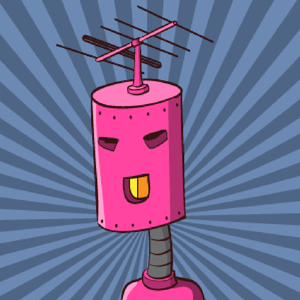

# hackthebox-writeups
Writeups for HacktheBox machines (boot2root) and challenges written in Spanish or English.  

https://www.hackthebox.eu/  

**Important**
All Challenge Writeups are password protected with the corresponding flag.  
**Active** machines writeups are protected with the corresponding root flag.

  

# Disclaimer

It is totally forbidden to unprotect (remove the password) and distribute the pdf files of active machines, if we detect any misuse will be reported immediately to the HTB admins.  
Anyway, all the authors of the writeups of active machines in this repository **are not responsible** for the misuse that can be given to the corresponding documents. Please think that this is done to share techniques not for spoilers.

# Submissions

If you want to incorporate your own writeup, notes, scripts or other material to solve the boot2root machines and challenges you can do it through a **'pull request'** or by sending us an email to: **hackplayers_at_Ymail.com**.

In this way, you will be added to our **top contributors list** (see below) and you will also receive an **invitation link to an exclusive Telegram group** where several hints (not spoilers) are discussed for the HacktheBox machines.  

Note: the minimum requirement to enter the "special" Telegram group is also to have a hacker level or higher (no script kiddies).  

# Contributors

 No | ctry | nick | avatar | team | machines | challenges
 --- | --- | --- | --- | --- | --- | ---
1 |  | drx51 |   | solitaire wolf | [Celestial,](https://github.com/Hackplayers/hackthebox-writeups/blob/master/machines/Celestial/drx51-celestial.pdf) [Dev0ops,](https://github.com/Hackplayers/hackthebox-writeups/blob/master/machines/DevOops/drx51-dev0ops.pdf) [Nibbles,](https://github.com/Hackplayers/hackthebox-writeups/blob/master/machines/Nibbles/drx51-nibbles.pdf) [Shocker,](https://github.com/Hackplayers/hackthebox-writeups/blob/master/machines/Shocker/drx51-shocker.pdf) [Valentine,](https://github.com/Hackplayers/hackthebox-writeups/blob/master/machines/Valentine/drx51-valentine.pdf) [Bashed,](https://github.com/Hackplayers/hackthebox-writeups/blob/master/machines/Bashed/drx51-bashed.pdf) [Chatterbox,](https://github.com/Hackplayers/hackthebox-writeups/blob/master/machines/Chatterbox/drx51-chatterbox.pdf) [Jerry,](https://github.com/Hackplayers/hackthebox-writeups/blob/master/machines/Jerry/drx51-jerry.pdf) [Canape,](https://github.com/Hackplayers/hackthebox-writeups/blob/master/machines/Canape/drx51-canape.pdf) [Sense,](https://github.com/Hackplayers/hackthebox-writeups/blob/master/machines/Sense/drx51-sense.pdf) [Silo, ](https://github.com/Hackplayers/hackthebox-writeups/blob/master/machines/Silo/drx51-silo.pdf) [Active, ](https://github.com/Hackplayers/hackthebox-writeups/blob/master/machines/Active/drx51-active.pdf) [Waldo, ](https://github.com/Hackplayers/hackthebox-writeups/blob/master/machines/Waldo/drx51-waldo.pdf) [Mischief, ](https://github.com/Hackplayers/hackthebox-writeups/blob/master/machines/Mischief/drx51-mischief.pdf) [Stratosphere, ](https://github.com/Hackplayers/hackthebox-writeups/blob/master/machines/Stratosphere/drx51-stratosphere.pdf) [Poison, ](https://github.com/Hackplayers/hackthebox-writeups/blob/master/machines/Poison/drx51-poison.pdf) [Olympus, ](https://github.com/Hackplayers/hackthebox-writeups/blob/master/machines/Olympus/drx51-olympus.pdf) [Tartarsauce](https://github.com/Hackplayers/hackthebox-writeups/blob/master/machines/TartarSauce/drx51-tartarsauce.pdf) | |
2 |  | Fiti |  | solitaire wolf |  [Bashed,](https://github.com/Hackplayers/hackthebox-writeups/blob/master/machines/Bashed/fiti-bashed.pdf) [Arctic,](https://github.com/Hackplayers/hackthebox-writeups/blob/master/machines/Arctic/fiti-arctic.pdf) [Tenten,](https://github.com/Hackplayers/hackthebox-writeups/blob/master/machines/Tenten/fiti-tenten.pdf) [Celestial,](https://github.com/Hackplayers/hackthebox-writeups/blob/master/machines/Celestial/fiti-celestial.pdf) [Mirai,](https://github.com/Hackplayers/hackthebox-writeups/blob/master/machines/Mirai/fiti-mirai.pdf) [Nibbles,](https://github.com/Hackplayers/hackthebox-writeups/blob/master/machines/Nibbles/fiti-nibbles.pdf) [Sunday,](https://github.com/Hackplayers/hackthebox-writeups/blob/master/machines/Sunday/fiti-sunday.pdf) [Valentine,](https://github.com/Hackplayers/hackthebox-writeups/blob/master/machines/Valentine/fiti-valentine.pdf) [Dev0ops, ](https://github.com/Hackplayers/hackthebox-writeups/blob/master/machines/DevOops/fiti-dev0ps.pdf) [Aragog, ](https://github.com/Hackplayers/hackthebox-writeups/blob/master/machines/Aragog/fiti-aragog.pdf)  [Canape, ](https://github.com/Hackplayers/hackthebox-writeups/blob/master/machines/Canape/fiti-canape.pdf) [Mischief, ](https://github.com/Hackplayers/hackthebox-writeups/blob/master/machines/Mischief/fiti-mischief.pdf) [Jerry, ](https://github.com/Hackplayers/hackthebox-writeups/blob/master/machines/Jerry/fiti-jerry.pdf) [Olympus, ](https://github.com/Hackplayers/hackthebox-writeups/blob/master/machines/Olympus/fiti-olympus.pdf)  [Bounty](https://github.com/Hackplayers/hackthebox-writeups/blob/master/machines/Bounty/fiti-bounty.pdf) |  [Impossible password](https://github.com/Hackplayers/hackthebox-writeups/blob/master/challenges/reversing/Impossible_password/fiti-impossible-password.pdf) |
3 |  | pimmytrousers |   | [BitsPlz](https://www.hackthebox.eu/home/teams/profile/732) | [Bounty,](https://github.com/Hackplayers/hackthebox-writeups/blob/master/machines/Bounty/pimmytrousers-bounty.pdf) [Celestial,](https://github.com/Hackplayers/hackthebox-writeups/blob/master/machines/Celestial/pimmytrousers-celestial.pdf) [Jerry,](https://github.com/Hackplayers/hackthebox-writeups/blob/master/machines/Jerry/pimmytrousers-jerry.pdf) [Poison,](https://github.com/Hackplayers/hackthebox-writeups/blob/master/machines/Poison/pimmytrousers-poison.pdf) [Sunday,](https://github.com/Hackplayers/hackthebox-writeups/blob/master/machines/Sunday/pimmytrousers-sunday.pdf) [Valentine,](https://github.com/Hackplayers/hackthebox-writeups/blob/master/machines/Valentine/pimmytrousers-valentine.pdf) [Canape,](https://github.com/Hackplayers/hackthebox-writeups/blob/master/machines/Canape/pimmytrousers-canape.pdf) [Stratosphere, ](https://github.com/Hackplayers/hackthebox-writeups/blob/master/machines/Stratosphere/pimmytrousers-stratosphere.pdf)[Dev0ops](https://github.com/Hackplayers/hackthebox-writeups/blob/master/machines/DevOops/pimmytrousers-dev0ops.pdf) |
4 |  | frosters |   |  solitaire wolf | [Aragog,](https://github.com/Hackplayers/hackthebox-writeups/blob/master/machines/Aragog/frosters-aragog.pdf) [Silo,](https://github.com/Hackplayers/hackthebox-writeups/blob/master/machines/Silo/frosters-silo.pdf) [Bounty,](https://github.com/Hackplayers/hackthebox-writeups/blob/master/machines/Bounty/frosters-bounty.pdf) [Rabbit,](https://github.com/Hackplayers/hackthebox-writeups/blob/master/machines/Rabbit/frosters-rabbit.pdf) [Dev0ps,](https://github.com/Hackplayers/hackthebox-writeups/blob/master/machines/DevOops/frosters-dev0ops.pdf) [Valentine, ](https://github.com/Hackplayers/hackthebox-writeups/blob/master/machines/Valentine/frosters-valentine.pdf) [Secnotes, ](https://github.com/Hackplayers/hackthebox-writeups/blob/master/machines/Secnotes/frosters-secnotes.pdf) [Oz](https://github.com/Hackplayers/hackthebox-writeups/blob/master/machines/Oz/frosters-oz.pdf) |  
5 |  | mcruz |   | solitaire wolf | [Valentine,](https://github.com/Hackplayers/hackthebox-writeups/blob/master/machines/Valentine/mcruz-valentine.pdf) [Jerry,](https://github.com/Hackplayers/hackthebox-writeups/blob/master/machines/Jerry/mcruz-jerry.pdf) [Legacy,](https://github.com/Hackplayers/hackthebox-writeups/blob/master/machines/Legacy/mcruz-legacy.pdf) [Poison,](https://github.com/Hackplayers/hackthebox-writeups/blob/master/machines/Poison/mcruz-poison.pdf) [Sunday, ](https://github.com/Hackplayers/hackthebox-writeups/blob/master/machines/Sunday/mcruz-sunday.pdf) [Silo, ](https://github.com/Hackplayers/hackthebox-writeups/blob/master/machines/Silo/mcruz-silo.pdf) [Active, ](https://github.com/Hackplayers/hackthebox-writeups/blob/master/machines/Active/mcruz-active.pdf) [Hawk](https://github.com/Hackplayers/hackthebox-writeups/blob/master/machines/Hawk/mcruz-hawk.pdf) | |  
6 |  | artikrh |  |  [Sushi](https://www.hackthebox.eu/home/teams/profile/780) | [Hawk,](https://github.com/Hackplayers/hackthebox-writeups/blob/master/machines/Hawk/artikrh-hawk.pdf) [Stratosphere, ](https://github.com/Hackplayers/hackthebox-writeups/blob/master/machines/Stratosphere/artikrh-stratosphere.pdf) [Reddish, ](https://github.com/Hackplayers/hackthebox-writeups/blob/master/machines/Reddish/artikrh-reddish.pdf) [Waldo, ](https://github.com/Hackplayers/hackthebox-writeups/blob/master/machines/Waldo/artikrh-waldo.pdf) [Dab, ](https://github.com/Hackplayers/hackthebox-writeups/blob/master/machines/Dab/artikrh-dab.pdf) [Secnotes, ](https://github.com/Hackplayers/hackthebox-writeups/blob/master/machines/Secnotes/artikrh-secnotes.pdf) [Access](https://github.com/Hackplayers/hackthebox-writeups/blob/master/machines/Access/artikrh-access.pdf) |
7 |  | KaoRz |   | [L1k0rD3B3ll0t4](https://www.hackthebox.eu/home/teams/profile/149) | [Olympus,](https://github.com/Hackplayers/hackthebox-writeups/blob/master/machines/Olympus/kaorz-olympus.pdf) [Secnotes,](https://github.com/Hackplayers/hackthebox-writeups/blob/master/machines/Secnotes/kaorz-secnotes.pdf) [Ypuffy,](https://github.com/Hackplayers/hackthebox-writeups/blob/master/machines/Ypuffy/kaorz-ypuffy.pdf) [Smasher](https://github.com/Hackplayers/hackthebox-writeups/blob/master/machines/Smasher/kaorz-smasher.zip)| [Find the easy pass,](https://github.com/Hackplayers/hackthebox-writeups/blob/master/challenges/reversing/Find_the_easy_pass/kaoRz_Find_the_easy_pass.pdf) [Impossible Password, ](https://github.com/Hackplayers/hackthebox-writeups/blob/master/challenges/reversing/Impossible_password/kaoRz-impossible_password.pdf) [ropme](https://github.com/Hackplayers/hackthebox-writeups/blob/master/challenges/pwn/ropme/KaoRz-ropme.zip) |  
8 |  | 1v4n |   | solitaire wolf | [Olympus, ](https://github.com/Hackplayers/hackthebox-writeups/blob/master/machines/Olympus/1v4n-olympus.pdf) [Jerry](https://github.com/Hackplayers/hackthebox-writeups/blob/master/machines/Jerry/1v4n-jerry.pdf) | [Da Vinci, ](https://github.com/Hackplayers/hackthebox-writeups/blob/master/challenges/stego/DaVinci/1v4n-davinci.pdf) [Hackerman, ](https://github.com/Hackplayers/hackthebox-writeups/blob/master/challenges/stego/Hackerman/1v4n-Hackerman.pdf) [Forest, ](https://github.com/Hackplayers/hackthebox-writeups/blob/master/challenges/stego/Forest/1v4n-forest.pdf) [fs0ciety, ](https://github.com/Hackplayers/hackthebox-writeups/blob/master/challenges/misc/fs0ciety/fs0ciety-1v4n.pdf) [Weak RSA](https://github.com/Hackplayers/hackthebox-writeups/blob/master/challenges/crypto/Weak%20RSA/1v4n-weak_rsa.pdf) |  
9 |  | manulqwerty |   | [L1k0rD3B3ll0t4](https://www.hackthebox.eu/home/teams/profile/149) | [Stratosphere,](https://github.com/Hackplayers/hackthebox-writeups/blob/master/machines/Stratosphere/Stratosphere-manulqwerty.pdf) [Canape,](https://github.com/Hackplayers/hackthebox-writeups/blob/master/machines/Canape/manulqwerty-canape.pdf) [Nibbles,](https://github.com/Hackplayers/hackthebox-writeups/blob/master/machines/Nibbles/manulqwerty-nibbles.pdf) [Bounty](https://github.com/Hackplayers/hackthebox-writeups/blob/master/machines/Bounty/manulqwerty-bounty.pdf) |  
10 |  | fibbot |   | solitaire wolf | [Celestial, ](https://github.com/Hackplayers/hackthebox-writeups/blob/master/machines/Celestial/fibbot-celestial.pdf) [Poison, ](https://github.com/Hackplayers/hackthebox-writeups/blob/master/machines/Poison/fibbot-poison.pdf) [Canape, ](https://github.com/Hackplayers/hackthebox-writeups/blob/master/machines/Canape/fibbot-canape.pdf) [Sunday](https://github.com/Hackplayers/hackthebox-writeups/blob/master/machines/Sunday/fibbot-sunday.pdf) | |
11 |  | spenkk |   |  [Sentry](https://www.hackthebox.eu/home/teams/profile/637) | [Bart,](https://github.com/Hackplayers/hackthebox-writeups/blob/master/machines/Bart/spenkk-bart.pdf) [Dev0ops,](https://github.com/Hackplayers/hackthebox-writeups/blob/master/machines/DevOops/spenkk-dev0ops.pdf) [Dropzone](https://github.com/Hackplayers/hackthebox-writeups/blob/master/machines/Dropzone/spenkk-dropzone.pdf) | [snake](https://github.com/Hackplayers/hackthebox-writeups/blob/master/challenges/reversing/snake/spenkk-snake.pdf) |
12 |  | 3v4Si0N |   | [L1k0rD3B3ll0t4](https://www.hackthebox.eu/home/teams/profile/149) | [Canape,](https://github.com/Hackplayers/hackthebox-writeups/blob/master/machines/Canape/3v4si0n-canape.pdf) [TartarSauce,](https://github.com/Hackplayers/hackthebox-writeups/blob/master/machines/TartarSauce/3v4Si0N-tartarsauce.pdf) [Bounty](https://github.com/Hackplayers/hackthebox-writeups/blob/master/machines/Bounty/Bounty-3v4Si0N.pdf) |
13 |  | Pitenager |   |  solitaire wolf | [Blue,](https://github.com/Hackplayers/hackthebox-writeups/blob/master/machines/Blue/pitenager-blue.pdf) [Mirai,](https://githu89b.com/Hackplayers/hackthebox-writeups/blob/master/machines/Mirai/pitenager-mirai.pdf) [Nibbles](https://github.com/Hackplayers/hackthebox-writeups/blob/master/machines/Nibbles/pitenager-nibbles.pdf) | [Cartographer,](https://github.com/Hackplayers/hackthebox-writeups/blob/master/challenges/web/cartographer/pitenager-cartographer.pdf) [Lernaean](https://github.com/Hackplayers/hackthebox-writeups/blob/master/challenges/web/lernaean/pitenager-lernaean.pdf)    
14 |  | x4nt0n  |  | [AlphaPwner](https://www.hackthebox.eu/home/teams/profile/673) | [Sunday, ](https://github.com/Hackplayers/hackthebox-writeups/blob/master/machines/Sunday/x4nt0n-Sunday.pdf) [Olympus, ](https://github.com/Hackplayers/hackthebox-writeups/blob/master/machines/Olympus/x4nt0n-Olympus.pdf) [Access](https://github.com/Hackplayers/hackthebox-writeups/blob/master/machines/Access/x4nt0n-aAccess.pdf) | [Marshal In The Middle](https://github.com/Hackplayers/hackthebox-writeups/blob/master/challenges/forensics/x4nt0n-Marshal_In_The_Middle.pdf) |
15 |  | FrankyTech |   | [L1k0rD3B3ll0t4](https://www.hackthebox.eu/home/teams/profile/149) | [Active, ](https://github.com/Hackplayers/hackthebox-writeups/blob/master/machines/Active/frankytech-active.pdf) [Dev0ops, ](https://github.com/Hackplayers/hackthebox-writeups/blob/master/machines/DevOops/frankytech-dev0ops.pdf) [Olympus](https://github.com/Hackplayers/hackthebox-writeups/blob/master/machines/Olympus/frankytech-olympus.pdf) | |
16 |  | TheLegend |   |  solitaire wolf | [Active, ](https://github.com/Hackplayers/hackthebox-writeups/blob/master/machines/Active/TheLegend-Active.pdf) [Dev0ops](https://github.com/Hackplayers/hackthebox-writeups/blob/master/machines/DevOops/TheLegend-DevOops.pdf)| [I know Mag1k, ](https://github.com/Hackplayers/hackthebox-writeups/blob/master/challenges/web/iknowmag1k/TheLegend-IknowMag1k.pdf) [Snake](https://github.com/Hackplayers/hackthebox-writeups/blob/master/challenges/reversing/snake/TheLegend-Snake.pdf) |
17 |  | Ghostpp7 |   | [L1k0rD3B3ll0t4](https://www.hackthebox.eu/home/teams/profile/149) | [Valentine,](https://github.com/Hackplayers/hackthebox-writeups/blob/master/machines/Valentine/Ghostpp7-Valentine.pdf) [TartarSauce](https://github.com/Hackplayers/hackthebox-writeups/blob/master/machines/TartarSauce/ghostpp7-tartarsauce.pdf) |  
18 |  | o00o |   | solitarire wolf | [Reel,](https://github.com/Hackplayers/hackthebox-writeups/blob/master/machines/Reel/o00o-reel.pdf) [Nightmare](https://github.com/Hackplayers/hackthebox-writeups/blob/master/machines/Nightmare/o00o_nightmare.pdf) | |
19 |  | felli0t |  | solitaire wolf |  [DevOops,](https://github.com/its-arun/hackthebox-writeups/blob/master/machines/DevOops/felli0t-DevOops.pdf) [Chatterbox](https://github.com/Hackplayers/hackthebox-writeups/blob/master/machines/Chatterbox/felli0t-Chatterbox.pdf) | |  
20 |  | CyberVaca |   | [L1k0rD3B3ll0t4](https://www.hackthebox.eu/home/teams/profile/149) | [Chatterbox,](https://github.com/Hackplayers/hackthebox-writeups/blob/master/machines/Chatterbox/cybervaca-chatterbox.pdf) [Reddish](https://github.com/Hackplayers/hackthebox-writeups/blob/master/machines/Reddish/reddish-cybervaca.pdf)|
21 |  | b1gb1t |   |  [r00th4ck](https://www.hackthebox.eu/home/teams/profile/450) | [Sunday, ](https://github.com/Hackplayers/hackthebox-writeups/blob/master/machines/Sunday/b1gb1t-Sunday.pdf) [Active](https://github.com/Hackplayers/hackthebox-writeups/blob/master/machines/Active/b1gb1t-Active.pdf) |  
22 |  | n4xh4ck5 |   | solitaire wolf | [Jerry, ](https://github.com/Hackplayers/hackthebox-writeups/blob/master/machines/Jerry/n4xh4ck5-jerry.pdf) [PopCorn, ](https://github.com/Hackplayers/hackthebox-writeups/blob/master/machines/Popcorn/Popcorn-n4xh4ck5.pdf) [Haircut](https://github.com/Hackplayers/hackthebox-writeups/blob/master/machines/Haircut/n4xh4ck5_haircut_write_up.pdf)| |  
23 |  | roskyfrosky |   | solitaire wolf | [Jerry, ](https://github.com/Hackplayers/hackthebox-writeups/blob/master/machines/Jerry/roskyfrosky-jerry.pdf) [Celestial](https://github.com/Hackplayers/hackthebox-writeups/blob/master/machines/Celestial/Roskyfrosky-Celestial.pdf)| |  
24 |  | Vis0r |   |  [L1k0rD3B3ll0t4](https://www.hackthebox.eu/home/teams/profile/149) | [Blocky,](https://github.com/Hackplayers/hackthebox-writeups/blob/master/machines/Blocky/vis0r_blocky.pdf) [Chatterbox](https://github.com/Hackplayers/hackthebox-writeups/blob/master/machines/Chatterbox/vis0r-chatterbox.pdf) |   
25 |  | OscarAkaElvis |   |  [L1k0rD3B3ll0t4](https://www.hackthebox.eu/home/teams/profile/149) | [Olympus](https://github.com/Hackplayers/hackthebox-writeups/blob/master/machines/Olympus/oscarakaelvis-olympus.pdf) | [The Art of Reversing,](https://github.com/Hackplayers/hackthebox-writeups/blob/master/challenges/reversing/theartofreversing/oscarakaelvis-the_art_of_reversing.pdf) [I know Mag1k,](https://github.com/Hackplayers/hackthebox-writeups/blob/master/challenges/web/iknowmag1k/oscarakaelvis-i_know_mag1k.pdf) [Retro](https://github.com/Hackplayers/hackthebox-writeups/blob/master/challenges/stego/Retro/oscarakaelvis-retro.pdf) |   
26 |  | wilde |   | Solitaire wolf | [Active, ](https://github.com/Hackplayers/hackthebox-writeups/blob/master/machines/Active/wilde-active.zip) [Waldo, ](https://github.com/Hackplayers/hackthebox-writeups/blob/master/machines/Waldo/wilde-waldo.pdf) [Hawk](https://github.com/Hackplayers/hackthebox-writeups/blob/master/machines/Hawk/wilde-hawk.pdf) | |
27|  | thereallulz |   |  solitaire wolf | | [Retro,](https://github.com/Hackplayers/hackthebox-writeups/blob/master/challenges/stego/Retro/thereallulz-retro.pdf) [Monstrosity,](https://github.com/Hackplayers/hackthebox-writeups/blob/master/challenges/stego/Monstrosity/thereallulz-monstrosity.pdf) [Senseless Behaviour](https://github.com/Hackplayers/hackthebox-writeups/blob/master/challenges/stego/Senseless_Behaviour/thereallulz-senseless-behaviour.pdf) |    
28 |  | icebreakcrypt |   | Solitaire wolf | | [Massacre, ](https://github.com/Hackplayers/hackthebox-writeups/blob/master/challenges/stego/Massacre/icebreakcrypt-massacre.pdf) [Brainy's Cipher, ](https://github.com/Hackplayers/hackthebox-writeups/blob/master/challenges/crypto/Brainy-s%20Cipher/icebreakcrypt-Brainy's%20Cipher.pdf) [Widescreen, ](https://github.com/Hackplayers/hackthebox-writeups/blob/master/challenges/stego/Widescreen/Icebreakcrypt-widescreen.pdf) [Blackhole](https://github.com/Hackplayers/hackthebox-writeups/blob/master/challenges/misc/Blackhole/Icebreakcrypt-Blackhole.pdf)  |
29 |  | luthorien |   | [ARGSS](https://www.hackthebox.eu/home/teams/profile/1032) | | [Not Art, ](https://github.com/Hackplayers/hackthebox-writeups/blob/master/challenges/stego/Not%20Art/luthorien-not_art.pdf) [Grammar, ](https://github.com/Hackplayers/hackthebox-writeups/blob/master/challenges/web/grammar/luthorien-grammar.pdf) [Hidden in Colors](https://github.com/Hackplayers/hackthebox-writeups/blob/master/challenges/stego/Hidden%20in%20Colors/luthorien-hiddenincolors.pdf) |  
30 |  | absolutezero |   | [Sentry](https://www.hackthebox.eu/home/teams/profile/637) | [Fighter](https://github.com/Hackplayers/hackthebox-writeups/blob/master/machines/Fighter/absolutezero-fighter.pdf) | |
31 |  | xephrox |  | solitaire wolf | [Mischief](https://github.com/Hackplayers/hackthebox-writeups/blob/master/machines/Mischief/xephrox_Mischief.zip) |  
32 |  | worldunruled |   | [hackmethod](https://www.hackthebox.eu/home/teams/profile/64) | [Active](https://github.com/Hackplayers/hackthebox-writeups/blob/master/machines/Active/worldunruled-active.pdf) |  
33 |  | rtheory |   | [FlavorTown](https://www.hackthebox.eu/home/teams/profile/531) | [Reddish](https://github.com/Hackplayers/hackthebox-writeups/blob/master/machines/Reddish/rtheory-reddish.pdf) |  
34 |  | thereverend |   | solitaire wolf | [Active](https://github.com/Hackplayers/hackthebox-writeups/blob/master/machines/Active/thereverend-active.pdf) |  
35 |  | Zaiuss |   |  [L1k0rD3B3ll0t4](https://www.hackthebox.eu/home/teams/profile/149) | [Celestial](https://github.com/Hackplayers/hackthebox-writeups/raw/master/machines/Celestial/zaiuss-celestial.pdf) |        
36 |  | attl4s |   | [juankeres](https://www.hackthebox.eu/home/teams/profile/160) | [Falafel](https://github.com/Hackplayers/hackthebox-writeups/tree/master/machines/Falafel/attl4s-falafel.pdf) |   
37 |  | kauffman |   |  solitaire wolf | [Poison](https://github.com/Hackplayers/hackthebox-writeups/blob/master/machines/Poison/kauffman-poison.pdf) |   
38 |  | revil |   | solitaire wolf | [Sunday](https://github.com/Hackplayers/hackthebox-writeups/blob/master/machines/Sunday/revil-sunday.pdf)  |  
39 |  | k4nj1d |   | solitaire wolf | [nibbles](https://github.com/Hackplayers/hackthebox-writeups/blob/master/machines/Nibbles/k4nj1d-nibbles.pdf)  |  
40 |  | giovii |   | [criuz](https://www.hackthebox.eu/home/teams/profile/621) | [Mischief](https://github.com/Hackplayers/hackthebox-writeups/blob/master/machines/Mischief/giovii-mischief.pdf)  |
41 |  | 3zculprit |   | solitaire wolf | [Olympus](https://github.com/Hackplayers/hackthebox-writeups/blob/master/machines/Olympus/3zculprit-mischief.pdf)  |
42 |  | w4tchw0lf |   |  [L1k0rD3B3ll0t4](https://www.hackthebox.eu/home/teams/profile/149) | | [BitsNBytes,](https://github.com/Hackplayers/hackthebox-writeups/blob/master/challenges/stego/BitsNBytes/w4tchw0lf-bitsNbytes.pdf) [Monstrosity](https://github.com/Hackplayers/hackthebox-writeups/blob/master/challenges/stego/Monstrosity/w4tchw0lf-Monstruosity.pdf) |
43 |  | SadFud |   |  solitaire wolf | | [Impossible Password,](https://github.com/Hackplayers/hackthebox-writeups/blob/master/challenges/reversing/Impossible_password/sadfud-impossible_password.pdf) [Find the easy pass](https://github.com/Hackplayers/hackthebox-writeups/blob/master/challenges/reversing/Find_the_easy_pass/sadfud_Find_the_easy_pass.pdf) |   
44 |  | FuxSocy  |   |  [PhobosGroup](https://www.hackthebox.eu/home/teams/profile/177) | [Dev0ops](https://github.com/Hackplayers/hackthebox-writeups/blob/master/machines/DevOops/fux-DevOops.pdf) | |  
45 |  | abselithat |   | [Pratum](https://www.hackthebox.eu/home/teams/profile/666) | [Chatterbox](https://github.com/Hackplayers/hackthebox-writeups/blob/master/machines/Chatterbox/chadporter1-chatterbox.pdf) | |  
46 |  | Killerloops |   |  [prosegur](https://www.hackthebox.eu/home/teams/profile/79) | | [Tear or dear](https://github.com/Hackplayers/hackthebox-writeups/blob/master/challenges/reversing/tearordear/killerloops-tearordear.pdf) |  
47 |  | Renero |   |  [criuz](https://www.hackthebox.eu/home/teams/profile/621) | | [Digital Cube](https://github.com/Hackplayers/hackthebox-writeups/blob/master/challenges/stego/Digital_Cube/renero-digitalcube.pdf) |  
48 |  | Gibdeon |   |  [PKTeam](https://www.hackthebox.eu/home/teams/profile/122) | | [Old Bridge](https://github.com/Hackplayers/hackthebox-writeups/blob/master/challenges/pwn/old_bridge/gibdeon-old_bridge.rar) |  
49 |  | therearwindow |   | solitaire wolf | | [Beatles](https://github.com/Hackplayers/hackthebox-writeups/blob/master/machines/Beatles/therearwindow-beatles.pdf)  |  
50 |  | kabutor |   | solitaire wolf | [Aragog](https://github.com/Hackplayers/hackthebox-writeups/blob/master/machines/Aragog/kabutor-aragog.pdf) | |  
51 |  | malwrecon |   | solitaire wolf | [Ypuffy](https://github.com/Hackplayers/hackthebox-writeups/blob/master/machines/Ypuffy/malwrecon-ypuffy.pdf) | |  
52 |  | Paint |   | solitaire wolf | [Carrier](https://github.com/Hackplayers/hackthebox-writeups/blob/master/machines/Carrier/paint-carrier.pdf) | |  
53 |  | labyrinth |   |  [badwolf](https://www.hackthebox.eu/home/teams/profile/999) | | [Ebola Virus](https://github.com/Hackplayers/hackthebox-writeups/blob/master/challenges/crypto/ebola/labyrinth-ebola.pdf) | |
54 |  | zdravich |   | [TMHC](https://www.hackthebox.eu/home/teams/profile/709) | [Carrier](https://github.com/Hackplayers/hackthebox-writeups/blob/master/machines/Carrier/zdravich-carrier.pdf) | |
55 |  | epi |   | [Hackmethod](https://www.hackthebox.eu/home/teams/profile/64) | [Ypuffy](https://github.com/Hackplayers/hackthebox-writeups/blob/master/machines/Ypuffy/epi-ypuffy.pdf)  | |
  
# Special note  

Hack the Box is a superb platform to learn pentesting, there are many challenges and machines of different levels and with each one you manage to pass you learn a new thing. But talking among ourselves we realized that many times there are several ways to get rooting a machine, get a flag ... That's why we created this repository, as a site to share different unofficial writeups to see different techniques and acquire even more knowledge. That is our goal and our passion, to share to learn together.  

Some people have been distrustful because in this repository there are writeups of active machines, even knowing that absolutely each one of them is protected with the corresponding password (root flag or challenge). But We did not want to give up this because we think the most interesting thing for a HTB player is to check other users' walkthroughs right after they get it, that is, not wait for weeks or months afterwards. For this reason, we have asked the HTB admins and they have given us a pleasant surprise: in the future, they are going to add the ability for users to submit writeups directly to HTB which can automatically be unlocked after owning a machine. And also, they merge in all of the writeups from this github page. Simply great!  

Therefore it is a real pride that they have decided to include the functionality of this repo directly on their platform. When this is done, this Github will be migrated and will be inactive but with a pleasantly fulfilled mission. Until then, Keep pushing!  

*Hackplayers community, HTB Hispano & Born2root groups*.  
