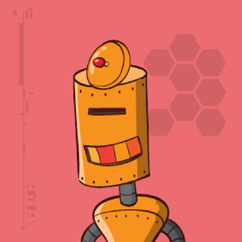

# hackthebox-writeups
Writeups for HacktheBox machines (boot2root) and challenges written in Spanish or English.  

https://www.hackthebox.eu/  

**Important**
All Challenge Writeups are password protected with the corresponding flag.  
**Active** machines writeups are protected with the corresponding root flag.

  

# Submissions

If you want to incorporate your own writeup, notes, scripts or other material to solve the boot2root machines and challenges you can do it through a **'pull request'** or by sending us an email to: **hackplayers_at_Ymail.com**. 

In this way, you will be added to our **top contributors list** (see below) and you will also receive an **invitation link to an exclusive Telegram group** where several hints (not spoilers) are discussed for the HacktheBox machines.  

Note: the minimum requirement to enter the "special" Telegram group is also to have a hacker level or higher (no script kiddies).  

# Contributors

 No | nick | avatar | team | machines | challenges 
 --- | --- | --- | --- | --- | ---
1 | Fiti |   | solitaire wolf |  [Bashed,](https://github.com/Hackplayers/hackthebox-writeups/blob/master/machines/Bashed/fiti-bashed.pdf) [Arctic,](https://github.com/Hackplayers/hackthebox-writeups/blob/master/machines/Arctic/fiti-arctic.pdf) [Tenten,](https://github.com/Hackplayers/hackthebox-writeups/blob/master/machines/Tenten/fiti-tenten.pdf) [Celestial,](https://github.com/Hackplayers/hackthebox-writeups/blob/master/machines/Celestial/fiti-celestial.pdf) [Mirai,](https://github.com/Hackplayers/hackthebox-writeups/blob/master/machines/Mirai/fiti-mirai.pdf) [Nibbles](https://github.com/Hackplayers/hackthebox-writeups/blob/master/machines/Nibbles/fiti-nibbles.pdf) |    
2 | manulqwerty |   | [PeakyBlinders](https://www.hackthebox.eu/home/teams/profile/588) | [Stratosphere,](https://github.com/Hackplayers/hackthebox-writeups/blob/master/machines/Stratosphere/Stratosphere-manulqwerty.pdf) [Canape,](https://github.com/Hackplayers/hackthebox-writeups/blob/master/machines/Canape/manulqwerty-canape.pdf) [Nibbles](https://github.com/Hackplayers/hackthebox-writeups/blob/master/machines/Nibbles/manulqwerty-nibbles.pdf) |  
3 | Ghostpp7 |   | [PeakyBlinders](https://www.hackthebox.eu/home/users/profile/24844) | [Valentine,](https://github.com/Hackplayers/hackthebox-writeups/blob/master/machines/Valentine/Ghostpp7-Valentine.pdf) [TartarSauce](https://github.com/Hackplayers/hackthebox-writeups/blob/master/machines/TartarSauce/ghostpp7-tartarsauce.pdf) |  
4 | 3v4Si0N |   | [r00th4ck](https://www.hackthebox.eu/home/teams/profile/450) | [Canape,](https://github.com/Hackplayers/hackthebox-writeups/blob/master/machines/Canape/3v4si0n-canape.pdf) [TartarSauce](https://github.com/Hackplayers/hackthebox-writeups/blob/master/machines/TartarSauce/3v4Si0N-tartarsauce.pdf) | 
5 | Vis0r |   |  [L1k0rD3B3ll0t4](https://www.hackthebox.eu/home/teams/profile/149) | [Blocky,](https://github.com/Hackplayers/hackthebox-writeups/blob/master/machines/Blocky/vis0r_blocky.pdf) [Chatterbox](https://github.com/Hackplayers/hackthebox-writeups/blob/master/machines/Chatterbox/vis0r-chatterbox.pdf) |  
6 | OscarAkaElvis |   |  [L1k0rD3B3ll0t4](https://www.hackthebox.eu/home/teams/profile/149) | [Olympus](https://github.com/Hackplayers/hackthebox-writeups/blob/master/machines/Olympus/oscarakaelvis-olympus.pdf) | [The Art of Reversing,](https://github.com/Hackplayers/hackthebox-writeups/blob/master/challenges/reversing/theartofreversing/oscarakaelvis-the_art_of_reversing.pdf) [I know Mag1k](https://github.com/Hackplayers/hackthebox-writeups/blob/master/challenges/web/iknowmag1k/oscarakaelvis-i_know_mag1k.pdf) | 
7 | w4tchw0lf |   |  [w0lfs3c](https://www.hackthebox.eu/home/teams/profile/401) | | [BitsNBytes,](https://github.com/Hackplayers/hackthebox-writeups/blob/master/challenges/stego/BitsNBytes/w4tchw0lf-bitsNbytes.pdf) [Monstrosity](https://github.com/Hackplayers/hackthebox-writeups/blob/master/challenges/stego/Monstrosity/w4tchw0lf-Monstruosity.pdf) | 
8 | Pitenager |   |  solitaire wolf | [Blue](https://github.com/Hackplayers/hackthebox-writeups/blob/master/machines/Blue/pitenager-blue.pdf) [Mirai](https://github.com/Hackplayers/hackthebox-writeups/blob/master/machines/Mirai/pitenager-mirai.pdf)  |  
9 | Zaiuss |   |  [L1k0rD3B3ll0t4](https://www.hackthebox.eu/home/teams/profile/149) | [Celestial](https://github.com/Hackplayers/hackthebox-writeups/raw/master/machines/Celestial/zaiuss-celestial.pdf) |       
10 | CyberVaca |   | [L1k0rD3B3ll0t4](https://www.hackthebox.eu/home/teams/profile/149) | [Chatterbox](https://github.com/Hackplayers/hackthebox-writeups/blob/master/machines/Chatterbox/cybervaca-chatterbox.pdf) |   
11 | attl4s |   | [juankeres](https://www.hackthebox.eu/home/teams/profile/160) | [Falafel](https://github.com/Hackplayers/hackthebox-writeups/tree/master/machines/Falafel/attl4s-falafel.pdf) |   
12 | kauffman |   |  solitaire wolf | [Poison](https://github.com/Hackplayers/hackthebox-writeups/blob/master/machines/Poison/kauffman-poison.pdf) |  
13 | SadFud |   |  solitaire wolf | | [Impossible Password,](https://github.com/Hackplayers/hackthebox-writeups/blob/master/challenges/reversing/Impossible_password/sadfud-impossible_password.pdf) [Find the easy pass](https://github.com/Hackplayers/hackthebox-writeups/blob/master/challenges/reversing/Find_the_easy_pass/sadfud_Find_the_easy_pass.pdf) |   
14 | Killerloops |   |  [prosegur](https://www.hackthebox.eu/home/teams/profile/79) | | [Tear or dear](https://github.com/Hackplayers/hackthebox-writeups/blob/master/challenges/reversing/tearordear/killerloops-tearordear.pdf) |   
15 | b1gb1t |   |  [r00th4ck](https://www.hackthebox.eu/home/teams/profile/450) | [Sunday](https://github.com/Hackplayers/hackthebox-writeups/blob/master/machines/Sunday/b1gb1t-Sunday.pdf) |  
16 | revil |   | solitaire wolf | [Sunday](https://github.com/Hackplayers/hackthebox-writeups/blob/master/machines/Sunday/revil-sunday.pdf)  |  
17 | k4nj1d |   | solitaire wolf | [nibbles](https://github.com/Hackplayers/hackthebox-writeups/blob/master/machines/Nibbles/k4nj1d-nibbles.pdf)  |  
18 | KaoRz |   |  [L1k0rD3B3ll0t4](https://www.hackthebox.eu/home/teams/profile/149) |  | [Find the easy pass](https://github.com/Hackplayers/hackthebox-writeups/blob/master/challenges/reversing/Find_the_easy_pass/kaoRz_Find_the_easy_pass.pdf)  |  
